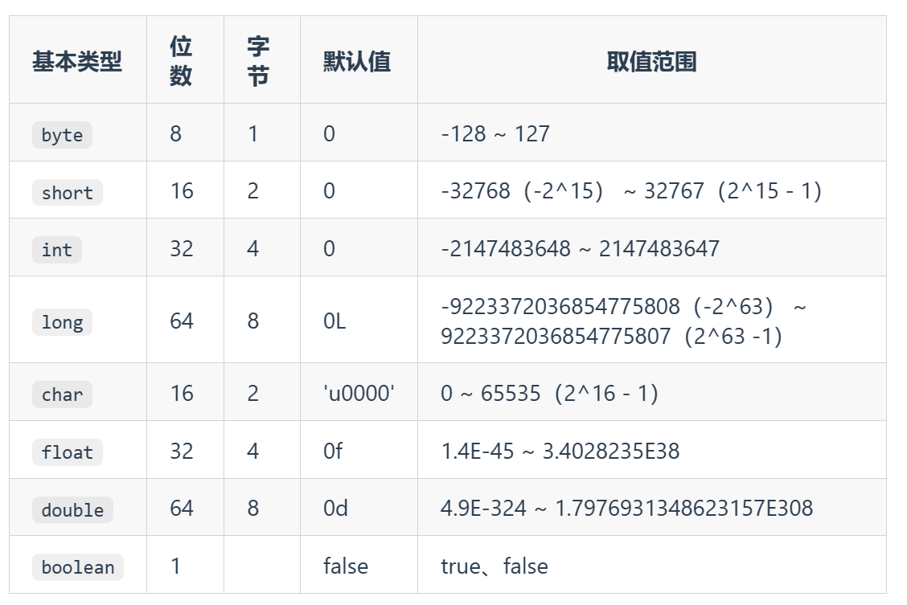
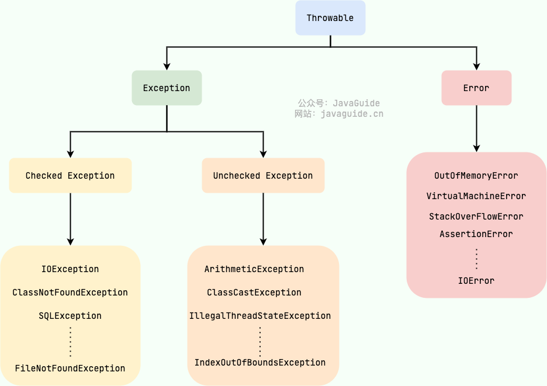
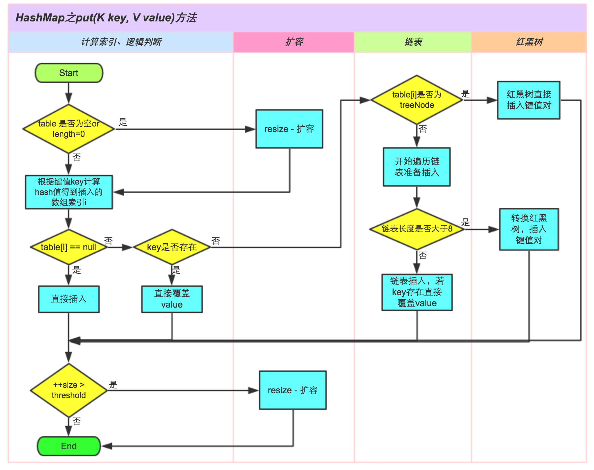
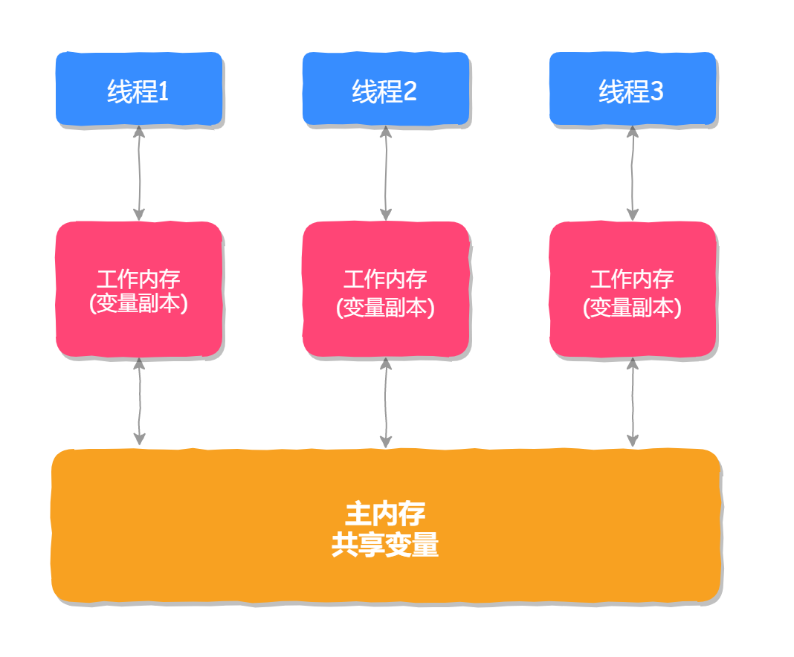
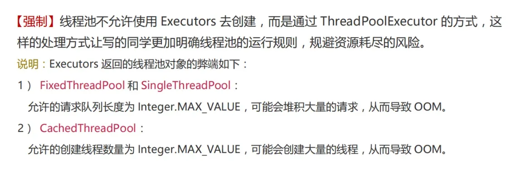

# Java

## 基础

### JVM、JDK、JRE

Java 虚拟机（JVM）是运行 Java 字节码的虚拟机。JVM 有针对不同系统的特定实现（Windows，Linux，macOS），目的是使用相同的字节码，它们都会给出相同的结果。字节码和不同系统的 JVM 实现是 Java 语言“一次编译，随处可以运行”的关键所在。

JDK（Java Development Kit），它是功能齐全的 Java SDK，是提供给开发者使用，能够创建和编译 Java 程序的开发套件。它包含了 JRE，同时还包含了编译 java 源码的编译器 javac 以及一些其他工具比如 javadoc（文档注释工具）、jdb（调试器）、jconsole（基于 JMX 的可视化监控⼯具）、javap（反编译工具）等等。

JRE（Java Runtime Environment） 是 Java 运行时环境。它是运行已编译 Java 程序所需的所有内容的集合，主要包括 Java 虚拟机（JVM）、Java 基础类库（Class Library）。


### Java 和 C++ 的区别

- Java 不提供指针来直接访问内存，程序内存更加安全
- Java 的类是单继承的，C++ 支持多重继承；虽然 Java 的类不可以多继承，但是接口可以多继承。
- Java 有自动内存管理垃圾回收机制(GC)，不需要程序员手动释放无用内存。
- C ++同时支持方法重载和操作符重载，但是 Java 只支持方法重载（操作符重载增加了复杂性，这与 Java 最初的设计思想不符）。

### 基本数据类型



**拆箱和装**箱：对于一些常用的比如integer的 -127-128是内存提前缓存好的对象，所以他们所指向的对象是同一个，以及character中的所有字符，除此之外使用装箱的时候都会新建一个对象。

当 "=="运算符的两个操作数都是 包装器类型的引用，则是比较指向的是否是同一个对象，而如果其中有一个操作数是表达式（即包含算术运算）则比较的是数值（即会触发自动拆箱的过程）

### 重载和重写的区别？

重载发生在同一个类中（或者父类和子类之间），方法名必须相同，参数类型不同、个数不同、顺序不同，方法返回值和访问修饰符可以不同。

重写发生在运行期，是子类对父类的允许访问的方法的实现过程进行重新编写。

**方法的重写要遵循“两同两小一大”**：

- “两同”即方法名相同、形参列表相同；
- “两小”指的是子类方法返回值类型应比父类方法返回值类型更小或相等，子类方法声明抛出的异常类应比父类方法声明抛出的异常类更小或相等；
- “一大”指的是子类方法的访问权限应比父类方法的访问权限更大或相等。

### 面向对象的三大特征

**封装**  是指把一个对象的状态信息（也就是属性）隐藏在对象内部，不允许外部对象直接访问对象的内部信息。但是可以提供一些可以被外界访问的方法来操作属性。

**继承**  继承是使用已存在的类的定义作为基础建立新类的技术，新类的定义可以增加新的数据或新的功能，也可以用父类的功能，但不能选择性地继承父类。通过使用继承，可以快速地创建新的类，可以提高代码的重用，程序的可维护性，节省大量创建新类的时间 ，提高我们的开发效率。子类拥有父类对象所有的属性和方法（包括私有属性和私有方法），但是父类中的私有属性和方法子类是无法访问，**只是拥有**。

**多态**  多态，顾名思义，表示一个对象具有多种的状态，具体表现为父类的引用指向子类的实例。多态是指通过指向父类的指针，来调用在不同子类中实现的方法。。

### 接口和抽象类的异同？

**共同点**：

- 都不能被实例化。
- 都可以包含抽象方法。
- 都可以有默认实现的方法（Java 8 可以用 `default` 关键字在接口中定义默认方法）。

**区别**：

- 接口主要用于对类的行为进行约束，你实现了某个接口就具有了对应的行为。抽象类主要用于代码复用，强调的是所属关系。
- 一个类只能继承一个类，但是可以实现多个接口。继承的时候根据子类是否是抽象类可以选择性的实现父抽象类中的方法（如果子类是抽象类，可以实现部分抽象方法，如果子类不是抽象类，则必须实现所有抽象方法）
- 接口中的成员变量只能是 `public static final` 类型的，不能被修改且必须有初始值，而抽象类的成员变量默认 default，可在子类中被重新定义，也可被重新赋值。

### 引用拷贝和对象拷贝（深拷贝、浅拷贝）

**引用拷贝**就是两个不同的引用指向同一个对象。

对象拷贝包括了深拷贝和浅拷贝

**浅拷贝**会在堆上创建一个新的对象，不过，如果原对象内部的属性是引用类型的话，浅拷贝会直接复制内部对象的引用地址，也就是说拷贝对象和原对象共用同一个内部对象。

**深拷贝**会完全复制整个对象，包括这个对象所包含的内部对象。

（Person含有Address这个引用）


### == 和 equals（）的区别

因为 Java 只有值传递，对于 == 来说，不管是比较基本数据类型，还是引用数据类型的变量，其本质比较的都是值，只是引用类型变量存的值是对象的地址。

**`equals()`** 不能用于判断基本数据类型的变量，只能用来判断两个对象是否相等。通常我们会重写这个方法（例如String类重写这个方法），如果不重写的话就是==，即比较对象的内存地址

### String、StringBuffer、StringBuilder

`String`是不可变的。

`StringBuffer`和`StringBuilder`都是可变的。`StringBuffer` 对方法加了同步锁`synchronized` 或者对调用的方法加了同步锁，所以是线程安全的，带来的坏处就是性能会比`StringBuilder`差一点。

### 异常



**`Exception`** :程序本身可以处理的异常，可以通过 `catch` 来进行捕获。`Exception` 又可以分为 Checked Exception (受检查异常，必须处理) 和 Unchecked Exception (不受检查异常，可以不处理)。

**`Error`**：`Error` 属于程序无法处理的错误 ，不建议通过`catch`捕获 。例如 Java 虚拟机运行错误（`Virtual MachineError`）、虚拟机内存不够错误(`OutOfMemoryError`)、类定义错误（`NoClassDefFoundError`）等 。这些异常发生时，Java 虚拟机（JVM）一般会选择线程终止。

**Checked Exception** 即 受检查异常 ，Java 代码在编译过程中，如果受检查异常没有被 `catch`或者`throws` 关键字处理的话，就没办法通过编译。

**Unchecked Exception** 即 不受检查异常 ，Java 代码在编译过程中 ，我们即使不处理不受检查异常也可以正常通过编译。

### 序列化和反序列化

- **序列化**：将数据结构或对象转换成二进制字节流的过程
- **反序列化**：将在序列化过程中所生成的二进制字节流转换成数据结构或者对象的过程

常见应用场景：

- 对象在进行网络传输（比如远程方法调用 RPC 的时候）之前需要先被序列化，接收到序列化的对象之后需要再进行反序列化；
- 将对象存储到文件之前需要进行序列化，将对象从文件中读取出来需要进行反序列化；
- 将对象存储到数据库（如 Redis）之前需要用到序列化，将对象从缓存数据库中读取出来需要反序列化；
- 将对象存储到内存之前需要进行序列化，从内存中读取出来之后需要进行反序列化。

### 语法糖

**语法糖（Syntactic sugar）** 代指的是编程语言为了方便程序员开发程序而设计的一种特殊语法，这种语法对编程语言的功能并没有影响。实现相同的功能，基于语法糖写出来的代码往往更简单简洁且更易阅读。

Java 中最常用的语法糖主要有泛型、自动拆装箱、变长参数、枚举、内部类、增强 for 循环、try-with-resources 语法、lambda 表达式等。


## 集合

Java 集合， 也叫作容器，主要是由两大接口派生而来：一个是 `Collection`接口，主要用于存放单一元素；另一个是 `Map` 接口，主要用于存放键值对。对于`Collection` 接口，下面又有三个主要的子接口：`List`、`Set` 和 `Queue`。


HashSet第底层是用HashMap实现的，在put的时候会利用equls判断对象是否相等（即是否存在过），如果存在则不会插入。

TreeSet第底层是用红黑树实现的，不用B树和B+的原因应该是数据都在内存，不像数据库频繁的读取数据到内存中，故而选择结构更加简单的红黑树。

### HashMap的底层实现

JDK1.8 之前 `HashMap` 底层是 **数组和链表** 结合在一起使用也就是 **链表散列**。HashMap 通过 key 的 `hashcode` 经过扰动函数处理过后得到 hash 值，然后通过 `(n - 1) & hash` （即对数组的长度取模运算，得到的余数是用来要存放的位置也就是对应的数组下标）判断当前元素存放的位置（这里的 n 指的是数组的长度），如果当前位置存在元素的话，就判断该元素与要存入的元素的 hash 值以及 key 是否相同，如果相同的话，直接覆盖，不相同就通过拉链法解决冲突。

JDK1.8 之后在解决哈希冲突时有了较大的变化，当链表长度大于阈值（默认为 8）（将链表转换成红黑树前会判断，如果当前数组的长度小于 64，那么会选择先进行数组扩容，而不是转换为红黑树）时，将链表转化为红黑树，以减少搜索时间。




java1.8+在**扩容**时，不需要重新计算元素的hash进行元素迁移。而是用原先位置key的hash值与旧数组的长度（oldCap）进行"与"操作。

- 如果结果是0，那么当前元素的桶位置不变。
- 如果结果为1，那么桶的位置就是原位置+原数组长度

**为什么HashMap要引入红黑树？** 

引入之前，当发生哈希冲突时，数据是以链表的形式进行存储的，如果冲突严重，链表就会过长，链表O（N）的复杂度性能太差。用红黑树期望是把复杂度降到O（log n）

**为什么树化的默认节点是8？** 

根据JDK 设计者的解释：主要是为了寻找一种**时间和空间的平衡**。

**红黑树中的TreeNode是链表中的Node所占空间的2倍**，虽然红黑树的查找效率为o(logN)，要优于链表的o(N)，但是当链表长度比较小的时候，即使全部遍历，时间复杂度也不会太高。固要寻找一种时间和空间的平衡，即在链表长度达到一个阈值之后再转换为红黑树。 之所以是8，是因为Java的源码贡献者在进行大量实验发现，hash碰撞发生8次的概率已经降低到了0.00000006，几乎为不可能事件，如果真的碰撞发生了8次，那么这个时候说明由于元素本身和hash函数的原因，此时的链表性能已经已经很差了，操作的hash碰撞的可能性非常大了，后序可能还会继续发生hash碰撞。所以，在这种极端的情况下才会把链表转换为红黑树.

### HashMap为什么线程不安全？

JDK 1.8 后，在 `HashMap` 中，多个键值对可能会被分配到同一个桶（bucket），并以链表或红黑树的形式存储。多个线程对 `HashMap` 的 `put` 操作会导致线程不安全，具体来说会有数据覆盖的风险。

举个例子：

- 两个线程 1,2 同时进行 put 操作，并且发生了哈希冲突（hash 函数计算出的插入下标是相同的）。
- 不同的线程可能在不同的时间片获得 CPU 执行的机会，当前线程 1 执行完哈希冲突判断后，由于时间片耗尽挂起。线程 2 先完成了插入操作。
- 随后，线程 1 获得时间片，由于之前已经进行过 hash 碰撞的判断，所有此时会直接进行插入，这就导致线程 2 插入的数据被线程 1 覆盖了。

**ConcurrentHashMap** 在 JDK 1.7 时使用的是数据加链表的形式实现的，其中数组分为两类：大数组 Segment 和小数组 HashEntry，而加锁是通过给 Segment 添加 ReentrantLock 锁来实现线程安全的。而 JDK 1.8 中 ConcurrentHashMap 使用的是数组+链表/红黑树的方式实现的，它是通过 CAS 或 synchronized 来实现线程安全的，并且它的锁粒度更小，查询性能也更高。


## 并发编程

### 直接调用Thread的run方？

调用 `start()` 方法方可启动线程并使线程进入就绪状态，直接执行 `run()` 方法的话不会以多线程的方式执行。

### 乐观锁和悲观锁

**悲观锁**总是假设最坏的情况，认为共享资源每次被访问的时候就会出现问题(比如共享数据被修改)，所以每次在获取资源操作的时候都会上锁，这样其他线程想拿到这个资源就会阻塞直到锁被上一个持有者释放。也就是说，**共享资源每次只给一个线程使用，其它线程阻塞，用完后再把资源转让给其它线程**。像 Java 中`synchronized`和`ReentrantLock`等独占锁就是悲观锁思想的实现。

高并发的场景下，激烈的锁竞争会造成线程阻塞，大量阻塞线程会导致系统的上下文切换，增加系统的性能开销。并且，悲观锁还可能会存在死锁问题，影响代码的正常运行。

**乐观锁**总是假设最好的情况，认为共享资源每次被访问的时候不会出现问题，线程可以不停地执行，无需加锁也无需等待，只是在提交修改的时候去验证对应的资源（也就是数据）是否被其它线程修改了（具体方法可以使用版本号机制或 CAS 算法）。

高并发的场景下，乐观锁相比悲观锁来说，不存在锁竞争造成线程阻塞，也不会有死锁的问题，在性能上往往会更胜一筹。但是，如果冲突频繁发生（写占比非常多的情况），会频繁失败和重试，这样同样会非常影响性能，导致 CPU 飙升。

**版本号实现乐观锁**：一般是在数据表中加上一个数据版本号 `version` 字段，表示数据被修改的次数。当数据被修改时，`version` 值会加一。当线程 A 要更新数据值时，在读取数据的同时也会读取 `version` 值，在提交更新时，若刚才读取到的 version 值为当前数据库中的 `version` 值相等时才更新，否则重试更新操作，直到更新成功。

**CAS Compare And Swap（比较与交换）**。CAS 是一个原子操作，底层依赖于一条 CPU 的原子指令。

> **原子操作** 即最小不可拆分的操作，也就是说操作一旦开始，就不能被打断，直到操作完成。

CAS 涉及到三个操作数：

- **V**：要更新的变量值(Var)
- **E**：预期值(Expected)
- **N**：拟写入的新值(New)

当且仅当 V 的值等于 E 时，CAS 通过原子方式用新值 N 来更新 V 的值。如果不等，说明已经有其它线程更新了 V，则当前线程放弃更新。

**ABA 问题**是乐观锁最常见的问题。如果一个变量 V 初次读取的时候是 A 值，并且在准备赋值的时候检查到它仍然是 A 值，那我们就能说明它的值没有被其他线程修改过了吗？很明显是不能的，因为在这段时间它的值可能被改为其他值，然后又改回 A，那 CAS 操作就会误认为它从来没有被修改过。这个问题被称为 CAS 操作的 ABA问题。ABA问题在某些操作下可能不会出现问题，但是对于同值不同对象的情况，就会发生错误。故而可以给数据加一个版本号，要确保修改时的版本号要和读取时的版本号一致。


### synchronized 关键字

在JDK早期，**synchronized 叫做重量级锁， 因为加锁和解锁都必须通过操作系统的内核**。在JDK1.6中，**为了减少获取锁和释放锁带来的性能开销**，对synchronized进行了锁升级，引入了偏向锁、轻量级锁的概念。因此锁状态一共变成了四种：**无锁、偏向锁、轻量级锁和重量级锁**。

synchronized 是 JVM 内部实现的一种**可重入的互斥锁**，当一个线程尝试获取一个已经被其他线程获取的 synchronized 锁时，该线程会进入阻塞状态等待其他线程释放该锁。在这个等待过程中，该线程会不断的尝试获取锁，这个过程被称为“自旋”，即不断重试直到获取到锁为止。

**偏向锁**，如果一个线程获取到了一个对象的锁，那么该对象的头信息中会存储这个线程的标识，后续该线程再次获取这个锁的时候就不需要竞争了。

**轻量级锁**，当线程竞争锁的次数较少时，锁会采用自旋的方式，而不是阻塞，**可以避免阻塞线程切换带来的性能损耗**。如果线程竞争锁的次数达到一定阈值，就会升级为重量级锁，避免出现过多的自旋。

**重量级锁**，当多个线程需要争用同一个锁的时候，会进入到阻塞状态，此时需要等待其他线程释放锁才能继续执行。

无论是偏向锁、重量级锁还是自适应锁，都是通过加锁和解锁来实现线程同步的，加锁的过程需要消耗系统资源，如果在高并发场景下，线程竞争锁的次数过多，就会影响系统的性能。为了避免这种情况，我们可以使用更加高效的锁，例如 ReentrantLock。


### synchronized 和 volatile 有什么区别？

`synchronized` 关键字和 `volatile` 关键字是两个互补的存在，而不是对立的存在！

- `volatile` 关键字是线程同步的轻量级实现，所以 `volatile`性能肯定比`synchronized`关键字要好 。但是 `volatile` 关键字只能用于变量而 `synchronized` 关键字可以修饰方法以及代码块 。

- `volatile` 关键字能保证数据的可见性，但不能保证数据的原子性。`synchronized` 关键字两者都能保证。

- `volatile`关键字主要用于解决变量在多个线程之间的**可见性**，而 `synchronized` 关键字解决的是多个线程之间访问资源的**同步性**。

  JMM定义了线程和主内存之间的抽象关系：

  共享变量存储在主内存(Main Memory)中，每个线程都有一个私有的本地内存（Local Memory）
  本地内存保存了被该线程使用到的主内存的副本拷贝，线程对变量的所有操作都必须在工作内存中进行，而不能直接读写主内存中的变量。
  对于普通的共享变量来讲：

  线程A将其修改为某个值发生在线程A的本地内存中，此时还未同步到主内存中去；
  而线程B已经缓存了该变量的旧值，所以就导致了共享变量值的不一致。
  解决这种共享变量在多线程模型中的不可见性问题，较粗暴的方式自然就是加锁，但是此处使用synchronized或者Lock这些方式太重量级了，比较合理的方式其实就是volatile。


### volatile

**volatile 作用有两个：保证内存可见性和有序性（禁止指令重排序）**。

#### 内存可见性

Java 内存模型规定：所有的变量（实例变量和静态变量）都必须存储在主内存中，每个线程也会有自己的工作内存，**线程的工作内存保存了该线程用到的变量和主内存的副本拷贝**，线程对变量的操作都在工作内存中进行。线程不能直接读写主内存中的变量。




然而，Java 内存模型会带来一个新的问题，那就是内存可见性问题，也就是当某个线程修改了主内存中共享变量的值之后，其他线程不能感知到此值被修改了，它会一直使用自己工作内存中的“旧值”，这样程序的执行结果就不符合我们的预期了，这就是**内存可见性问题**

**volatile 内存可见性主要通过 lock 前缀指令实现的**，它会锁定当前内存区域的缓存（缓存行），并且立即将当前缓存行数据写入主内存（耗时非常短），回写主内存的时候会通过 **MESI 协议**（MESI 协议，全称为 Modified, Exclusive, Shared, Invalid，是一种高速缓存一致性协议。它是为了解决多处理器（CPU）在并发环境下，多个 CPU 缓存不一致问题而提出的）**使其他线程缓存了该变量的地址失效**，从而导致其他线程需要重新去主内存中重新读取数据到其工作线程中。

#### 有序性（禁止指令重排序）

指令重排序是指编译器或 CPU 为了优化程序的执行性能，而对指令进行重新排序的一种手段。

```java
public class Singleton {
    private Singleton() {}
    private static Singleton instance = null;
    public static Singleton getInstance() {
        if (instance == null) { // ①
            synchronized (Singleton.class) {
            	if (instance == null) {
                	instance = new Singleton(); // ②
                }
            }
        }
        return instance;
    }
}
```

以上问题发生在代码 ② 这一行“instance = new Singleton();”，这行代码**看似只是一个创建对象的过程，然而它的实际执行却分为以下 3 步：**

1. **创建内存空间。**
2. **在内存空间中初始化对象 Singleton。**
3. **将内存地址赋值给 instance 对象（执行了此步骤，instance 就不等于 null 了）。**

如果此变量不加 volatile，那么线程 1 在执行到上述代码的第 ② 处时就可能会执行指令重排序，**将原本是 1、2、3 的执行顺序，重排为 1、3、2**。但是特殊情况下，线程 1 在执行完第 3 步之后，如果来了线程 2 执行到上述代码的第 ① 处，判断 instance 对象已经不为 null，但此时线程 1 还未将对象实例化完，那么线程 2 将会得到一个被实例化“一半”的对象，从而导致程序执行出错，这就是为什么要给私有变量添加 volatile 的原因了。

**volatile 的有序性是通过插入内存屏障（Memory Barrier），在内存屏障前后禁止重排序优化，以此实现有序性的。**

在 Java 内存模型（JMM）中，volatile 关键字用于修饰变量时，能够保证该变量的可见性和有序性。关于有序性，volatile 通过内存屏障的插入来实现：

- **写内存屏障（Store Barrier / Write Barrier）**： 当线程写入 volatile 变量时，JMM 会在写操作前插入 StoreStore 屏障，确保在这次写操作之前的所有普通写操作都已完成。接着在写操作后插入 StoreLoad 屏障，强制所有后来的读写操作都在此次写操作完成之后执行，这就确保了其他线程能立即看到 volatile 变量的最新值。
- **读内存屏障（Load Barrier / Read Barrier）**： 当线程读取 volatile 变量时，JMM 会在读操作前插入 LoadLoad 屏障，确保在此次读操作之前的所有读操作都已完成。而在读操作后插入 LoadStore 屏障，防止在此次读操作之后的写操作被重排序到读操作之前，这样就确保了对 volatile 变量的读取总是能看到之前对同一变量或其他相关变量的写入结果。


### 锁的分类

**可重入锁** 也叫递归锁，指的是线程可以再次获取自己的内部锁。比如一个线程获得了某个对象的锁，此时这个对象锁还没有释放，当其再次想要获取这个对象的锁的时候还是可以获取的，如果是不可重入锁的话，就会造成死锁。

**可中断锁**：获取锁的过程中可以被中断，不需要一直等到获取锁之后 才能进行其他逻辑处理。`ReentrantLock` 就属于是可中断锁。

**不可中断锁**：一旦线程申请了锁，就只能等到拿到锁以后才能进行其他的逻辑处理。 `synchronized` 就属于是不可中断锁

**共享锁**：一把锁可以被多个线程同时获得。

**独占锁**：一把锁只能被一个线程获得

### ThreadLocal

`ThreadLocal`类主要解决的就是让每个线程绑定自己的值，可以将`ThreadLocal`类形象的比喻成存放数据的盒子，盒子中可以存储每个线程的私有数据。


### 线程

### 线程池

线程池就是管理一系列线程的资源池。当有任务要处理时，直接从线程池中获取线程来处理，处理完之后线程并不会立即被销毁，而是等待下一个任务。（数据库连接池也是这个道理）

- **降低资源消耗**。通过重复利用已创建的线程降低线程创建和销毁造成的消耗。
- **提高响应速度**。当任务到达时，任务可以不需要等到线程创建就能立即执行。
- **提高线程的可管理性**。线程是稀缺资源，如果无限制的创建，不仅会消耗系统资源，还会降低系统的稳定性，使用线程池可以进行统一的分配，调优和监控。


**分类**（Executors创建，但是不建议）

1）FixedThreadPool：只有核心线程，线程数量固定，执行完立即回收，任务队列为链表结构的有界队列。
2）ScheduledThreadPool：核心线程数量固定，非核心线程数量无限，执行完闲置 10ms 后回收，任务队列为延时阻塞队列。
3）CachedThreadPool：无核心线程，非核心线程数量无限，执行完闲置 60s 后回收，任务队列为不存储元素的阻塞队列。
4）SingleThreadExecutor：只有 1 个核心线程，无非核心线程，执行完立即回收，任务队列为链表结构的有界队列

#### 线程池的主要参数有哪些？

1）corePoolSize（必需）：核心线程数。默认情况下，核心线程会一直存活，但是当将 allowCoreThreadTimeout 设置为 true 时，核心线程也会超时回收。
2）maximumPoolSize（必需）：线程池所能容纳的最大线程数。当活跃线程数达到该数值后，后续的新任务将会阻塞。
3）keepAliveTime（必需）：线程闲置超时时长。如果超过该时长，非核心线程就会被回收。如果将 allowCoreThreadTimeout 设置为 true 时，核心线程也会超时回收。
4）unit（必需）：指定 keepAliveTime 参数的时间单位。常用的有：TimeUnit.MILLISECONDS（毫秒）、TimeUnit.SECONDS（秒）、TimeUnit.MINUTES（分）。
5）workQueue（必需）：任务队列。通过线程池的 execute() 方法提交的 Runnable 对象将存储在该参数中。其采用阻塞队列实现。

​	①ArrayBlockingQueue 基于数组的有界阻塞队列，按FIFO排序。

​	②LinkedBlockingQuene基于链表的无界阻塞队列（其实最大容量为Interger.MAX），按照FIFO排序。

​	③SynchronousQuene 一个不缓存任务的阻塞队列，生产者放入一个任务必须等到消费者取出这个任务。也就是说新任务进来时，不会缓存，而是直接被调度执行该任务，如果没有可用线程，则创建新线程，如果线程数量达到maxPoolSize，则执行拒绝策略。

​	④PriorityBlockingQueue具有优先级的无界阻塞队列，优先级通过参数Comparator实现。

6）threadFactory（可选）：线程工厂。用于指定为线程池创建新线程的方式。
7）handler（可选）：拒绝策略。当达到最大线程数时需要执行的饱和策略

​	当线程池无法接受新任务时，会触发拒绝策略，内置的拒绝策略有四种：

​	**AbortPolicy**：默认策略，直接抛出 RejectedExecutionException 异常。

​	**CallerRunsPolicy**：由调用者线程执行任务。

​	**DiscardPolicy**：默默地丢弃任务，没有任何异常抛出。

​	**DiscardOldestPolicy**：尝试抛弃队列中最旧的任务，然后重新尝试提交当前任务。


#### 执行原理

1. 如果当前运行的线程数小于核心线程数，那么就会新建一个线程来执行任务。
2. 如果当前运行的线程数等于或大于核心线程数，那么就把该任务放入到任务队列里等待执行。
3. 如果向任务队列投放任务失败（任务队列已经满了），但是当前运行的线程数是小于最大线程数的，就新建一个线程来执行任务。
4. 如果当前运行的线程数已经等同于最大线程数了，新建线程将会使当前运行的线程超出最大线程数，那么当前任务会被拒绝，饱和策略会调用`RejectedExecutionHandler.rejectedExecution()`方法。


#### 使用建议

1. 普通 Java 项目，使用 ThreadPoolExecutor 来创建线程池

   

2. Spring 项目中，会使用代码可读性更高的 ThreadPoolTaskExecutor 来创建线程池，虽然它的底层也是通过 ThreadPoolExecutor 来实现的，但 ThreadPoolTaskExecutor 可读性更高，因为它不需要在构造方法中设置参数，而是通过属性设置的方式来设置参数的，所以可读性更高

   ```java
   @Configuration
   public class AsyncConfig {
       @Bean
       public TaskExecutor taskExecutor() {
           ThreadPoolTaskExecutor executor = new ThreadPoolTaskExecutor();
           // 核心线程数
           executor.setCorePoolSize(5);
           // 最大线程数
           executor.setMaxPoolSize(10);
           // 队列容量
           executor.setQueueCapacity(20);
           // 线程池维护线程所允许的空闲时间
           executor.setKeepAliveSeconds(60);
           // 线程池对拒绝任务（无线程可用）的处理策略
           executor.setRejectedExecutionHandler(new ThreadPoolExecutor.CallerRunsPolicy());
           // 初始化
           executor.initialize();
           return executor;
       }
   }
   ```

   

   

## 面试题

### C++ Java Go 三种语言各有什么区别，以及他们的特点。

**JAVA**
优点
跨平台，⼀次编写可以在多个操作系统上运⾏
⾯向对象，⽀持继承、多态等特性
丰富的类库，可以快速开发应⽤程序
⾃动内存管理，减少了内存泄漏的可能性
缺点 :
由于 JVM 的存在，运⾏速度相对较慢
对于实时性要求较⾼的场景， Java 的表现可能不如 C++ 和 Go‘

**C++**

优点：
速度快，适合编写需要⾼性能的应⽤程序
应⽤⼴泛，特别是在游戏开发、操作系统和嵌⼊式系统开发⽅⾯
灵活性⾼，可以直接访问硬件和内存
缺点：
学习难度较⾼，需要掌握指针、内存管理等底层知识
容易出现内存泄漏和指针错误等问题
编写代码过程中需要更多的⼿动管理，相⽐ Java 更容易出错

 **Go**
优点：
⾼并发，天⽣⽀持协程，能够轻松编写⾼效的并发程序
简单易学，语法简洁，上⼿容易
静态类型语⾔，可以避免⼀些潜在的运⾏时错误
快速编译，可以快速构建和部署应⽤程序
缺点：
缺乏丰富的类库，与 Java 和 C++ 相⽐有些不⾜
在⼀些性能要求极⾼的场景中可能不如 C++ 表现
语⾔本身还⽐较年轻，相关⽣态和⼯具还需要进⼀步完善

