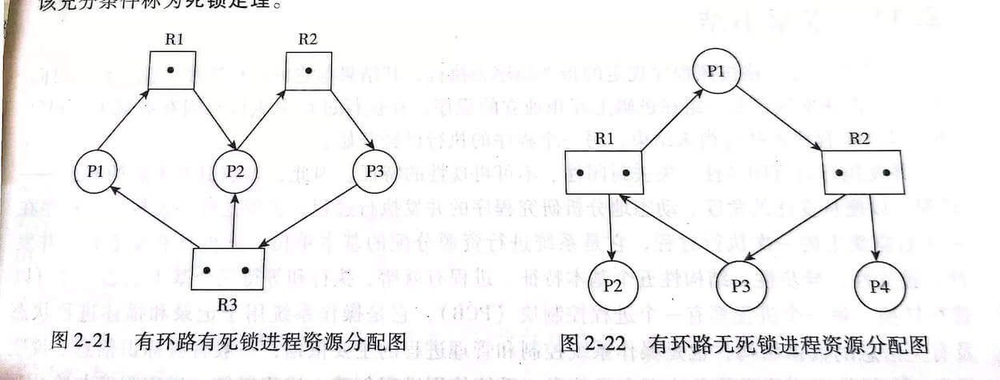
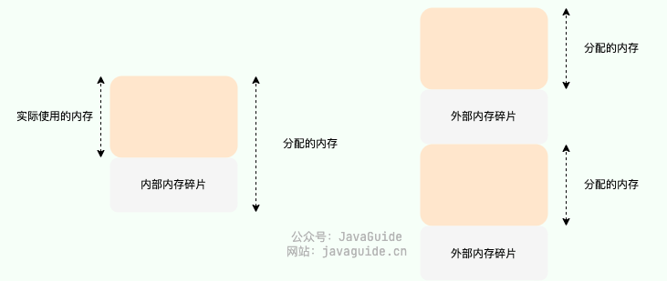

# 操作系统

## 基础知识

### 什么是操作系统？

**操作系统本质上是一个运行在计算机上的软件程序 ，主要用于管理计算机硬件和软件资源。**操作系统的内核（Kernel）是操作系统的核心部分，它负责系统的内存管理，硬件设备的管理，文件系统的管理以及应用程序的管理。 内核是连接应用程序和硬件的桥梁，决定着系统的性能和稳定性。

### 操作系统的主要功能

- **进程和线程的管理**：进程的创建、撤销、阻塞、唤醒，进程间的通信等。
- **存储管理**：内存的分配和管理、外存（磁盘等）的分配和管理等。
- **文件管理**：文件的读、写、创建及删除等。
- **设备管理**：完成设备（输入输出设备和外部存储设备等）的请求或释放，以及设备启动等功能。
- **网络管理**：操作系统负责管理计算机网络的使用。网络是计算机系统中连接不同计算机的方式，操作系统需要管理计算机网络的配置、连接、通信和安全等，以提供高效可靠的网络服务。
- **安全管理**：用户的身份认证、访问控制、文件加密等，以防止非法用户对系统资源的访问和操作。

### 用户态和内核态

根据进程访问资源的特点，我们可以把进程在系统上的运行分为两个级别：

- **用户态(User Mode)** : 用户态运行的进程可以直接读取用户程序的数据，拥有较低的权限。当应用程序需要执行某些需要特殊权限的操作，例如读写磁盘、网络通信等，就需要向操作系统发起系统调用请求，进入内核态。
- **内核态(Kernel Mode)**：内核态运行的进程几乎可以访问计算机的任何资源包括系统的内存空间、设备、驱动程序等，不受限制，拥有非常高的权限。当操作系统接收到进程的系统调用请求时，就会从用户态切换到内核态，执行相应的系统调用，并将结果返回给进程，最后再从内核态切换回用户态。

系统调用是应用程序与操作系统之间进行交互的一种方式，通过系统调用，应用程序可以访问操作系统底层资源例如文件、设备、网络等。系统调用会从用户态切换到内核态。


## 进程和线程

**进程（Process）** 是指计算机中正在运行的一个程序实例。系统进行资源分配的基本单位

**线程（Thread）** 也被称为轻量级进程，更加轻量。多个线程可以在同一个进程中同时执行，是CPU调度基本单位

**区别**

- 线程是进程划分成的更小的运行单位,一个进程在其执行的过程中可以产生多个线程。
- 线程和进程最大的不同在于基本上各进程是独立的，而各线程则不一定，因为同一进程中的线程极有可能会相互影响。
- 线程执行开销小，但不利于资源的管理和保护；而进程正相反。

### 进程状态转换


- **创建状态(new)**：进程正在被创建，尚未到就绪状态。
- **就绪状态(ready)**：进程已处于准备运行状态，即进程获得了除了处理器之外的一切所需资源，一旦得到处理器资源(处理器分配的时间片)即可运行。
- **运行状态(running)**：进程正在处理器上运行(单核 CPU 下任意时刻只有一个进程处于运行状态)。
- **阻塞状态(waiting)**：又称为等待状态，进程正在等待某一事件而暂停运行如等待某资源为可用或等待 IO 操作完成。即使处理器空闲，该进程也不能运行。
- **结束状态(terminated)**：进程正在从系统中消失。可能是进程正常结束或其他原因中断退出运行。

### 进程间的通信方式

- **管道/匿名管道(Pipes)**：用于具有亲缘关系的父子进程间或者兄弟进程之间的通信。

  ```shell
  $ ps auxf | grep mysql
  ```

  「`|`」竖线就是一个**管道**，它的功能是将前一个命令（`ps auxf`）的输出，作为后一个命令（`grep mysql`）的输入，从这功能描述，可以看出**管道传输数据是单向的**

- **有名管道(Named Pipes)** : 匿名管道由于没有名字，只能用于亲缘关系的进程间通信。为了克服这个缺点，提出了有名管道。有名管道严格遵循 **先进先出(First In First Out)** 。有名管道以**磁盘文件**的方式存在，可以实现本机任意两个进程通信

- **消息队列**：消息队列是**保存在内核中的消息链表**，消息队列生命周期随内核，如果没有释放消息队列或者没有关闭操作系统，消息队列会一直存在。**不适合大数据的传输，并且读写消息涉及到用户态和内核态的转换**。

- **共享内存(Shared memory)**：使得多个进程可以访问同一块**内存空间**，不同进程可以及时看到对方进程中对共享内存中数据的更新。这种方式需要依靠某种同步操作，如互斥锁和信号量等。可以说这是最有用的进程间通信方式。

- **信号量(Semaphores)**：信号量是一个计数器，用于多进程对共享数据的访问，信号量的意图在于进程间同步。这种通信方式主要用于解决与同步相关的问题并避免竞争条件。

- **套接字(Sockets)** : 跨网络与不同主机上的进程之间通信。套接字是支持 TCP/IP 的网络通信的基本操作单元，可以看做是不同主机之间的进程进行双向通信的端点，简单的说就是通信的两方的一种约定，用套接字中的相关函数来完成通信过程。


### 进程调度算法

- **先到先服务调度算法(FCFS，First Come, First Served)** : 从就绪队列中选择一个最先进入该队列的进程为之分配资源，使它立即执行并一直执行到完成或发生某事件而被阻塞放弃占用 CPU 时再重新调度。

- **短作业优先的调度算法(SJF，Shortest Job First)** : 从就绪队列中选出一个估计运行时间最短的进程为之分配资源，使它立即执行并一直执行到完成或发生某事件而被阻塞放弃占用 CPU 时再重新调度。

- **时间片轮转调度算法（RR，Round-Robin）** : 时间片轮转调度是一种最古老，最简单，最公平且使用最广的算法。每个进程被分配一个时间段，称作它的时间片，即该进程允许运行的时间。

- **高响应比优先调度算法(Highest Response Ratio Next, HRRN）**: 按照下面公式计算的优先权选择。由于要求服务时间不可知，所以这是一个理想的算法。

  

- **多级反馈队列调度算法（MFQ，Multi-level Feedback Queue）**：多级反馈队列调度算法既能使高优先级的作业得到响应又能使短作业（进程）迅速完成。，因而它是目前**被公认的一种较好的进程调度算法**，UNIX 操作系统采取的便是这种调度算法。

  新的进程会进入优先级最高时间片最短的队列1的末尾，按照先来先服务进入CPU，用完时间片之后进入队列2等待，依次列推。

  

- **优先级调度算法（Priority）**：为每个流程分配优先级，首先执行具有最高优先级的进程，依此类推。具有相同优先级的进程以 FCFS 方式执行。可以根据内存要求，时间要求或任何其他资源要求来确定优先级。

### 僵尸进程和孤儿进程

在 Unix/Linux 系统中，子进程通常是通过 fork()系统调用创建的，该调用会创建一个新的进程，该进程是原有进程的一个副本。子进程和父进程的运行是相互独立的，它们各自拥有自己的 PCB，**即使父进程结束了，子进程仍然可以继续运行**。

当一个进程调用 exit()系统调用结束自己的生命时，内核会释放该进程的所有资源，包括打开的文件、占用的内存等，但是**该进程对应的 PCB 依然存在于系统**中。这些信息只有在父进程调用 wait()或 waitpid()系统调用时才会被释放，以便让父进程得到子进程的状态信息。

- **僵尸进程**：子进程已经终止，但是其父进程仍在运行，且父进程没有调用 wait()或 waitpid()等系统调用来获取子进程的状态信息，释放子进程占用的资源，导致子进程的 PCB 依然存在于系统中，但无法被进一步使用。这种情况下，子进程被称为“僵尸进程”。避免僵尸进程的产生，父进程需要及时调用 wait()或 waitpid()系统调用来回收子进程。
- **孤儿进程**：一个进程的父进程已经终止或者不存在，但是该进程仍在运行。这种情况下，该进程就是孤儿进程。孤儿进程通常是由于父进程意外终止或未及时调用 wait()或 waitpid()等系统调用来回收子进程导致的。为了避免孤儿进程占用系统资源，操作系统会将孤儿进程的父进程设置为 init 进程（进程号为 1），由 init 进程来回收孤儿进程的资源


## 死锁

多个进程/线程同时被阻塞，它们中的一个或者全部都在等待某个资源被释放。由于进程/线程被无限期地阻塞，因此程序不可能正常终止。

### 产生死锁的四个必要条件？

1. **互斥**：资源必须处于非共享模式，即任意时刻一个资源只能给一个进程使用。如果另一进程申请该资源，那么必须等待直到该资源被释放为止。
2. **占有并等待**：进程每次申请它所需要的一部分资源，在申请新的资源的同时，继续占用已分配到的资源。
3. **非抢占**：资源不能被抢占。只能在持有资源的进程完成任务后，该资源才会被释放。
4. **循环等待**：有一组等待进程 `{P0, P1,..., Pn}`， `P0` 等待的资源被 `P1` 占有，`P1` 等待的资源被 `P2` 占有，……，`Pn-1` 等待的资源被 `Pn` 占有，`Pn` 等待的资源被 `P0` 占有。

### 解决死锁的方法

解决死锁的方法可以从多个角度去分析，一般的情况下，有**预防，避免，检测和解除四种**。

#### 死锁预防

只要破坏四个必要条件中的任何一个就能够预防死锁的发生。

- 破坏互斥条件：使得资源是可以同时访问的，有很多资源 往往是不能同时访问的 ，所以这种做法在大多数的场合是行不通的。

- 破坏非抢占式：采用 剥夺式调度算法，但剥夺式调度方法目前一般仅适用于 主存资源 和 处理器资源 的分配，并不适用于所有的资源，会导致 资源利用率下降。

- 破坏占有且等待：就是指一个进程必须在**执行前就申请到它所需要的全部资源**，并且知道它所要的资源都得到满足之后才开始执行。

- 破坏循环等待：

  **层次分配策略**下，所有的资源被分成了多个层次，一个进程得到某一次的一个资源后，它只能再申请较高一层的资源；当一个进程要释放某层的一个资源时，必须先释放所占用的较高层的资源，按这种策略，是不可能出现循环等待链的，因为那样的话，就出现了已经申请了较高层的资源，反而去申请了较低层的资源，不符合层次分配策略，证明略。

#### **死锁避免**

死锁的避免**(银行家算法)**改善了 **资源使用率低的问题** ，但是它要不断地检测每个进程对各类资源的占用和申请情况，以及做 **安全性检查** ，需要花费较多的时间。

当一个进程申请使用资源的时候，银行家算法通过先 **试探** 分配给该进程资源，然后通过安全性算法判断分配后的系统是否处于安全状态，若不安全则试探分配作废，让该进程继续等待。

#### 死锁检测

进程-资源分配图



1. 如果进程-资源分配图中无环路，则此时系统没有发生死锁
2. 如果进程-资源分配图中有环路，且每个资源类仅有一个资源，则系统中已经发生了死锁。
3. 如果进程-资源分配图中有环路，且涉及到的资源类有多个资源，此时系统未必会发生死锁。如果能在进程-资源分配图中找出一个 **既不阻塞又非独立的进程** ，该进程能够在有限的时间内归还占有的资源，也就是把边给消除掉了，重复此过程，直到能在有限的时间内 **消除所有的边** ，则不会发生死锁，否则会发生死锁。(消除边的过程类似于 **拓扑排序**）

#### 死锁解除

当死锁检测程序检测到存在死锁发生时，应设法让其解除，让系统从死锁状态中恢复过来，常用的解除死锁的方法有以下四种：

1. **立即结束所有进程的执行，重新启动操作系统**：这种方法简单，但以前所在的工作全部作废，损失很大。
2. **撤销涉及死锁的所有进程，解除死锁后继续运行**：这种方法能彻底打破**死锁的循环等待**条件，但将付出很大代价，例如有些进程可能已经计算了很长时间，由于被撤销而使产生的部分结果也被消除了，再重新执行时还要再次进行计算。
3. **逐个撤销涉及死锁的进程，回收其资源直至死锁解除。**
4. **抢占资源**：从涉及死锁的一个或几个进程中抢占资源，把夺得的资源再分配给涉及死锁的进程直至死锁解除


## 内存管理

### 内存管理做了什么？


- **内存的分配与回收**：对进程所需的内存进行分配和释放，malloc 函数：申请内存，free 函数：释放内存。
- **地址转换**：将程序中的虚拟地址转换成内存中的物理地址。
- **内存扩充**：当系统没有足够的内存时，利用虚拟内存技术或自动覆盖技术，从逻辑上扩充内存。
- **内存映射**：将一个文件直接映射到进程的进程空间中，这样可以通过内存指针用读写内存的办法直接存取文件内容，速度更快。
- **内存优化**：通过调整内存分配策略和回收算法来优化内存使用效率。
- **内存安全**：保证进程之间使用内存互不干扰，避免一些恶意程序通过修改内存来破坏系统的安全性

### 内存碎片

内存碎片是由内存的申请和释放产生的，通常分为下面两种：

- **内部内存碎片(Internal Memory Fragmentation，简称为内存碎片)**：已经分配给进程使用但未被使用的内存。
- **外部内存碎片(External Memory Fragmentation，简称为外部碎片)**：由于未分配的连续内存区域太小，以至于不能满足任意进程所需要的内存分配请求，这些小片段且不连续的内存空间被称为外部碎片。



### 内存分配方式

#### 连续内存管理

为一个用户程序分配一个连续的内存空间，内存利用率一般不高。

- 单一连续分配：只支持单一程序，内存分为系统区和用户区
- 固定分区分配：内存分为固定大小（区域的大小可以不同）的区域，每个区域对应单个程序
- 动态分区分配：根据进程的大小动态的建立分区，包括首次适应、最佳适应、最坏适应和邻近适应。

#### 非连续内存管理

允许一个程序使用的内存分布在离散或者说不相邻的内存中，相对更加灵活一些。

- 基本分页式存储：把主存空间划分为大小相等的块，块相对较小，作为主存的基本单元。每个进程也以块为单位划分，进程执行时，以块为单位申请内存空间。
- 基本分段式存储：按照进程自然划分成若干逻辑空间，例如进程由主程序、两个子程序、栈和数据组成。于是可以把这个进程分成5段，每一段的逻辑地址从0开始编址，并分配一段连续的内存空间。
- 段页式管理：首先将进程根据逻辑结构划分成若干个逻辑段，每个段都有自己的段号，然后将这些段划分成若干个大小固定的页。这样对内存空间的管理依然和分页式管理相似，将内存分成和页面大小相同的存储块，对内存分配一存储块为单位。
- 请求分页管理：基于虚拟内存的思想，请求分页系统中只需要将当前需要的一部分页面装入内存中作业就可以正常运行，当访问的页面不在内存中的时候，可以采用换入将外存中的页面换入内存。

### 页面置换算法

**最佳置换算法(OPT)**

- 思想：最佳置换算法是淘汰以后不会使用的，或者是在长时间内不在访问的页面，以保证获得最低的缺页率。
- 特点：这个算法是**很难实现**的，由于很难预估那个页面是以后不会访问的。
- 注意：最长时间不访问和以后访问次数最小是两个概念。

**先进先出页面置换算法(FIFO)**

- 思想：淘汰最早进入内存的页面，就是在内存中驻留最久的页面。
- 特点：这个算法容易实现，但是不符合常理，因为在进程中有的页面会被经常访问到。
- 注意：这个算法可能产生换页次数不减反增的现象，称为Belady现象

**最近最久未使用置换算法(LRU)**

- 思想：选择最近最长时间没有被访问的页面
- 特点：性能好，但是需要寄存器和栈的硬件支持，

**时钟置换算法(CLOCK)**

- 简单的时钟置换算法
  - 思想：让一个指针循环扫描缓冲区，像时钟转动一样。会给每一页面增加一个附加位，称为使用位。当页面被调入内存的时候和页面被使用后将他的使用位置为1。页面需要替换的时候，指针会扫描每一页的使用位，如果为1，扫描过后置成0；如果为0，就将该页置换出去。如果所有的页面都为1的话，会继续扫描第二遍。
  - 特点：这个算法的思想其实和最近最久未使用页面置换算法相似，只是这个实现起来更加的方便。

### 虚拟内存

**局部性原理**

时间局部性：程序中的一条指令一旦执行，不久后改指令还可能再次被执行。产生时间局部性的原因是程序中存在大量的循环操作*。* 

空间局部性：一旦程序访问了某个存储单元，在不久后，其附近的存储单元也会被访问。因为指令的顺序通常是顺序存储、顺序执行的。数据的存储也是向量、数组、表等形式

**虚拟内存**

基于局部性原理，在程序装入内存时，只会将程序的一部分装入内存，就可以启动程序。在程序执行过程中如果所需要的信息不在内存中，可以由操纵系统将需要的那一部分数据再调入内存。如果操作系统暂时不适用某些内容，可以将其调到外存上，从而腾出空间供别的作业使用。以上就称为虚拟存储器。

## 文件系统

文件系统主要负责管理和组织计算机存储设备上的文件和目录，其功能包括以下几个方面：

1. **存储管理**：将文件数据存储到物理存储介质中，并且管理空间分配，以确保每个文件都有足够的空间存储，并避免文件之间发生冲突。
2. **文件管理**：文件的创建、删除、移动、重命名、压缩、加密、共享等等。
3. **目录管理**：目录的创建、删除、移动、重命名等等。
4. **文件访问控制**：管理不同用户或进程对文件的访问权限，以确保用户只能访问其被授权访问的文件，以保证文件的安全性和保密性。

### 软链接和硬链接

**1、硬链接（Hard Link）**

- 在 Linux/类 Unix 文件系统中，每个文件和目录都有一个唯一的索引节点（inode）号，用来标识该文件或目录。多个文件名指向同一索引节点是存在的，**所以硬连接指通过索引节点来进行的连接**，即每一个硬链接都是一个指向对应区域的文件。硬链接通过 inode 节点号建立连接，硬链接和源文件的 inode 节点号相同，两者对文件系统来说是完全平等的（可以看作是互为硬链接，源头是同一份文件），删除其中任何一个对另外一个没有影响，可以通过给文件设置硬链接文件来防止重要文件被误删，**事实上文件系统会维护一个引用计数，只要有文件指向这个区块，它就不会从硬盘上消失**。
- 只有删除了源文件和所有对应的硬链接文件，该文件才会被真正删除。
- 硬链接具有一些限制，不能对目录以及不存在的文件创建硬链接，并且，**硬链接也不能跨越文件系统，因为每个文件系统都有自己的inode 表，不互通**。
- `ln` 命令用于创建硬链接。

**2、软链接（Symbolic Link 或 Symlink）**

- 软链接和源文件的 inode 节点号不同，而是指向一个文件路径。
- 源文件删除后，软链接依然存在，但是指向的是一个无效的文件路径。
- 软连接类似于 Windows 系统中的快捷方式。
- 不同于硬链接，可以对目录或者不存在的文件创建软链接，并且，软链接可以跨越文件系统。
- `ln -s` 命令用于创建软链接。

