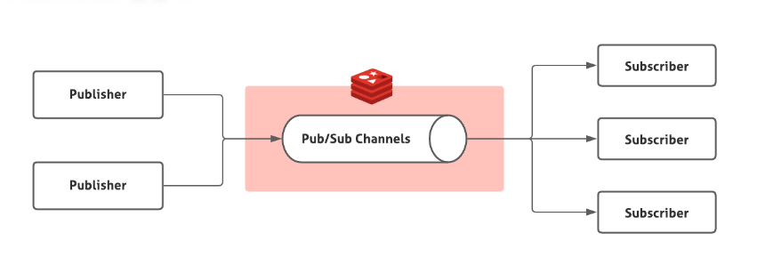

# 数据库

## 基础知识

### 数据库三范式

- **1NF（第一范式）**：1NF 是所有关系型数据库的最基本要求，属性不可再分。
- **2NF（第二范式）**：在 1NF 的基础之上，消除了非主属性对于码的部分函数依赖，即所有非主属性都依赖于主键。**表中任意一个主键或任意一组联合主键，可以确定除该主键外的所有的非主键值。一个表只能描述一件事情。**
- **3NF（第三范式）**：在 2NF 的基础之上，消除了非主属性对于码的传递函数依赖 。

**部分函数依赖**：如果 X→Y，并且存在 X 的一个真子集 X0，使得 X0→Y，则称 Y 对 X 部分函数依赖。比如学生基本信息表 R 中（学号，身份证号，姓名）当然学号属性取值是唯一的，在 R 关系中，（学号，身份证号）->（姓名），（学号）->（姓名），（身份证号）->（姓名）；所以姓名部分函数依赖于（学号，身份证号）

**传递函数依赖：**在关系模式 R(U)中，设 X，Y，Z 是 U 的不同的属性子集，如果 X 确定 Y、Y 确定 Z，且有 X 不包含 Y，Y 不确定 X，（X∪Y）∩Z=空集合，则称 Z 传递函数依赖(transitive functional dependency) 于 X。传递函数依赖会导致数据冗余和异常。传递函数依赖的 Y 和 Z 子集往往同属于某一个事物，因此可将其合并放到一个表中。比如在关系 R(学号 , 姓名, 系名，系主任)中，学号 → 系名，系名 → 系主任，所以存在非主属性系主任对于学号的传递函数依赖。

### 为什么不要使用外键？

外键与级联更新适用于单机低并发，不适合分布式、高并发集群；级联更新是强阻塞，存在数据库更新风暴的风险；外键影响数据库的插入速度。

### drop、delete和truncate的区别？

1. 用法不同

   - `drop`(丢弃数据): `drop table 表名` ，直接将表都删除掉，在删除表的时候使用。
   - `truncate` (清空数据) : `truncate table 表名` ，只删除表中的数据，再插入数据的时候自增长 id 又从 1 开始，在清空表中数据的时候使用。
   - `delete`（删除数据） : `delete from 表名 where 列名=值`，删除某一行的数据，如果不加 `where` 子句和`truncate table 表名`作用类似，id递增没有回到1

2. 类型不同

   `truncate` 和 `drop` 属于 DDL(数据定义语言)语句，操作立即生效，原数据不放到 rollback segment 中，不能回滚，操作不触发 trigger。

    `delete` 语句是 DML (数据库操作语言)语句，这个操作会放到 rollback segment 中，事务提交之后才生效。

3. 执行速度不同

   一般来说：`drop` > `truncate` > `delete`（这个我没有实际测试过）。

   - `delete`命令执行的时候会产生数据库的`binlog`日志，而日志记录是需要消耗时间的，但是也有个好处方便数据回滚恢复。
   - `truncate`命令执行的时候不会产生数据库日志，因此比`delete`要快。除此之外，还会把表的自增值重置和索引恢复到初始大小等。
   - `drop`命令会把表占用的空间全部释放掉。

### Boolean类型如何表示？

MySQL 中没有专门的布尔类型，而是用 TINYINT(1) 类型来表示布尔值。TINYINT(1) 类型可以存储 0 或 1，分别对应 false 或 true。

### MyISAM和InnoDB 有什么区别？

MySQL 5.5 之前，MyISAM 引擎是 MySQL 的默认存储引擎，MyISAM 不支持事务和行级锁，而且最大的缺陷就是崩溃后无法安全恢复。

MySQL 5.5 版本之后，InnoDB 是 MySQL 的默认存储引擎。

- InnoDB 支持行级别的锁粒度，MyISAM 不支持，只支持表级别的锁粒度。
- MyISAM 不提供事务支持。InnoDB 提供事务支持，实现了 SQL 标准定义了四个隔离级别。
- MyISAM 不支持外键，而 InnoDB 支持。
- MyISAM 不支持 MVCC，而 InnoDB 支持。
- 虽然 MyISAM 引擎和 InnoDB 引擎都是使用 B+Tree 作为索引结构，但是两者的实现方式不太一样。
- MyISAM 不支持数据库异常崩溃后的安全恢复，而 InnoDB 支持。
- InnoDB 的性能比 MyISAM 更强大。

## 索引

**索引是一种用于快速查询和检索数据的数据结构，其本质可以看成是一种排序好的数据结构。**

**优点**：

- 使用索引可以大大加快 数据的检索速度（大大减少检索的数据量）, 这也是创建索引的最主要的原因。
- 通过创建唯一性索引，可以保证数据库表中每一行数据的唯一性。

**缺点**：

- 创建索引和维护索引需要耗费许多时间。当对表中的数据进行增删改的时候，如果数据有索引，那么索引也需要动态的修改，会降低 SQL 执行效率。
- 索引需要使用物理文件存储，也会耗费一定空间。

### 聚族索引和非聚簇索引

**聚簇索引（Clustered Index）即索引结构和数据一起存放的索引，并不是一种单独的索引类型。InnoDB 中的主键索引就属于聚簇索引。**用数据的主键作为索引，树的叶子节点存放的整个数据。

**非聚簇索引(Non-Clustered Index)即索引结构和数据分开存放的索引，并不是一种单独的索引类型。二级索引(辅助索引)就属于非聚簇索引。MySQL 的 MyISAM 引擎，不管主键还是非主键，使用的都是非聚簇索引。**每一个非主键就会构成一棵索引树，叶子节点时对应的数据的主键，再用这个主键去聚簇索引中查询。

### **如何正确使用索引**

1. 选择合适的字段
   - **不为 NULL 的字段**：索引字段的数据应该尽量不为 NULL，因为对于数据为 NULL 的字段，数据库较难优化。如果字段频繁被查询，但又避免不了为 NULL，建议使用 0,1,true,false 这样语义较为清晰的短值或短字符作为替代。
   - **被频繁查询的字段**：我们创建索引的字段应该是查询操作非常频繁的字段。
   - **被作为条件查询的字段**：被作为 WHERE 条件查询的字段，应该被考虑建立索引。
   - **频繁需要排序的字段**：索引已经排序，这样查询可以利用索引的排序，加快排序查询时间。
   - **被经常频繁用于连接的字段**：经常用于连接的字段可能是一些外键列，对于外键列并不一定要建立外键，只是说该列涉及到表与表的关系。对于频繁被连接查询的字段，可以考虑建立索引，提高多表连接查询的效率。
2. 慎重选择频繁更新的字段作为索引， 维护索引的成本也是不小的
3. 限制每张表的索引数量，建议单张表索引不超过 5 个

### 索引失效

- 使用左或者左右模糊匹配，也就是 `like %xx` 或者 `like %xx%` 这两种方式都会造成索引失效。**因为索引 B+ 树是按照「索引值」有序排列存储的，只能根据前缀进行比较。**

- 对索引使用函数，因为索引保存的是索引字段的原始值，而不是经过函数计算后的值，自然就没办法走索引了。

- 对索引使用表达式， where id = 10 - 1不会失效，而 where id +1 = 10 会失效

- 对索引隐形类型转换，如果字段类型是字符串，而条件是整数select * from t_user where phone = 1300000001;其中phone定义的时候是varchar。因为**MySQL 在遇到字符串和数字比较的时候，会自动把字符串转为数字，然后再进行比较**。所以会将phone先转换为数字，这样就相当于对索引使用了函数。

- 联合索引非最左匹配，在联合索引的情况下，数据是按照索引第一列排序，第一列数据相同时才会按照第二列排序。

  

- WHERE 子句中 OR ，在 WHERE 子句中，如果在 OR 前的条件列是索引列，而在 OR 后的条件列不是索引列，那么索引会失效。

## 事务

SQL 标准定义了四个隔离级别：

- **READ-UNCOMMITTED(读取未提交)** ：最低的隔离级别，允许读取尚未提交的数据变更，可能会导致脏读、幻读或不可重复读。
- **READ-COMMITTED(读取已提交)** ：允许读取并发事务已经提交的数据，可以阻止脏读，但是幻读或不可重复读仍有可能发生。
- **REPEATABLE-READ(可重复读)** ：对同一字段的多次读取结果都是一致的，除非数据是被本身事务自己所修改，可以阻止脏读和不可重复读，但幻读仍有可能发生。**MySQL InnoDB 存储引擎的默认支持的隔离级别是 REPEATABLE-READ（可重读）。InnoDB 实现的 REPEATABLE-READ 隔离级别其实是可以解决幻读问题发生的**
- **SERIALIZABLE(可串行化)** ：最高的隔离级别，完全服从 ACID 的隔离级别。所有的事务依次逐个执行，这样事务之间就完全不可能产生干扰，也就是说，该级别可以防止脏读、不可重复读以及幻读。

这四种隔离级别具体是如何实现的呢？

- 对于「读未提交」隔离级别的事务来说，因为可以读到未提交事务修改的数据，所以直接读取最新的数据就好了；
- 对于「串行化」隔离级别的事务来说，通过加读写锁的方式来避免并行访问；
- 对于「读提交」和「可重复读」隔离级别的事务来说，它们是通过 **Read View 来实现的，它们的区别在于创建 Read View 的时机不同，大家可以把 Read View 理解成一个数据快照，就像相机拍照那样，定格某一时刻的风景。「读提交」隔离级别是在「每个语句执行前」都会重新生成一个 Read View，而「可重复读」隔离级别是「启动事务时」生成一个 Read View，然后整个事务期间都在用这个 Read View**。

### ACID特性

- 原子性(Atomicity)：单个事务，为一个不可分割的最小工作单元，整个事务中的所有操作要么全部commit成功，要么全部失败rollback。
- 一致性(Consistency)：数据库总是从一个一致性的状态转换到另外一个一致性的状态。
- 隔离性(Isolation)：通常来说，一个事务所做的修改在最终提交以前，对其他事务是不可见的。
- 持久性(Durability)：一旦事务提交，则其所做的修改就会永久保存到数据库中。此时即使系统崩溃，修改的数据也不会丢失。

### 并发场景下事务可能会存在的问题

- 脏读（读到未提交的数据）：A事务正在修改数据但未提交，此时B事务去读取此条数据，B事务读取的是未提交的数据，A事务回滚。
- 不可重复读（前后两次读取的数据不一样）：A事务中两次查询同一数据的内容不同，B事务间在A事务两次读取之间更改了此条数据。
- 幻读（前后两次读取的数据总量不一致）：在同一事务中两次相同查询数据的条数不一致，例如第一次查询查到5条数据，第二次查到8条数据，这是因为在两次查询的间隙，另一个事务插入了3条数据。

### **并发事务的控制方式**

MySQL 中并发事务的控制方式无非就两种：**锁** 和 **MVCC**。锁可以看作是悲观控制的模式，多版本并发控制（MVCC，Multiversion concurrency control）可以看作是乐观控制的模式。

MySQL 中主要是通过 **读写锁** 来实现并发控制。

- **共享锁（S 锁）**：又称读锁，事务在读取记录的时候获取共享锁，允许多个事务同时获取（锁兼容）。
- **排他锁（X 锁）**：又称写锁/独占锁，事务在修改记录的时候获取排他锁，不允许多个事务同时获取。如果一个记录已经被加了排他锁，那其他事务不能再对这条记录加任何类型的锁（锁不兼容）。

**MVCC** 是多版本并发控制方法，即对一份数据会存储多个版本，通过事务的可见性来保证事务能看到自己应该看到的版本。通常会有一个全局的版本分配器来为每一行数据设置版本号，版本号是唯一的。

### MVCC

**Read View的结构**

Read View 有四个重要的字段：

- m_ids ：指的是在创建 Read View 时，当前数据库中「活跃事务」的**事务 id 列表**，注意是一个列表，**“活跃事务”指的就是，启动了但还没提交的事务**。
- min_trx_id ：指的是在创建 Read View 时，当前数据库中「活跃事务」中事务 **id 最小的事务**，也就是 m_ids 的最小值。
- max_trx_id ：这个并不是 m_ids 的最大值，而是**创建 Read View 时当前数据库中应该给下一个事务的 id 值**，也就是全局事务中最大的事务 id 值 + 1；
- creator_trx_id ：指的是**创建该 Read View 的事务的事务 id**。

**聚簇索引记录中的两个隐藏列**

对于使用 InnoDB 存储引擎的数据库表，它的聚簇索引记录中都包含下面两个隐藏列：

- trx_id，当一个事务对某条聚簇索引记录进行改动时，就会**把该事务的事务 id 记录在 trx_id 隐藏列里**；
- roll_pointer，每次对某条聚簇索引记录进行改动时，都会把**旧版本的记录写入到 undo 日志**中，然后**这个隐藏列是个指针，指向每一个旧版本记录**，于是就可以通过它找到修改前的记录。

一个事务去访问记录的时候，除了自己的更新记录总是可见之外，还有这几种情况：

- 如果记录的 trx_id 值小于 Read View 中的 `min_trx_id` 值，表示这个版本的记录是在创建 Read View **前**已经提交的事务生成的，所以该版本的记录对当前事务**可见**。
- 如果记录的 trx_id 值大于等于 Read View 中的 `max_trx_id` 值，表示这个版本的记录是在创建 Read View **后**才启动的事务生成的，所以该版本的记录对当前事务**不可见**。
- 如果记录的 trx_id 值在 Read View 的min_trx_id和max_trx_id之间，需要判断 trx_id 是否在 m_ids 列表中：
  - 如果记录的 trx_id **在** `m_ids` 列表中，表示生成该版本记录的活跃事务依然活跃着（还没提交事务），所以该版本的记录对当前事务**不可见**。
  - 如果记录的 trx_id **不在** `m_ids`列表中，表示生成该版本记录的活跃事务已经被提交，所以该版本的记录对当前事务**可见**。

**这种通过「版本链」来控制并发事务访问同一个记录时的行为就叫 MVCC（多版本并发控制）。**

但是mvcc并不能完全解决幻读

第一个例子：对于快照读， MVCC 并不能完全避免幻读现象。因为当事务 A 更新了一条事务 B 插入的记录（此时记录的更改事务id会变成事务A），那么事务 A 前后两次查询的记录条目就不一样了，所以就发生幻读。

第二个例子：对于当前读，如果事务开启后，并没有执行当前读，而是先快照读，然后这期间如果其他事务插入了一条记录，那么事务后续使用当前读进行查询的时候，就会发现两次查询的记录条目就不一样了，所以就发生幻读。

## 读写分离

**写分离主要是为了将对数据库的读写操作分散到不同的数据库节点上。** 这样的话，就能够小幅提升写性能，大幅提升读性能。

### 主从复制的过程

1. 主库将数据库中数据的变化写入到 binlog
2. 从库连接主库
3. 从库会创建一个 I/O 线程向主库请求更新的 binlog
4. 主库会创建一个 binlog dump 线程来发送 binlog ，从库中的 I/O 线程负责接收
5. 从库的 I/O 线程将接收的 binlog 写入到 relay log 中。
6. 从库的 SQL 线程读取 relay log 同步数据本地（也就是再执行一遍 SQL ）。

### 如何避免主从延迟

- 强制将请求路由到主库处理：检测到从库过期之后，将读请求路由到主库
- 延迟读取：比如主从同步延迟 0.5s,那我就 1s 之后再读取数据。

## 分库分表

**垂直分库** 就是把单一数据库按照业务进行划分，不同的业务使用不同的数据库，进而将一个数据库的压力分担到多个数据库。

**水平分库** 是把同一个表按一定规则拆分到不同的数据库中，每个库可以位于不同的服务器上，这样就实现了水平扩展，解决了单表的存储和性能瓶颈的问题。

**垂直分表** 是对数据表列的拆分，把一张列比较多的表拆分为多张表。

**水平分表** 是对数据表行的拆分，把一张行比较多的表拆分为多张表，可以解决单一表数据量过大的问题。

### 分片算法

**哈希分片**：求指定 key（比如 id） 的哈希，然后根据哈希值确定数据应被放置在哪个表中。哈希分片比较适合随机读写的场景，不太适合经常需要范围查询的场景。

**范围分片**：按照特性的范围区间（比如时间区间、ID 区间）来分配数据，比如 将 `id` 为 `1~299999` 的记录分到第一个库， `300000~599999` 的分到第二个库。范围分片适合需要经常进行范围查找的场景，不太适合随机读写的场景（数据未被分散，容易出现热点数据的问题）。

**地理位置分片**：很多 NewSQL 数据库都支持地理位置分片算法，也就是根据地理位置（如城市、地域）来分配数据。

**融合算法**：灵活组合多种分片算法，比如将哈希分片和范围分片组合

### 分库分表会带来什么问题？

- **join 操作**：同一个数据库中的表分布在了不同的数据库中，导致无法使用 join 操作。因为 join 的效率低，并且会对分库分表造成影响。
- **事务问题**：同一个数据库中的表分布在了不同的数据库中，如果单个操作涉及到多个数据库，那么数据库自带的事务就无法满足我们的要求了。这个时候，我们就需要引入分布式事务了。
- **分布式 ID**：分库之后， 数据遍布在不同服务器上的数据库，数据库的自增主键已经没办法满足生成的主键唯一了。我们如何为不同的数据节点生成全局唯一主键呢？这个时候，我们就需要为我们的系统引入分布式 ID 了。

## 日志

- **undo log（回滚日志）**：是 Innodb 存储引擎层生成的日志，实现了事务中的**原子性**，主要**用于事务回滚和 MVCC**。回滚日志会先于数据持久化到磁盘上。这样就保证了即使遇到数据库突然宕机等情况，当用户再次启动数据库的时候，数据库还能够通过查询回滚日志来回滚将之前未完成的事务。

- **redo log（重做日志）**：是 Innodb 存储引擎层生成的日志，实现了事务中的**持久性**，主要**用于掉电等故障恢复**；redo log 是循环写，日志空间大小是固定，全部写满就从头开始，保存未被刷入磁盘的脏页日志。

  

  InnoDB 存储引擎为 redo log 的刷盘策略提供了 innodb_flush_log_at_trx_commit 参数，它支持三种策略：

  0 ：设置为 0 的时候，表示每次事务提交时不进行刷盘操作

  1 ：设置为 1 的时候，表示每次事务提交时都将进行刷盘操作（默认值）

  2 ：设置为 2 的时候，表示每次事务提交时都只把 redo log buffer 内容写入 page cache
  另外，`InnoDB` 存储引擎有一个后台线程，每隔`1` 秒，就会把 `redo log buffer` 中的内容写到文件系统缓存（`page cache`），然后调用 `fsync` 刷盘。

  

- **binlog （归档日志）**：是 Server 层生成的日志，主要**用于数据备份和主从复制**；是追加写，写满一个文件，就创建一个新的文件继续写，不会覆盖以前的日志，保存的是全量的日志。`binlog`会记录所有涉及更新数据的逻辑操作，并且是顺序写。**保证了`MySQL`集群架构的数据一致性**

  `binlog` 日志有三种格式，可以通过`binlog_format`参数指定。

  - **statement**，记录的内容是`SQL`语句原文
  - **row**，记录的内容不再是简单的`SQL`语句了，还包含操作的具体数据
  - **mixed**，`MySQL`会判断这条`SQL`语句是否可能引起数据不一致，如果是，就用`row`格式，否则就用`statement`格式

​	`redo log`在事务执行过程中可以不断写入，而`binlog`只有在提交事务时才写入，所以`redo log`与`binlog`的写入时机不一样。导致可能redo log中的数据，binlog中没有，而从库依靠binlog恢复数据。造成主从不一致。使用**两阶段提交**后，写入`binlog`时发生异常也不会有影响，因为`MySQL`根据`redo log`日志恢复数据时，发现`redo log`还处于`prepare`阶段，并且没有对应`binlog`日志，就会回滚该事务。

## Redis

### Redis为什么这么快？

- 首先，Redis是一个**内存数据库**，所有的数据都存储在内存中，这大大减少了磁盘I/O的延迟，使得数据读写速度非常快；
- 其次，Redis使用**单线程模型**，避免了线程切换和锁竞争等开销，能够更高效地利用CPU资源；
- 此外，Redis提供了多种**高效的数据结构**，如字符串、哈希表、列表、集合等，这些数据结构都经过了高度优化，能够实现快速的读写操作；
- 最后，Redis还使用了**异步I/O模型**，能够同时处理多个并发请求，提高了系统的吞吐量。这些因素共同作用，使得Redis在处理大量读写请求时表现出色，成为了一个高性能的键值数据库。

### **为什么要使用缓存/Redis？**

- **高性能**：当用户访问的数据属于高频数据并且不会经常改变的话，将该用户访问的数据存在缓存中，保证用户下一次再访问这些数据的时候就可以直接从缓存中获取了。操作缓存就是直接操作内存，所以速度相当快。
- **高并发**：一般像 MySQL 这类的数据库的 QPS 大概都在 1w 左右（4 核 8g） ，但是使用 Redis 缓存之后很容易达到 10w+，甚至最高能达到 30w+（就单机 Redis 的情况，Redis 集群的话会更高）。

### 缓存读写策略

#### **Cache Aside Pattern**，旁路缓存模式

- 写：先更新db，再删除cache
- 读：先读cache，如果读不到就读db，再同步到cache中

**缺陷 1：首次请求数据一定不在 cache 的问题**

解决办法：可以将热点数据可以提前放入 cache 中。

**缺陷 2：写操作比较频繁的话导致 cache 中的数据会被频繁被删除，这样会影响缓存命中率 。**

解决办法：

- 数据库和缓存数据强一致场景：更新 db 的时候同样更新 cache，不过我们需要加一个锁/分布式锁来保证更新 cache 的时候不存在线程安全问题。
- 可以短暂地允许数据库和缓存数据不一致的场景：更新 db 的时候同样更新 cache，但是给缓存加一个比较短的过期时间，这样的话就可以保证即使数据不一致的话影响也比较小。

#### Read/Write Through Pattern，读写穿透

Read/Write Through Pattern 中服务端把 cache 视为主要数据存储，从中读取数据并将数据写入其中。cache 服务负责将此数据读取和写入 db，从而减轻了应用程序的职责。

- 写：先查cache，如果存在就更新cache，由cache更新到数据库；如果不存在直接更新数据库
- 读：先读cache，如果读不到就从db加载到cache之后再返回响应

#### Write Behind Pattern，异步缓存写入

Read/Write Through 是同步更新 cache 和 db，而 Write Behind 则是只更新缓存，不直接更新 db，而是改为异步批量的方式来更新 db。

Write Behind Pattern 下 db 的写性能非常高，非常适合一些数据经常变化又对数据一致性要求没那么高的场景，比如浏览量、点赞量。

### Redis的应用

- **分布式锁**：通过 Redis 来做分布式锁是一种比较常见的方式。通常情况下，我们都是基于 Redisson 来实现分布式锁。
- **限流**：一般是通过 Redis + Lua 脚本的方式来实现限流。
- **消息队列**：Redis 自带的 List 数据结构可以作为一个简单的队列使用。Redis 5.0 中增加的 Stream 类型的数据结构更加适合用来做消息队列。它比较类似于 Kafka，有主题和消费组的概念，支持消息持久化以及 ACK 机制。
- **延时队列**：Redisson 内置了延时队列（基于 Sorted Set 实现的）。
- **分布式 Session** ：利用 String 或者 Hash 数据类型保存 Session 数据，所有的服务器都可以访问。
- **复杂业务场景**：通过 Redis 以及 Redis 扩展（比如 Redisson）提供的数据结构，我们可以很方便地完成很多复杂的业务场景比如通过 Bitmap 统计活跃用户、通过 Sorted Set 维护排行榜。

#### 基于Redis实现分布式锁

一个最基本的分布式锁需要满足：

- **互斥**：任意一个时刻，锁只能被一个线程持有。
- **高可用**：锁服务是高可用的，当一个锁服务出现问题，能够自动切换到另外一个锁服务。并且，即使客户端的释放锁的代码逻辑出现问题，锁最终一定还是会被释放，不会影响其他线程对共享资源的访问。这一般是通过超时机制实现的。
- **可重入**：一个节点获取了锁之后，还可以再次获取锁。

在 Redis 中， `SETNX` 命令是可以帮助我们实现互斥。`SETNX` 即 **SET** if **N**ot e**X**ists (对应 Java 中的 `setIfAbsent` 方法)，如果 key 不存在的话，才会设置 key 的值。如果 key 已经存在， `SETNX` 啥也不做。

选用 Lua 脚本是为了保证解锁操作的原子性。因为 Redis 在执行 Lua 脚本时，可以以原子性的方式执行，从而保证了锁释放操作的原子性。

当应用程序遇到一些问题比如释放锁的逻辑突然挂掉，可能会导致锁无法被释放，进而造成共享资源无法再被其他线程/进程访问。**给这个 key（也就是锁） 设置一个过期时间** 。

如果操作共享资源的时间大于过期时间，就会出现锁提前过期的问题，进而导致分布式锁直接失效。如果锁的超时时间设置过长，又会影响到性能。**使用Redisson实现锁的自动续期**

Redisson 中的分布式锁自带自动续期机制，其提供了一个专门用来监控和续期锁的 **Watch Dog（ 看门狗）**，如果操作共享资源的线程还未执行完成的话，Watch Dog 会不断地延长锁的过期时间，进而保证锁不会因为超时而被释放。

**Redisson还内置了可重入锁。**所谓可重入锁指的是在一个线程中可以多次获取同一把锁，比如一个线程在执行一个带锁的方法，该方法中又调用了另一个需要相同锁的方法，则该线程可以直接执行调用的方法即可重入 ，而无需重新获得锁。

可重入分布式锁的实现核心思路是线程在获取锁的时候判断是否为自己的锁，如果是的话，就不用再重新获取了。为此，我们可以为每个锁关联一个可重入计数器和一个占有它的线程。当可重入计数器大于 0 时，则锁被占有，需要判断占有该锁的线程和请求获取锁的线程是否为同一个。

#### 基于Redis实现消息队列

**Redis 2.0 之前，使用List实现简易的消息队列。**List 实现消息队列功能太简单，像消息确认机制等功能还需要我们自己实现，最要命的是没有广播机制，消息也只能被消费一次。

**Redis 2.0 引入了发布订阅 (pub/sub) 功能，解决了 List 实现消息队列没有广播机制的问题。**

pub/sub 涉及发布者（Publisher）和订阅者（Subscriber，也叫消费者）两个角色：

- 发布者通过 `PUBLISH` 投递消息给指定 channel。
- 订阅者通过`SUBSCRIBE`订阅它关心的 channel。并且，订阅者可以订阅一个或者多个 channel。

但是，发布订阅功能不能解决消息丢失，消息堆积等问题。

**Redis 5.0 新增加的一个数据结构 `Stream` 来做消息队列。**

`Stream` 支持：

- 发布 / 订阅模式
- 按照消费者组进行消费（借鉴了 Kafka 消费者组的概念）
- 消息持久化（ RDB 和 AOF）
- ACK 机制（通过确认机制来告知已经成功处理了消息）
- 阻塞式获取消息

### Redis的数据类型

Redis 共有 5 种**基本数据类型**：String（字符串）、List（列表）、Set（集合）、Hash（散列）、Zset（有序集合）。

**String** 是一种二进制安全的数据类型，可以用来实现一个简易的分布式锁。

 **List** 其实就是链表数据结构的实现，Redis 的 List 的实现为一个 **双向链表**

**Hash** 是一个 String 类型的 field-value（键值对） 的映射表，特别适合用于存储对象，Hash 类似于 JDK1.8 前的 `HashMap`，内部实现也差不多(数组 + 链表)

**Set** 类型是一种无序集合，集合中的元素没有先后顺序但都唯一，有点类似于 Java 中的 `HashSet` 

**Sorted Set** 类似于 Set，但和 Set 相比，Sorted Set 增加了一个权重参数 `score`，使得集合中的元素能够按 `score` 进行有序排列，还可以通过 `score` 的范围来获取元素的列表。有点像是 Java 中 `HashMap` 和 `TreeSet` 的结合体。

除了 5 种基本的数据类型之外，Redis 还支持 3 种**特殊的数据类型**：Bitmap、HyperLogLog、GEO。

**Bitmap** 存储的是连续的二进制数字（0 和 1），通过 Bitmap, 只需要一个 bit 位来表示某个元素对应的值或者状态，key 就是对应元素本身 。我们知道 8 个 bit 可以组成一个 byte，所以 Bitmap 本身会极大的节省储存空间。

**HyperLogLog** 是一种有名的基数计数概率算法 ，基于 LogLog Counting(LLC)优化改进得来，并不是 Redis 特有的，Redis 只是实现了这个算法并提供了一些开箱即用的 API。Redis 提供的 HyperLogLog 占用空间非常非常小，只需要 12k 的空间就能存储接近`2^64`个不同元素。适用数量量巨大（百万、千万级别以上）的计数场景

**Geospatial index**（地理空间索引，简称 GEO） 主要用于存储地理位置信息，基于 Sorted Set 实现。通过 GEO 我们可以轻松实现两个位置距离的计算、获取指定位置附近的元素等功能。

#### 比较String和Hash两种方式存储对象

- String 存储的是序列化后的对象数据，存放的是整个对象。Hash 是对对象的每个字段单独存储，可以获取部分字段的信息，也可以修改或者添加部分字段，节省网络流量。如果对象中某些字段需要经常变动或者经常需要单独查询对象中的个别字段信息，Hash 就非常适合。
- String 存储相对来说更加节省内存，缓存相同数量的对象数据，String 消耗的内存约是 Hash 的一半。并且，存储具有多层嵌套的对象时也方便很多。如果系统对性能和资源消耗非常敏感的话，String 就非常适合。

在绝大部分情况，我们建议使用 String 来存储对象数据即可！

#### Redis中有序集合底层（Zset）为什么要用跳表，不用平衡树、红黑树或者B+树？

这主要取决于两个配置参数：zset-max-ziplist-entries 和 zset-max-ziplist-value。

使用**压缩列表**：当 Zset 存储的元素数量小于 zset-max-ziplist-entries 的值，且所有元素的最大长度小于 zset-max-ziplist-value 的值时，Redis 会选择使用压缩列表作为底层实现。压缩列表占用的内存较少，但是在需要修改数据时，可能需要对整个压缩列表进行重写，性能较低。

使用**跳跃表**：当 Zset 存储的元素数量超过 zset-max-ziplist-entries 的值，或者任何元素的长度超过 zset-max-ziplist-value 的值时，Redis 会将底层结构从压缩列表转换为跳跃表。跳跃表的查找和修改数据的性能较高，但是占用的内存也较多。

redis中的zset中包含了两个数据结构，一个是map，一个就是跳表。跳表如下图所示

跳表相对于平衡树 红黑树 和B+树 的插入和删除更加简单，适合于范围查找

### Redis的持久化机制

Redis 支持持 3 种持久化方式:

- 快照（snapshotting，RDB）
- 只追加文件（append-only file, AOF）
- RDB 和 AOF 的混合持久化(Redis 4.0 新增)

#### RDB持久化

Redis 可以通过创建快照来获得存储在内存里面的数据在 **某个时间点** 上的副本。快照持久化是 Redis 默认采用的持久化方式。

Redis 提供了两个命令来生成 RDB 快照文件：

- `save` : 同步保存操作，会阻塞 Redis 主线程；
- `bgsave` : fork 出一个子进程，子进程执行，不会阻塞 Redis 主线程，默认选项。

#### AOF持久化

AOF 持久化的实时性更好。默认情况下 Redis 没有开启 AOF方式的持久化（Redis 6.0 之后已经默认是开启了）。AOF 记录日志是在 Redis 主线程中进行的。

AOF 持久化功能的实现可以简单分为 5 步：

1. **命令追加（append）**：所有的写命令会追加到 AOF 缓冲区中。

2. **文件写入（write）**：将 AOF 缓冲区的数据写入到 AOF 文件中。这一步需要调用`write`函数（系统调用），`write`将数据写入到了系统内核缓冲区之后直接返回了（延迟写）。注意！！！此时并没有同步到磁盘。

3. **文件同步（fsync）**：AOF 缓冲区根据对应的持久化方式（ `fsync` 策略）向硬盘做同步操作。这一步需要调用 `fsync` 函数（系统调用）， `fsync` 针对单个文件操作，对其进行强制硬盘同步，`fsync` 将阻塞直到写入磁盘完成后返回，保证了数据持久化。

4. **文件重写（rewrite）**：随着 AOF 文件越来越大，需要定期对 AOF 文件进行重写，达到压缩的目的。该功能是通过读取数据库中的键值对来实现的，程序无须对现有 AOF 文件进行任何读入、分析或者写入操作。

   AOF 文件重写期间，Redis 还会维护一个 **AOF 重写缓冲区**，该缓冲区会在子进程创建新 AOF 文件期间，记录服务器执行的所有写命令。当子进程完成创建新 AOF 文件的工作之后，服务器会将重写缓冲区中的所有内容追加到新 AOF 文件的末尾，使得新的 AOF 文件保存的数据库状态与现有的数据库状态一致。最后，服务器用新的 AOF 文件替换旧的 AOF 文件，以此来完成 AOF 文件重写操作。

5. **重启加载（load）**：当 Redis 重启时，可以加载 AOF 文件进行数据恢复。

   AOF 校验机制是 Redis 在启动时对 AOF 文件进行检查，以判断文件是否完整，是否有损坏或者丢失的数据。用一种叫做 **校验和（checksum）** 的数字来验证 AOF 文件。这个校验和是通过对整个 AOF 文件内容进行 CRC64 算法计算得出的数字。如果文件内容发生了变化，那么校验和也会随之改变。因此，Redis 在启动时会比较计算出的校验和与文件末尾保存的校验和（计算的时候会把最后一行保存校验和的内容给忽略点），从而判断 AOF 文件是否完整。如果发现文件有问题，Redis 就会拒绝启动并提供相应的错误信息。AOF 校验机制十分简单有效，可以提高 Redis 数据的可靠性。

在 Redis 的配置文件中存在三种不同的 AOF 持久化方式（ `fsync`策略），它们分别是：

1. `appendfsync always`：主线程调用 `write` 执行写操作后，后台线程（ `aof_fsync` 线程）立即会调用 `fsync` 函数同步 AOF 文件（刷盘），`fsync` 完成后线程返回，这样会严重降低 Redis 的性能（`write` + `fsync`）。
2. `appendfsync everysec`：主线程调用 `write` 执行写操作后立即返回，由后台线程（ `aof_fsync` 线程）每秒钟调用 `fsync` 函数（系统调用）同步一次 AOF 文件（`write`+`fsync`，`fsync`间隔为 1 秒）
3. `appendfsync no`：主线程调用 `write` 执行写操作后立即返回，让操作系统决定何时进行同步，Linux 下一般为 30 秒一次（`write`但不`fsync`，`fsync` 的时机由操作系统决定）。

可以看出：**这 3 种持久化方式的主要区别在于 `fsync` 同步 AOF 文件的时机（刷盘）**。

#### 比较RBD和AOF

**RDB 比 AOF 优秀的地方**：

- RDB 文件存储的内容是经过压缩的二进制数据， 保存着某个时间点的数据集，**文件很小，适合做数据的备份**，灾难恢复。AOF 文件存储的是每一次写命令，类似于 MySQL 的 binlog 日志，通常会比 RDB 文件大很多。
- 使用 RDB 文件恢复数据，直接解析还原数据即可，不需要一条一条地执行命令，速度非常快。而 AOF 则需要依次执行每个写命令，速度非常慢。也就是说，与 AOF 相比，**恢复大数据集的时候，RDB 速度更快**。

**AOF 比 RDB 优秀的地方**：

- RDB 的数据安全性不如 AOF，**没有办法实时或者秒级持久化数据**。生成 RDB 文件的过程是比较繁重的， 虽然 BGSAVE 子进程写入 RDB 文件的工作不会阻塞主线程，但会对机器的 CPU 资源和内存资源产生影响，严重的情况下甚至会直接把 Redis 服务干宕机。AOF 支持秒级数据丢失（取决 fsync 策略，如果是 everysec，最多丢失 1 秒的数据），仅仅是追加命令到 AOF 文件，操作轻量。
- RDB 文件是以特定的二进制格式保存的，并且在 Redis 版本演进中有多个版本的 RDB，所以存在老版本的 Redis 服务不兼容新版本的 RDB 格式的问题。
- AOF 以一种易于理解和解析的格式包含所有操作的日志。你可以轻松地导出 AOF 文件进行分析，你也可以直接操作 AOF 文件来解决一些问题。比如，**如果执行`FLUSHALL`命令意外地刷新了所有内容后，只要 AOF 文件没有被重写，删除最新命令并重启即可恢复之前的状态**。

### Redis的线程模型

对于读写命令来说，Redis 一直是单线程模型。不过，在 Redis 4.0 版本之后引入了多线程来执行一些大键值对的异步删除操作， Redis 6.0 版本之后引入了多线程来处理网络请求（提高网络 IO 读写性能）。

Redis 基于 Reactor 模式开发了自己的网络事件处理器：这个处理器被称为文件事件处理器（file event handler）。

- 文件事件处理器使用 I/O 多路复用（multiplexing）程序来同时监听多个套接字，并根据套接字目前执行的任务来为套接字关联不同的事件处理器。
- 当被监听的套接字准备好执行连接应答（accept）、读取（read）、写入（write）、关 闭（close）等操作时，与操作相对应的文件事件就会产生，这时文件事件处理器就会调用套接字之前关联好的事件处理器来处理这些事件。

**虽然文件事件处理器以单线程方式运行，但通过使用 I/O 多路复用程序来监听多个套接字**，文件事件处理器既实现了高性能的网络通信模型，又可以很好地与 Redis 服务器中其他同样以单线程方式运行的模块进行对接，这保持了 Redis 内部单线程设计的简单性。

Redis 通过 **IO 多路复用程序** 来监听来自客户端的大量连接（或者说是监听多个 socket），它会将感兴趣的事件及类型（读、写）注册到内核中并监听每个事件是否发生。

这样的好处非常明显：**I/O 多路复用技术的使用让 Redis 不需要额外创建多余的线程来监听客户端的大量连接，降低了资源的消耗**

文件事件处理器（file event handler）主要是包含 4 个部分：

- 多个 socket（客户端连接）
- IO 多路复用程序（支持多个客户端连接的关键）
- 文件事件分派器（将 socket 关联到相应的事件处理器）
- 事件处理器（连接应答处理器、命令请求处理器、命令回复处理器）

#### 为什么Redis6.0之前不使用多线程？

主要原因有 3 点：

- 单线程编程容易并且更容易维护；
- Redis 的性能瓶颈不在 CPU ，主要在内存和网络；
- 多线程就会存在死锁、线程上下文切换等问题，甚至会影响性能。

**Redis6.0 引入多线程主要是为了提高网络 IO 读写性能**，Redis 6.0 的多线程默认是禁用的

### Redis的内存管理

#### 给数据设置过期时间

因为内存是有限的，如果缓存中的所有数据都是一直保存的话，分分钟直接 Out of memory。

业务场景就是需要某个数据只在某一时间段内存在，比如我们的短信验证码可能只在 1 分钟内有效，用户登录的 Token 可能只在 1 天内有效。

#### 如何判断数据是否过期

Redis 通过一个叫做**过期字典（可以看作是 hash 表）来保存数据过期的时间**。过期字典的键指向 Redis 数据库中的某个 key(键)，过期字典的值是一个 long long 类型的整数，这个整数保存了 key 所指向的数据库键的过期时间（毫秒精度的 UNIX 时间戳）。

1. **惰性删除**：只会在取出 key 的时候才对数据进行过期检查。这样对 CPU 最友好，但是可能会造成太多过期 key 没有被删除。
2. **定期删除**：每隔一段时间抽取一批 key 执行删除过期 key 操作。并且，Redis 底层会通过限制删除操作执行的时长和频率来减少删除操作对 CPU 时间的影响。

定期删除对内存更加友好，惰性删除对 CPU 更加友好。两者各有千秋，所以 Redis 采用的是 **定期删除+惰性/懒汉式删除** 。

#### Redis内存淘汰机制

Redis 提供 6 种数据淘汰策略：

1. **volatile-lru（least recently used）**：从已设置过期时间的数据集（`server.db[i].expires`）中挑选最近最少使用的数据淘汰。
2. **volatile-ttl**：从已设置过期时间的数据集（`server.db[i].expires`）中挑选将要过期的数据淘汰。
3. **volatile-random**：从已设置过期时间的数据集（`server.db[i].expires`）中任意选择数据淘汰。
4. **allkeys-lru（least recently used）**：当内存不足以容纳新写入数据时，在键空间中，移除最近最少使用的 key（这个是最常用的）。
5. **allkeys-random**：从数据集（`server.db[i].dict`）中任意选择数据淘汰。
6. **no-eviction**：禁止驱逐数据，也就是说当内存不足以容纳新写入数据时，新写入操作会报错。

4.0 版本后增加以下两种：

这里的lfu是会用counter记录某个键的使用数量，但是不是单纯的++，会按照一定的概率++，且增加的速率随着counter的增大而增大，counter最大值255。而且还有一个衰减机制，如果一个键值在之前用的非常频繁，但是最近时间内没用使用过，会对counter做减法。

1. **volatile-lfu（least frequently used）**：从已设置过期时间的数据集（`server.db[i].expires`）中挑选最不经常使用的数据淘汰。
2. **allkeys-lfu（least frequently used）**：当内存不足以容纳新写入数据时，在键空间中，移除最不经常使用的 key。

### Redis事务

Redis 事务提供了一种将多个命令请求打包的功能。然后，再按顺序执行打包的所有命令，并且不会被中途打断。务中的每条命令都会与 Redis 服务器进行网络交互，这是比较浪费资源的行为。

**Redis事务不支持原子性**

Redis 事务在运行错误的情况下，除了执行过程中出现错误的命令外，其他命令都能正常执行。并且，Redis 事务是不支持回滚（roll back）操作的。因此，Redis 事务其实是不满足原子性的。

**Redis事务不支持持久性**

Redis支持持久化，Redis有三种持久化的方式，对于AOF只追加文件方式，由于我们在开发中不会使用always策略，在其他策略下是存在数据丢失的可能性的，故而Redis事务是不支持持久性的

#### Lua脚本

Redis 从 2.6 版本开始支持执行 Lua 脚本，它的功能和事务非常类似。我们可以利用 Lua 脚本来批量执行多条 Redis 命令，这些 Redis 命令会被提交到 Redis 服务器一次性执行完成，大幅**减小了网络开销**。

如果 Lua 脚本运行时出错并中途结束，出错之后的命令是不会被执行的。并且错误之前的命令是无法撤回的，故而使用Lua来批量执行Redis的命令也是无法一定满足原子性的。

### Redis的性能优化

#### 使用批量操作减少网络传输

- 原生批量操作命令
  - `MGET`(获取一个或多个指定 key 的值)、`MSET`(设置一个或多个指定 key 的值)、
  - `HMGET`(获取指定哈希表中一个或者多个指定字段的值)、`HMSET`(同时将一个或多个 field-value 对设置到指定哈希表中)、
  - `SADD`（向指定集合添加一个或多个元素）
- pipeline，流水线。对于不支持批量操作的命令，我们可以利用 pipeline将一批 Redis 命令封装成一组。pipeline 不适用于执行顺序有依赖关系的一批命令， pipeline 可以同时以交错方式执行封装的命令
- Lua脚本：是一个原子操作，一段 Lua 脚本执行过程中不会有其他脚本或 Redis 命令同时执行，保证了操作不会被其他指令插入或打扰

#### 大量key集中过期的问题

对于过期 key，Redis 采用的是 **定期删除+惰性/懒汉式删除** 策略。

定期删除执行过程中，如果突然遇到大量过期 key 的话，客户端请求必须等待定期清理过期 key 任务线程执行完成，因为这个这个定期任务线程是在 Redis 主线程中执行的。这就导致客户端请求没办法被及时处理，响应速度会比较慢。

下面是两种常见的方法：

1. 给 key 设置随机过期时间。
2. 开启 lazy-free（惰性删除/延迟释放） 。lazy-free 特性是 Redis 4.0 开始引入的，指的是让 Redis 采用异步方式延迟释放 key 使用的内存，将该操作交给单独的子线程处理，避免阻塞主线程。

#### Redis bigkey

如果一个 key 对应的 value 所占用的内存比较大，那这个 key 就可以看作是 bigkey。

bigkey 通常是由于下面这些**原因**产生的：

- 程序设计不当，比如直接使用 String 类型存储较大的文件对应的二进制数据。
- 对于业务的数据规模考虑不周到，比如使用集合类型的时候没有考虑到数据量的快速增长。
- 未及时清理垃圾数据，比如哈希中冗余了大量的无用键值对。

bigkey 会造成**阻塞问题**。

1. 客户端超时阻塞：由于 Redis 执行命令是单线程处理，然后在操作大 key 时会比较耗时，那么就会阻塞 Redis，从客户端这一视角看，就是很久很久都没有响应。
2. 网络阻塞：每次获取大 key 产生的网络流量较大，如果一个 key 的大小是 1 MB，每秒访问量为 1000，那么每秒会产生 1000MB 的流量，这对于普通千兆网卡的服务器来说是灾难性的。
3. 工作线程阻塞：如果使用 del 删除大 key 时，会阻塞工作线程，这样就没办法处理后续的命令。

bigkey 的常见**处理**以及优化办法如下：

- 分割 bigkey：将一个 bigkey 分割为多个小 key。例如，将一个含有上万字段数量的 Hash 按照一定策略（比如二次哈希）拆分为多个 Hash。
- 手动清理：Redis 4.0+ 可以使用 `UNLINK` 命令来异步删除一个或多个指定的 key。Redis 4.0 以下可以考虑使用 `SCAN` 命令结合 `DEL` 命令来分批次删除。
- 采用合适的数据结构：例如，文件二进制数据不使用 String 保存、使用 HyperLogLog 统计页面 UV、Bitmap 保存状态信息（0/1）。
- 开启 lazy-free（惰性删除/延迟释放） ：lazy-free 特性是 Redis 4.0 开始引入的，指的是让 Redis 采用异步方式延迟释放 key 使用的内存，将该操作交给单独的子线程处理，避免阻塞主线程。

#### Redis hotkey

如果一个 key 的访问次数比较多且明显多于其他 key 的话，那这个 key 就可以看作是 hotkey（热 Key）。

hotkey 的常见**处理**以及优化办法如下（这些方法可以配合起来使用）：

- 读写分离：主节点处理写请求，从节点处理读请求。
- 使用 Redis Cluster：将热点数据分散存储在多个 Redis 节点上。
- 二级缓存：hotkey 采用二级缓存的方式进行处理，将 hotkey 存放一份到 JVM 本地内存中（可以用 Caffeine）。

### Redis生产问题

#### 缓存穿透

缓存穿透说简单点就是大量请求的 key 是不合理的，**根本不存在于缓存中，也不存在于数据库中** 。造成大量请求直接落在数据库上，造成数据库的巨大压力。

**解决方案**

- 参数校验：最基本的就是首先做好参数校验，一些不合法的参数请求直接抛出异常信息返回给客户端。
- 缓存无效key：如果缓存和数据库都查不到某个 key 的数据就写一个到 Redis 中去并设置过期时间，可以解决key不变化的情况下；当黑客制造大量变化的无效key时，该方法会缓存大量无效key在缓存中，可以将过期时间设置得短一点来应对这种大量变化的无效key。
- 布隆过滤器：通过它我们可以非常方便地判断一个给定数据是否存在于海量数据中。把所有可能存在的请求的值都存放在布隆过滤器中，当用户请求过来，先判断用户发来的请求的值是否存在于布隆过滤器中。不存在的话，直接返回请求参数错误信息给客户端，存在的话才会走下面的流程。
- 接口限流：根据用户或者 IP 对接口进行限流，对于异常频繁的访问行为，还可以采取黑名单机制，例如将异常 IP 列入黑名单。

#### 缓存击穿

缓存击穿中，请求的 key 对应的是 **热点数据** ，该数据 **存在于数据库中，但不存在于缓存中（通常是因为缓存中的那份数据已经过期）** 。这就可能会导致瞬时大量的请求直接打到了数据库上，对数据库造成了巨大的压力

**解决方案**

- 热点数据永不过期或者过期时间比较长
- 对热点数据提前预热
- 使用互斥锁，当缓存失效的时候，不是立即去load db，而是通过缓存工具的某个机制（如Redis的SETNX）去设置一个锁，当操作返回成功时，再去load db并放入缓存；否则，就重试获取缓存值。

#### 缓存雪崩

**缓存在同一时间大面积的失效，导致大量的请求都直接落到了数据库上，对数据库造成了巨大的压力。**Redis宕机也会出现缓存雪崩。

**针对 Redis 服务不可用的情况：**

1. 采用 Redis 集群，避免单机出现问题整个缓存服务都没办法使用。
2. 使用互斥锁，当缓存失效的时候，不是立即去load db，而是先使用缓存工具的某个机制，比如Redis的SETNX去设置一个锁，当操作返回成功时，再去load db并放入缓存；否则，就重试获取缓存值。
3. 给缓存的失效时间加上一个随机值，避免集体失效。
4. 多级缓存，例如本地缓存+Redis 缓存的组合，当 Redis 缓存出现问题时，还可以从本地缓存中获取到部分数据。

**针对热点缓存失效的情况：**

1. 设置不同的失效时间比如随机设置缓存的失效时间。
2. 缓存永不失效（不太推荐，实用性太差）。
3. 缓存预热，也就是在程序启动后或运行过程中，主动将热点数据加载到缓存中。

## 面试题补充

### **write-ahead logging（WAL）**

​	**Mysql**:中的redo log相关实现用到了这个WAL策略。WAL 技术指的是， MySQL 的写操作并不是立刻写到磁盘上，而是先写日志，然后在合适的时间再写到磁盘上。（**先写内存-->再写日志-->最后更新到磁盘**）所以相对写磁盘来说，是先写的日志，叫write-ahead logging

​	**Redis**: 我们再看redis的流程：redis是先执行命令，再更新日志，最后持久化到磁盘。（**执行命令（写内存）-->写AOF日志-->持久化到磁盘**），可以看到，其实没有本质差别的。并不是redis没想到这个策略，应该说它就已经使用了这个策略，那就是在数据持久化到磁盘之前，先写了AOF日志。

### IO模型

**blockingIO - 阻塞IO**：进程会一直阻塞等待IO准备好

**nonblockingIO - 非阻塞IO**：进程不会阻塞等待，但是会一直轮询IO是否准备好

**signaldrivenIO - 信号驱动IO**：进程不会阻塞等待，当IO准备好之后，系统会告诉进程数据准备好了，进程再调用相关函数读取数据

**asynchronousIO - 异步IO**：进程不会阻塞等待，系统准备好数据之后也不会通知进程，直接吧数据拷贝给进程

**IOmultiplexing - IO多路复用**：I/O多路复用就是通过一种机制，一个进程可以监视多个描述符，一旦某个描述符就绪（一般是读就绪或者写就绪），能够通知程序进行相应的读写操作。

### IO多路复用

#### select/poll

select 实现多路复用的方式是，将已连接的 Socket 都放到一个**文件描述符集合**，然后调用 select 函数将文件描述符集合**拷贝**到内核里，**让内核来检查是否有网络事件产生**，检查的方式很粗暴，就是通过**遍历**文件描述符集合的方式，当检查到有事件产生后，将此 Socket 标记为可读或可写， 接着再把整个文件描述符集合**拷贝**回用户态里，然后用户态还需要再通过**遍历**的方法找到可读或可写的 Socket，然后再对其处理。

所以，对于 select 这种方式，需要进行 **2 次「遍历」文件描述符集合**，一次是在内核态里，一个次是在用户态里 ，而且还会发生 **2 次「拷贝」文件描述符集合**，先从用户空间传入内核空间，由内核修改后，再传出到用户空间中。

select 使用固定长度的 BitsMap，表示文件描述符集合，而且所支持的文件描述符的个数是有限制的，在 Linux 系统中，由内核中的 FD_SETSIZE 限制， 默认最大值为 `1024`，只能监听 0~1023 的文件描述符。

poll 不再用 BitsMap 来存储所关注的文件描述符，取而代之用动态数组，以链表形式来组织，突破了 select 的文件描述符个数限制，当然还会受到系统文件描述符限制。

但是 poll 和 select 并没有太大的本质区别，**都是使用「线性结构」存储进程关注的 Socket 集合，因此都需要遍历文件描述符集合来找到可读或可写的 Socket，时间复杂度为 O(n)，而且也需要在用户态与内核态之间拷贝文件描述符集合**，这种方式随着并发数上来，性能的损耗会呈指数级增长。

#### epoll

*第一点*，epoll 在内核里使用**红黑树来跟踪进程所有待检测的文件描述字**，把需要监控的 socket 通过 `epoll_ctl()` 函数加入**内核中的红黑树里**，红黑树是个高效的数据结构，增删改一般时间复杂度是 `O(logn)`。而 select/poll 内核里没有类似 epoll 红黑树这种保存所有待检测的 socket 的数据结构，所以 select/poll 每次操作时都传入整个 socket 集合给内核，而 epoll 因为在内核维护了红黑树，可以保存所有待检测的 socket ，所以只需要传入一个待检测的 socket，减少了内核和用户空间大量的数据拷贝和内存分配。

*第二点*， epoll 使用**事件驱动**的机制，内核里**维护了一个链表来记录就绪事件**，当某个 socket 有事件发生时，通过**回调函数**内核会将其加入到这个就绪事件列表中，当用户调用 `epoll_wait()` 函数时，这样应用进程只需要判断链表就能找出就绪进程，而不用去遍历红黑树的所有节点了，大大提高了检测的效率。

### count(1)和count(*)

数据库底层会把count（*）转化为count（0），表示查询「 表中，0 这个表达式不为 NULL 的记录」有多少个，也就是一共有多少个记录。

