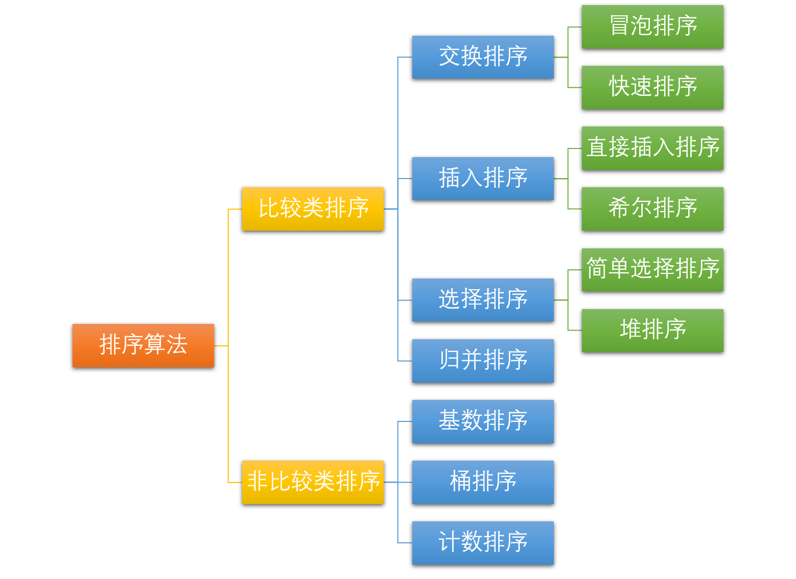

# 数据结构和算法

## 红黑树

**红黑树（Red Black Tree）**是一种自平衡二叉查找树。由于其自平衡的特性，保证了**最坏情形下在 O(logn) 时间复杂度**内完成查找、增加、删除等操作，性能表现稳定。在 JDK 中，`TreeMap`、`TreeSet` 以及 JDK1.8 的 `HashMap` 底层都用到了红黑树。**红黑树的提出是解决二叉查找树退化成O(n)**

叉查找树有一个很大的问题，就是它的形状取决于节点插入的顺序。如果**节点是按照升序或降序的方式插入的**，那么二叉查找树就会退化成一个线性结构，也就是一个链表。这样的情况下，二叉查找树的性能就会大大降低，**时间复杂度就会从 O(logn) 变为 O(n)**。红黑树的诞生就是为了解决二叉查找树的缺陷，因为二叉查找树在某些情况下会退化成一个线性结构。

- 根节点的黑色的，叶节点是不存储数据的黑色空节点
- 任何相邻的两个节点不能同时为红色
- 任意节点到其可到达的叶节点间包含相同数量的黑色节点

正是这些特点才保证了红黑树的平衡，让红黑树的高度不会超过 2log(n+1)。

**问题**：由于读取磁盘的速度受IO次数的影响，红黑树是二叉树，每个根节点只能有两个孩子，导致树会很高，树高影响IO次数

## B树

B-树是一种多路自平衡的搜索树（B树是**一颗多路平衡查找树**），**B树的提出是解决红黑树是二叉树，树高的问题**。

B-树有如下特点:

1. 所有键值分布在整颗树中（索引值和具体data都在每个节点里）；
2. 任何一个关键字出现且只出现在一个结点中；
3. 搜索有可能在非叶子结点结束（最好情况O(1)就能找到数据）；
4. 在关键字全集内做一次查找,性能逼近二分查找；

**问题**：B树在一定程度上降低了树高，但是由于每个节点不仅会存储关键字k以及对应的孩子指针，还是存储关键字对应的数据，会占据内存，导致磁盘中存储单元（页）不能存储更多的关键字。

## B+树

B+树是B-树的变体，也是一种多路搜索树, **B+树的提出是解决内存交互问题，操作系统一次读取一页，如果非叶节点保存了数据导致一页中包含的数据个数减少，这样导致了同样次数的IO，B树能查询的数据总量没有B+树高**，它与 B- 树的不同之处在于:

1. 所有关键字存储在叶子节点出现,内部节点(非叶子节点并不存储真正的 data)
2. 为所有叶子结点增加了一个链指针

**B+树内节点不存储数据，所有 data 存储在叶节点导致查询时间复杂度固定为 log n**

**B+树叶节点两两相连可大大增加区间访问性，可使用在范围查询**

**B+树可以很好的利用局部性原理，我们可以利用磁盘预读原理提前将这些数据读入内存，减少了磁盘 IO 的次数。**

## 布隆过滤器

一个名叫 Bloom 的人提出了一种来检索元素是否在给定大集合中的数据结构，这种数据结构是高效且性能很好的，但缺点是具有一定的错误识别率和删除难度。并且，理论情况下，添加到集合中的元素越多，误报的可能性就越大。**布隆过滤器主要是为了解决海量数据的存在性问题。**

**原理**

- 加入元素
  1. 使用布隆过滤器中的哈希函数对元素值进行计算，得到哈希值（有几个哈希函数得到几个哈希值）。
  2. 根据得到的哈希值，在位数组中把对应下标的值置为 1。
- 判断是否存在
  1. 对给定元素再次进行相同的哈希计算；
  2. 得到值之后判断位数组中的每个元素是否都为 1，如果值都为 1，那么说明这个值在布隆过滤器中，如果存在一个值不为 1，说明该元素不在布隆过滤器中。

**布隆过滤器说某个元素存在，小概率会误判。布隆过滤器说某个元素不在，那么这个元素一定不在。**

## 排序

冒泡排序：两两比较，如果顺序不对就交换，这样每一轮最后一个位置的元素就确定下来。由于只有两者顺序不对才交换，故而是稳定的。

选择排序：每次选择最小的元素和未排序的第一个元素交换，**是不稳定的**。 例如 5  5  6  3 。第一次交换3和第一个5交换。

插入排序： 每次选择一个未排序的元素，然后从已排序的排序从后向前扫描，不断交换，直到前面的元素小于大于该元素。  是稳定的

希尔排序：对数组使用希尔增量进行分组（0,0+希尔增量，0+2*希尔增量...），然后对每一组使用插入排序，希尔增量减半，直到希尔增量为0。 不稳定。  时间复杂度O(nlogn)

归并排序：将已有序的子序列合并，得到完全有序的序列；即先使每个子序列有序，再使子序列段间有序。若将两个有序表合并成一个有序表，称为 2 - 路归并。稳定

快速排序：快速排序使用分治法策略来把一个序列分为较小和较大的 2 个子序列，然后递归地排序两个子序列，**不稳定**

堆排序：不稳定