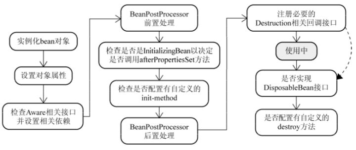

# 框架

## Spring

### Spring,Spring MVC,Spring Boot 三者的关系？

**Spring** 包含了多个功能模块（上面刚刚提到过），其中最重要的是 Spring-Core（主要提供 IoC 依赖注入功能的支持） 模块， Spring 中的其他模块（比如 Spring MVC）的功能实现基本都需要依赖于该模块。

**Spring MVC** 是 Spring 中的一个很重要的模块，主要赋予 Spring 快速构建 MVC 架构的 Web 程序的能力。MVC 是模型(Model)、视图(View)、控制器(Controller)的简写，其核心思想是通过将业务逻辑、数据、显示分离来组织代码。

**Spring Boot** 旨在简化 Spring 开发（减少配置文件，开箱即用）。使用 Spring 进行开发各种配置过于麻烦比如开启某些 Spring 特性时，需要用 XML 或 Java 进行显式配置。于是，Spring Boot 诞生了！

### Spring Ioc

**IoC（Inversion of Control:控制反转）** 是一种设计思想，而不是一个具体的技术实现。IoC 的思想就是将原本在程序中手动创建对象的控制权，交由 Spring 框架来管理。


在 Spring 中， IoC 容器是 Spring 用来实现 IoC 的载体， IoC 容器实际上就是个 Map（key，value），Map 中存放的是各种对象。将对象之间的相互依赖关系交给 IoC 容器来管理，并由 IoC 容器完成对象的注入。

### Spring Bean

Bean 代指的就是那些被 IoC 容器所管理的对象。

#### **将一个类声明为Bean的注解**

- `@Component`：通用的注解，可标注任意类为 `Spring` 组件。如果一个 Bean 不知道属于哪个层，可以使用`@Component` 注解标注。
- `@Repository` : 对应持久层即 Dao 层，主要用于数据库相关操作。
- `@Service` : 对应服务层，主要涉及一些复杂的逻辑，需要用到 Dao 层。
- `@Controller` : 对应 Spring MVC 控制层，主要用于接受用户请求并调用 `Service` 层返回数据给前端页面。

**`@Component`和`@Bean`的区别**

- `@Component` 注解作用于类，而`@Bean`注解作用于方法。
- `@Component`通常是通过类路径扫描来自动侦测以及自动装配到 Spring 容器中。`@Bean` 注解通常是我们在标有该注解的方法中定义产生这个 bean,`@Bean`告诉了 Spring 这是某个类的实例，当我需要用它的时候还给我。
- `@Bean` 注解比 `@Component` 注解的自定义性更强，而且很多地方我们只能通过 `@Bean` 注解来注册 bean。比如当我们引用第三方库中的类需要装配到 `Spring`容器时，则只能通过 `@Bean`来实现。

#### **注入Bean的注解**

Spring 内置的 `@Autowired` 以及 JDK 内置的 `@Resource` 和 `@Inject` 都可以用于注入 Bean。

- `@Autowired` 是 Spring 提供的注解，`@Resource` 是 JDK 提供的注解。
- `Autowired` 默认的注入方式为`byType`（根据类型进行匹配），`@Resource`默认注入方式为 `byName`（根据名称进行匹配）。
- 当一个接口存在多个实现类的情况下，`@Autowired` 和`@Resource`都需要通过名称才能正确匹配到对应的 Bean。`Autowired` 可以通过 `@Qualifier` 注解来显式指定名称，`@Resource`可以通过 `name` 属性来显式指定名称。
- `@Autowired` 支持在构造函数、方法、字段和参数上使用。`@Resource` 主要用于字段和方法上的注入，不支持在构造函数或参数上使用。

#### Bean的作用域

- **singleton** : IoC 容器中只有唯一的 bean 实例。Spring 中的 bean 默认都是单例的，是对单例设计模式的应用。
- **prototype** : 每次获取都会创建一个新的 bean 实例。也就是说，连续 `getBean()` 两次，得到的是不同的 Bean 实例。
- **request** （仅 Web 应用可用）: 每一次 HTTP 请求都会产生一个新的 bean（请求 bean），该 bean 仅在当前 HTTP request 内有效。
- **session** （仅 Web 应用可用） : 每一次来自新 session 的 HTTP 请求都会产生一个新的 bean（会话 bean），该 bean 仅在当前 HTTP session 内有效。
- **application/global-session** （仅 Web 应用可用）：每个 Web 应用在启动时创建一个 Bean（应用 Bean），该 bean 仅在当前应用启动时间内有效。
- **websocket** （仅 Web 应用可用）：每一次 WebSocket 会话产生一个新的bean。

#### Bean是线程安全的吗？

Spring 框架中的 Bean 是否线程安全，取决于其作用域和状态。

- prototype 作用域下，每次获取都会创建一个新的 bean 实例，不存在资源竞争问题，所以不存在线程安全问题。

- singleton 作用域下，IoC 容器中只有唯一的 bean 实例，可能会存在资源竞争问题（取决于 Bean 是否有状态）。如果这个 bean 是有状态的话，那就存在线程安全问题（有状态 Bean 是指包含可变的成员变量的对象）。

  对于有状态单例 Bean 的线程安全问题，常见的有两种解决办法：

  1. 在 Bean 中尽量避免定义可变的成员变量。
  2. 在类中定义一个 `ThreadLocal` 成员变量，将需要的可变成员变量保存在 `ThreadLocal` 中（推荐的一种方式）。

#### Bean的生命周期

实例化 -> 属性赋值 -> 初始化 -> 销毁



### Spring AOP

AOP（Aspect-Oriented Programming，面向切面编程）是一种编程技术，它允许开发者在不改变现有代码的情况下，增加新的功能或行为，这些功能或行为被称为“切面”。AOP 可以通过预编译方式和运行期动态代理的方式来实现，它的主要目的是降低业务逻辑的耦合性，提高程序的可重用性和开发效率。AOP 常用于统一功能的处理，例如：事务管理、日志记录、权限检查等功能。

使用 AOP 的主要原因有以下几点：

1. **模块化**：通过将公共行为（如日志记录、事务管理）提取为独立的切面，可以使代码更加模块化，提高代码的可维护性和可读性。
2. **减少重复代码**：通过使用 AOP，可以将重复的代码（如日志记录、权限检查）提取到一个切面中，避免在多个地方重复编写相同的代码。
3. **解耦**：AOP 允许开发者将业务逻辑与横切关注点（如日志记录、事务管理）分离，从而降低业务逻辑的耦合性，提高程序的可重用性和可扩展性。


AOP 可以将**横切关注点**（如日志记录、事务管理、权限控制、接口限流、接口幂等等）从 **核心业务逻辑（core concerns，核心关注点）** 中分离出来，实现关注点的分离。

Spring AOP 就是基于**动态代理**的。


- 切面（ASPECT）：切面，切面由切点和通知组成，是一个类。
- 切入点（PointCut）：每个切入点包括多个连接点，是连接点的集合。
- 连接点（JointPoint）：与切入点匹配的执行点，即你想要切入的函数方法。
- 通知（Advice）：切面必须要完成的工作。即，它是类中的一个方法。
- 目标（Target）：被通知对象。
- 代理（Proxy）：向目标对象应用通知之后创建的对象。

**通知的分类**

- 前置通知：在我们执行目标方法之前运行（**@Before**）
- 后置通知：在我们目标方法运行结束之后，不管有没有异常（**@After**）
- 返回通知：在我们的目标方法正常返回值后运行（**@AfterReturning**）
- 异常通知：在我们的目标方法出现异常后运行（**@AfterThrowing**）
- 环绕通知：目标方法的调用由环绕通知决定，即你可以决定是否调用目标方法，joinPoint.procced()就是执行目标方法的代码 。环绕通知可以控制返回对象(**@Around**)


**具体的实现**


## Spring MVC

### 核心组件

- **`DispatcherServlet`**：**核心的中央处理器**，负责接收请求、分发，并给予客户端响应。
- **`HandlerMapping`**：**处理器映射器**，根据 URL 去匹配查找能处理的 `Handler` ，并会将请求涉及到的拦截器和 `Handler` 一起封装。
- **`HandlerAdapter`**：**处理器适配器**，根据 `HandlerMapping` 找到的 `Handler` ，适配执行对应的 `Handler`；
- **`Handler`**：**请求处理器**，处理实际请求的处理器。
- **`ViewResolver`**：**视图解析器**，根据 `Handler` 返回的逻辑视图 / 视图，解析并渲染真正的视图，并传递给 `DispatcherServlet` 响应客户端

### 工作原理


1. 客户端（浏览器）发送请求， `DispatcherServlet`拦截请求。
2. `DispatcherServlet` 根据请求信息调用 `HandlerMapping` 。`HandlerMapping` 根据 URL 去匹配查找能处理的 `Handler`（也就是我们平常说的 `Controller` 控制器） ，并会将请求涉及到的拦截器和 `Handler` 一起封装。
3. `DispatcherServlet` 调用 `HandlerAdapter`适配器执行 `Handler` 。
4. `Handler` 完成对用户请求的处理后，会返回一个 `ModelAndView` 对象给`DispatcherServlet`，`ModelAndView` 顾名思义，包含了数据模型以及相应的视图的信息。`Model` 是返回的数据对象，`View` 是个逻辑上的 `View`。
5. `ViewResolver` 会根据逻辑 `View` 查找实际的 `View`。
6. `DispaterServlet` 把返回的 `Model` 传给 `View`（视图渲染）。
7. 把 `View` 返回给请求者（浏览器）

### 统一异常处理

推荐使用注解的方式统一异常处理，具体会使用到 `@ControllerAdvice` + `@ExceptionHandler` 这两个注解 。

```java
@ControllerAdvice
@ResponseBody
public class GlobalExceptionHandler {

    @ExceptionHandler(BaseException.class)
    public ResponseEntity<?> handleAppException(BaseException ex, HttpServletRequest request) {
      //......
    }

    @ExceptionHandler(value = ResourceNotFoundException.class)
    public ResponseEntity<ErrorReponse> handleResourceNotFoundException(ResourceNotFoundException ex, HttpServletRequest request) {
      //......
    }
}
```
`ExceptionHandlerMethodResolver` 中 `getMappedMethod` 方法决定了异常具体被哪个被 `@ExceptionHandler` 注解修饰的方法处理异常。源代码看出：**`getMappedMethod()`会首先找到可以匹配处理异常的所有方法信息，然后对其进行从小到大的排序，最后取最小的那一个匹配的方法(即匹配度最高的那个)。**

### Spring中的设计模式

- **工厂设计模式** : Spring 使用工厂模式通过 `BeanFactory`、`ApplicationContext` 创建 bean 对象。
- **代理设计模式** : Spring AOP 功能的实现。
- **单例设计模式** : Spring 中的 Bean 默认都是单例的。
- **模板方法模式** : Spring 中 `jdbcTemplate`、`hibernateTemplate` 等以 Template 结尾的对数据库操作的类，它们就使用到了模板模式。
- **包装器设计模式** : 我们的项目需要连接多个数据库，而且不同的客户在每次访问中根据需要会去访问不同的数据库。这种模式让我们可以根据客户的需求能够动态切换不同的数据源。
- **观察者模式:** Spring 事件驱动模型就是观察者模式很经典的一个应用。
- **适配器模式** : Spring AOP 的增强或通知(Advice)使用到了适配器模式、spring MVC 中也是用到了适配器模式适配`Controller`。

### Spring 事务

**Spring中管理事务的方式**

- **编程式事务**：在代码中硬编码(在分布式系统中推荐使用) : 通过 `TransactionTemplate`或者 `TransactionManager` 手动管理事务，事务范围过大会出现事务未提交导致超时，因此事务要比锁的粒度更小。
- **声明式事务**：在 XML 配置文件中配置或者直接基于注解（单体应用或者简单业务系统推荐使用） : 实际是通过 AOP 实现（基于`@Transactional` 的全注解方式使用最多）

**隔离级别**

- **`TransactionDefinition.ISOLATION_DEFAULT`** :使用后端数据库默认的隔离级别，MySQL 默认采用的 `REPEATABLE_READ` 隔离级别 Oracle 默认采用的 `READ_COMMITTED` 隔离级别.
- **`TransactionDefinition.ISOLATION_READ_UNCOMMITTED`** :最低的隔离级别，使用这个隔离级别很少，因为它允许读取尚未提交的数据变更，**可能会导致脏读、幻读或不可重复读**
- `TransactionDefinition.ISOLATION_READ_COMMITTED` : 允许读取并发事务已经提交的数据，**可以阻止脏读，但是幻读或不可重复读仍有可能发生**
- `TransactionDefinition.ISOLATION_REPEATABLE_READ` : 对同一字段的多次读取结果都是一致的，除非数据是被本身事务自己所修改，**可以阻止脏读和不可重复读，但幻读仍有可能发生。**
- `TransactionDefinition.ISOLATION_SERIALIZABLE` : 最高的隔离级别，完全服从 ACID 的隔离级别。所有的事务依次逐个执行，这样事务之间就完全不可能产生干扰，也就是说，**该级别可以防止脏读、不可重复读以及幻读**。但是这将严重影响程序的性能。通常情况下也不会用到该级别。

#### 事务传播行为

事务传播行为（propagation behavior）指的就是当一个事务方法被另一个事务方法调用时，这个事务方法应该如何进行。

正常来说有几种解决方案：

1. 融入事务：内层事务融入到外层事务中。问题：内层事务的错误会引起外层事务的回滚。
2. 挂起事务：可以开启两个连接，一个执行外层事务一个执行内层事务，互不影响，执行到内层事务的时候把外层事务挂起新起连接去执行内层事务，内层事务执行完了再唤醒外层事务执行。
3. 嵌套事务：MySQL中可以通过给内层事务加savepoint（保存点的方式）和rollback去模拟嵌套事务，把内层设置成伪事务。


spring中的事务传播行为：（A表示外层事务，B表示内层事务）

1. PROPAGATION\_REQUIRED（需要）：如果存在一个事务，则支持当前事务。如果没有事务则开启一个新的事务。（A如果存在事务，则B融入A事务，如果没有则新起一个事务）大部分的修改操作使用
2. PROPAGATION\_SUPPORTS（支持）：如果存在一个事务，支持当前事务。如果没有事务，则非事务的执行。（A有，则B融入，A没有，则非事务执行）大部分的查询操作
3. PROPAGATION\_MANDATORY（强制性）：如果已经存在一个事务，支持当前事务。如果没有一个活动的事务，则抛出异常。（A有，则B融入，A没有，则抛异常）
4. PROPAGATION\_NEVER（从不）：总是非事务地执行，如果存在一个活动事务，则抛出异常。（A有，则抛异常）
5. PROPAGATION\_REQUIRES\_NEW（需要新的）：如果一个事务已经存在，则先将这个存在的事务挂起。如果没有，则新起一个事务执行。（A有，则B挂起执行，A没有则新起一个事务）
6. PROPAGATION\_NOT\_SUPPORTED（不支持）：总是非事务地执行，并挂起任何存在的事务。（A有，则挂起B非事务执行）
7. PROPAGATION\_NESTED（嵌套的）：如果一个活动的事务存在，则运行在一个嵌套的事务中。 如果没有活动事务, 则按TransactionDefinition.PROPAGATION\_REQUIRED 属性执行。（A有，则B用savapoint方式嵌套执行，A没有，则自己开启一个事务）


## SpringBoot

Spring Boot是一个开源的Java-based框架，用来简化Spring应用程序的创建和部署。它是Spring平台和第三方库的集成，可以让你很容易的创建出独立的、生产级别的、基于Spring框架的应用。

### SpringBoot中的核心功能

1. **自动配置（Auto-configuration）**：Spring Boot自动配置Spring上下文
2. **起步依赖（Starter Dependencies）**：为了简化构建配置，Spring Boot提供了一系列的“起步依赖”，这些依赖将常用的库聚合在一起。例如，`spring-boot-starter-web`会包含构建web应用所需的所有组件。
3. **命令行界面（CLI）**：Spring Boot CLI（命令行界面）允许你用Groovy编写应用，这是一种JVM上的动态语言，它简化了脚本的编写和Spring Boot应用的运行。
4. **Actuator**：Spring Boot Actuator提供生产级别的功能，如监控和管理应用程序。它允许你查看应用的各种度量指标、健康状态、环境信息等。
5. **日志和监控**：Spring Boot内置了多种日志框架的支持，并且提供了一个统一的日志记录接口。此外，你可以集成如Prometheus、Grafana等工具进行应用监控。
6. **外部化配置**：Spring Boot允许你通过外部配置文件（如application.properties或application.yml）来配置你的应用。这让你可以根据不同的环境，如开发、测试、生产等，来调整配置而无需改动代码。
7. **安全**：如果你加入`spring-boot-starter-security`依赖，Spring Boot会自动配置Spring Security，提供认证和授权支持。
8. **数据访问**：Spring Boot简化了与SQL和NoSQL数据库的交互。它通过整合Spring Data提供了对JPA、MongoDB、Redis等的支持。
9. **事务管理**：Spring Boot管理事务，支持声明式事务，简化了事务代码的编写。
10. **内嵌服务器**：提供了Tomcat、Jetty或Undertow服务器的自动配置，无需部署war文件，可以打包为独立的jar运行。
11. **Web开发**：提供了Spring MVC的自动配置，支持创建RESTful APIs、服务器端渲染的Web应用等。
12. **测试**：通过`spring-boot-starter-test`提供了测试支持，包括JUnit、Spring Test & Spring Boot Test、AssertJ、Hamcrest和Mockito。

### 自动配置

SpringBoot 定义了一套接口规范，这套规范规定：SpringBoot 在启动时会扫描外部引用 jar 包中的`META-INF/spring.factories`文件，将文件中配置的类型信息加载到 Spring 容器（此处涉及到 JVM 类加载机制与 Spring 的容器知识），并执行类中定义的各种操作。对于外部 jar 来说，只需要按照 SpringBoot 定义的标准，就能将自己的功能装置进 SpringBoot。

## 注解辨析

### @Autowired和@Resource

@Autowired注解是Spring提供的，而@Resource注解是J2EE本身提供的

@Autowird默认的注入方式为byType，当通过byType找不到时，用byName找。配合@Qualifier注解来显式指定name值

@Resource默认通过byName注入，当通过byName找不到时，byType找。@Resource还有两个重要的属性：**name和type，用来显式指定byName和byType方式注入**


### @RestController

@RestController注解相当于**@ResponseBody和@Controller**的结合,那么在这里就大致介绍一下这两个注解的作用；

**@ResponseBody**
在实际操作中我们只需要在Controller层使用@RequestBody注解就可以将对象进行反序列化；而若需要对Controller的方法进行**序列化**，我们需要在返回值上使用@ResponseBody；也可以将@ResponseBody注解在Controller类上，这样可以将这个类中所有的方法序列化。

**@Controller**
@Controller是一种特殊化的@Component类，在实际操作中**@Controller用来表示Spring某个类是否可以接受HTTP请求**，她通常与@ResponseBody绑定使用。

**@Component**
1.把普通POJO（Plain Ordinary Java Object简单的java对象）实例化到spring容器中，相当于配置文件中的<bean id="" class=""/>
2.泛指组件，当组件不好归类的时候，可以使用@Component注解进行标注

### @RequestBody和@RequestParam()

**RequestBody**主要用来接收前端传递给后端的json字符串中的数据的(请求体中的数据的)；使用@RequestBody接收数据时，一般用POST方式进行提交。@RequestBody最多只能有一个

**RequestParam**接收的是key-value里面的参数，可以有多个

