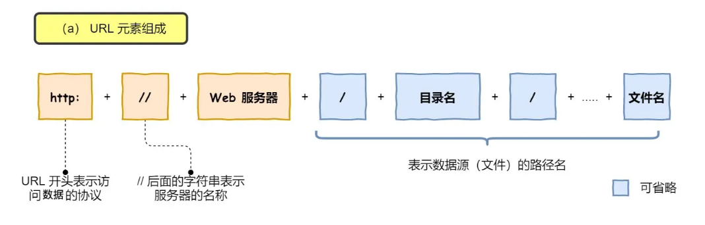
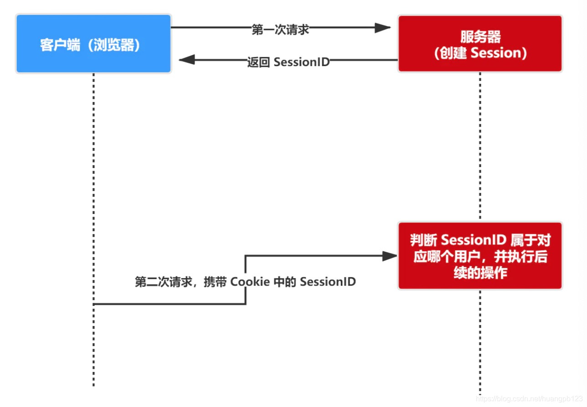
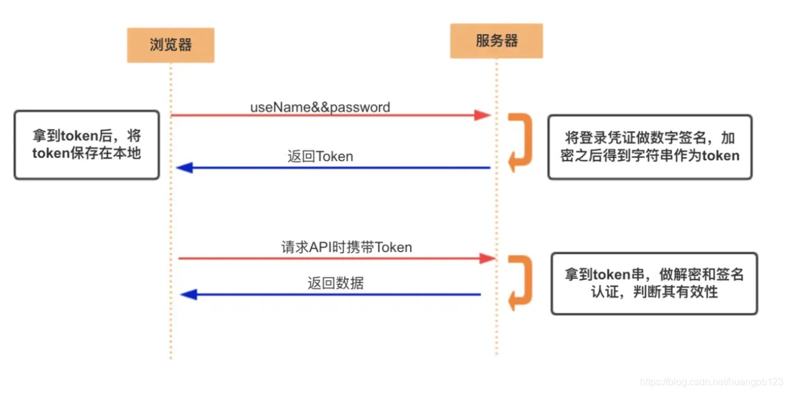
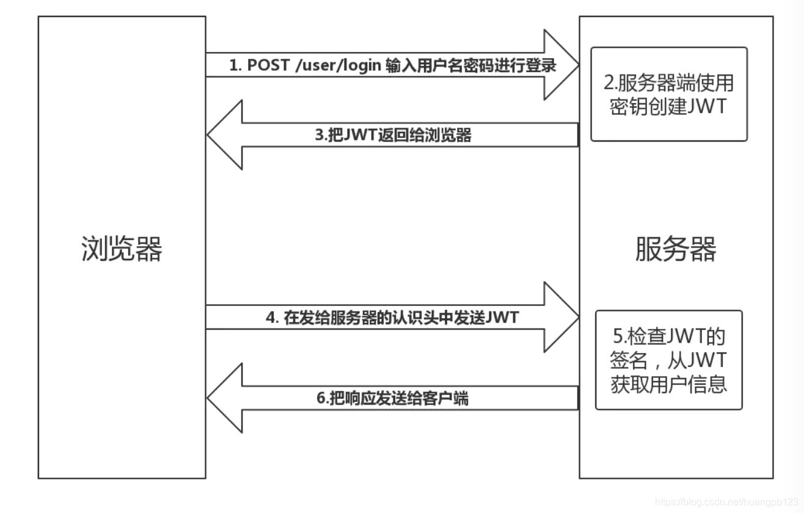
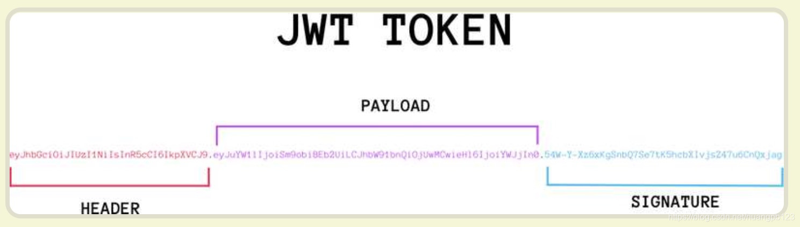
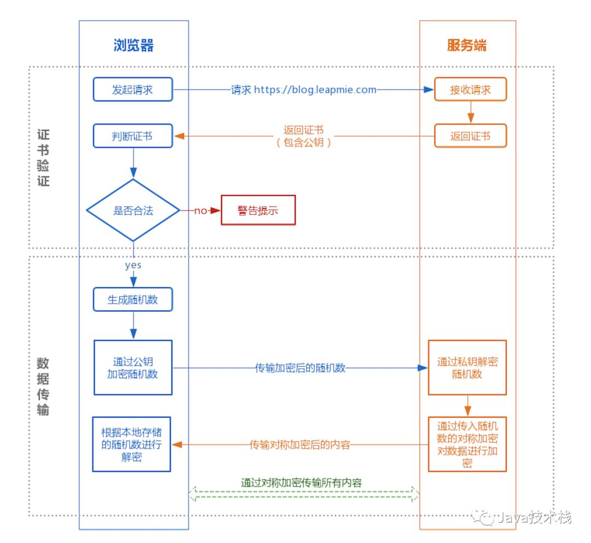
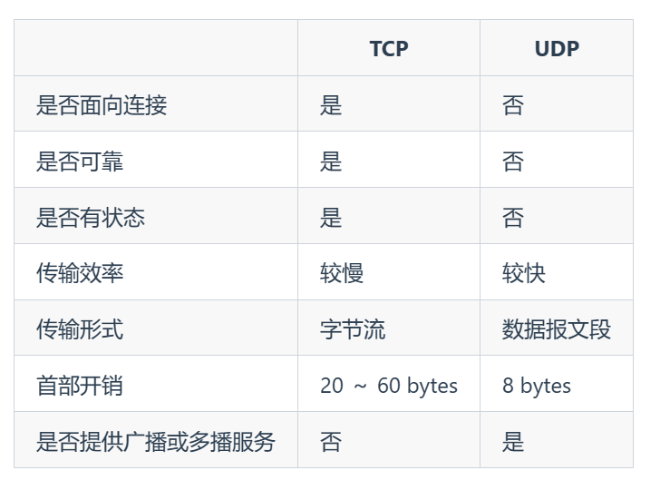
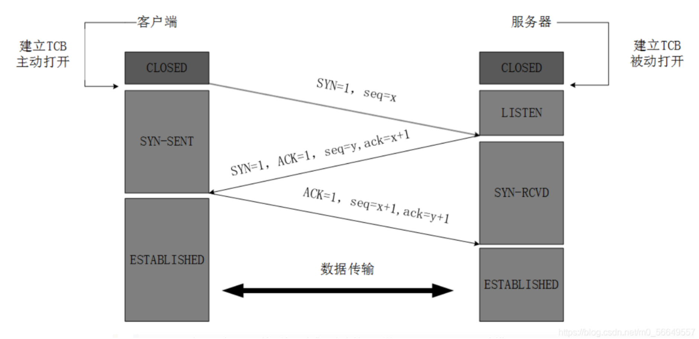
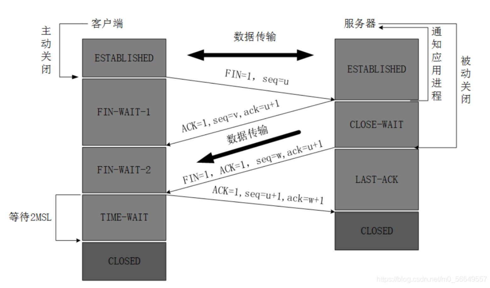
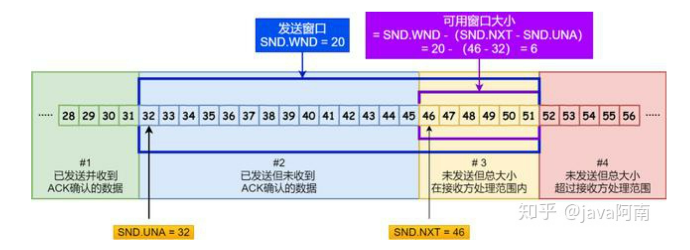

# 计算机网络

## 网络模型分层

**OSI七层模型**是国际标准化组织提出一个网络分层模型

**TCP/IP 四层模型** 是目前被广泛采用的一种模型，由以下 4 层组成：

1. 应用层
2. 传输层
3. 网络层
4. 网络接口层

我们并不能将 TCP/IP 四层模型 和 OSI 七层模型完全精确地匹配起来

**应用层**位于传输层之上，主要提供两个终端设备上的**应用程序**之间信息交换的服务，它定义了信息交换的格式，消息会交给下一层传输层来传输。 我们把应用层交互的数据单元称为报文。应用层协议定义了网络通信规则，对于不同的网络应用需要不同的应用层协议。在互联网中应用层协议很多，如支持 Web 应用的 HTTP 协议，支持电子邮件的 SMTP 协议等等。

- **HTTP（Hypertext Transfer Protocol，超文本传输协议）**：基于 TCP 协议，是一种用于传输超文本和多媒体内容的协议，主要是为 Web 浏览器与 Web 服务器之间的通信而设计的。当我们使用浏览器浏览网页的时候，我们网页就是通过 HTTP 请求进行加载的。
- **FTP（File Transfer Protocol，文件传输协议）** : 基于 TCP 协议，是一种用于在计算机之间传输文件的协议，可以屏蔽操作系统和文件存储方式。注意 ⚠️：FTP 是一种不安全的协议，因为它在传输过程中不会对数据进行加密。建议在传输敏感数据时使用更安全的协议，如 SFTP。
- **SSH（Secure Shell Protocol，安全的网络传输协议）**：基于 TCP 协议，通过加密和认证机制实现安全的访问和文件传输等业务
- **DNS（Domain Name System，域名管理系统）**: 基于 UDP 协议，用于解决域名和 IP 地址的映射问题。

**传输层**的主要任务就是负责向两台终端设备**进程之间**的通信提供通用的数据传输服务。 应用进程利用该服务传送应用层报文。“通用的”是指并不针对某一个特定的网络应用，而是多种应用可以使用同一个运输层服务。

- **TCP（Transmission Control Protocol，传输控制协议 ）**：提供 **面向连接** 的，**可靠** 的数据传输服务。
- **UDP（User Datagram Protocol，用户数据协议）**：提供 **无连接** 的，**尽最大努力** 的数据传输服务（不保证数据传输的可靠性），简单高效。

**网络层**负责为**分组交换网上的不同主机**提供通信服务。 在发送数据时，网络层把运输层产生的报文段或用户数据报封装成分组和包进行传送。在 TCP/IP 体系结构中，由于网络层使用 IP 协议，因此分组也叫 IP 数据报，简称数据报。网络层的还有一个任务就是选择**合适的路由**，使源主机运输层所传下来的分组，能通过网络层中的路由器找到目的主机。

- **IP（Internet Protocol，网际协议）**：TCP/IP 协议中最重要的协议之一，主要作用是定义数据包的格式、对数据包进行路由和寻址，以便它们可以跨网络传播并到达正确的目的地。目前 IP 协议主要分为两种，一种是过去的 IPv4，另一种是较新的 IPv6，目前这两种协议都在使用，但后者已经被提议来取代前者。
- **ARP（Address Resolution Protocol，地址解析协议）**：ARP 协议解决的是网络层地址和链路层地址之间的转换问题。因为一个 IP 数据报在物理上传输的过程中，总是需要知道下一跳（物理上的下一个目的地）该去往何处，但 IP 地址属于逻辑地址，而 MAC 地址才是物理地址，ARP 协议解决了 IP 地址转 MAC 地址的一些问题。

**网络接口层**看作是数据链路层和物理层的合体。

1. 数据链路层(data link layer)通常简称为链路层（ 两台主机之间的数据传输，总是在一段一段的链路上传送的）。**数据链路层的作用是将网络层交下来的 IP 数据报组装成帧，在两个相邻节点间的链路上传送帧。每一帧包括数据和必要的控制信息（如同步信息，地址信息，差错控制等）。**
2. **物理层的作用是实现相邻计算机节点之间比特流的透明传送，尽可能屏蔽掉具体传输介质和物理设备的差异**

### 为什么需要网络分层？

1. **各层之间相互独立**：各层之间相互独立，各层之间不需要关心其他层是如何实现的，只需要知道自己如何调用下层提供好的功能就可以了（可以简单理解为接口调用）**。这个和我们对开发时系统进行分层是一个道理。**
2. **提高了整体灵活性**：每一层都可以使用最适合的技术来实现，你只需要保证你提供的功能以及暴露的接口的规则没有改变就行了。这个和我们平时开发系统的时候要求的**高内聚、低耦合**的原则也是可以对应上的。
3. 大问题化小**：分层可以将复杂的网络问题分解为许多比较小的、界线比较清晰简单的小问题来处理和解决。这样使得复杂的计算机网络系统变得易于设计，实现和标准化。 **这个和我们平时开发的时候，一般会将系统功能分解，然后将复杂的问题分解为容易理解的更小的问题是相对应的，这些较小的问题具有更好的边界（目标和接口）定义。

## HTTP

HTTP 协议：Hyper Text Transfer Protocol（超文本传输协议）的缩写，是用于从万维网（WWW:World Wide Web ）服务器传输超文本到本地浏览器的传送协议。是应用层的协议。

### 从输入URL到页面展示发生了什么？

1. 在浏览器中输入指定网页的 URL。
2. 浏览器通过 DNS 协议，获取域名对应的 IP 地址。
3. 浏览器根据 IP 地址和端口号，向目标服务器发起一个 TCP 连接请求。
4. 浏览器在 TCP 连接上，向服务器发送一个 HTTP 请求报文，请求获取网页的内容。
5. 服务器收到 HTTP 请求报文后，处理请求，并返回 HTTP 响应报文给浏览器。
6. 浏览器收到 HTTP 响应报文后，解析响应体中的 HTML 代码，渲染网页的结构和样式，同时根据 HTML 中的其他资源的 URL（如图片、CSS、JS 等），再次发起 HTTP 请求，获取这些资源的内容，直到网页完全加载显示。
7. 浏览器在不需要和服务器通信时，可以主动关闭 TCP 连接，或者等待服务器的关闭请求。

**应用层**

- 解析URL

  

- DNS（Domain Name System）域名系统，要解决的是 **域名和 IP 地址的映射问题**

  - 根 DNS 服务器。根 DNS 服务器提供 TLD 服务器的 IP 地址。目前世界上只有 13 组根服务器，我国境内目前仍没有根服务器。

  - 顶级域 DNS 服务器（TLD 服务器）。顶级域是指域名的后缀，如`com`、`org`、`net`和`edu`等。国家也有自己的顶级域，如`uk`、`fr`和`ca`。TLD 服务器提供了权威 DNS 服务器的 IP 地址。

  - 权威 DNS 服务器。在因特网上具有公共可访问主机的每个组织机构必须提供公共可访问的 DNS 记录，这些记录将这些主机的名字映射为 IP 地址。

  - 本地 DNS 服务器。每个 ISP（互联网服务提供商）都有一个自己的本地 DNS 服务器。当主机发出 DNS 请求时，该请求被发往本地 DNS 服务器，它起着代理的作用，并将该请求转发到 DNS 层次结构中。严格说来，不属于 DNS 层级结构。

    查询IP地址分为**递归和迭代**查询。迭代是本地服务器依次请求根、顶级、权威DNS服务器；递归是按照本地、根、顶级、权威的顺序依次查询。

- HTTP/HTTPS，利用 DNS 拿到了目标主机的 IP 地址之后，浏览器便可以向目标 IP 地址发送 HTTP 报文，请求需要的资源了。在这里，根据目标网站的不同，请求报文可能是 HTTP 协议或安全性增强的 HTTPS 协议

**传输层**

由于 HTTP 协议是基于 TCP 协议的，在应用层的数据封装好以后，要交给传输层，经 TCP 协议继续封装。TCP 协议保证了数据传输的可靠性，是数据包传输的主力协议。

**网络层**

此时我们的主机不再是和另一台主机进行交互了，而是在和中间系统进行交互。也就是说，应用层和传输层都是端到端的协议，而网络层及以下都是中间件的协议了。**网络层的的核心功能——转发与路由**

- 转发：将分组从路由器的输入端口转移到合适的输出端口。
- 路由：确定分组从源到目的经过的路径。

### 常见HTTP状态码

### HTTP和HTTPS的区别

- **端口号**：HTTP 默认是 80，HTTPS 默认是 443。
- **URL 前缀**：HTTP 的 URL 前缀是 `http://`，HTTPS 的 URL 前缀是 `https://`。
- **安全性和资源消耗**：HTTP 协议运行在 TCP 之上，所有传输的内容都是明文，客户端和服务器端都无法验证对方的身份。HTTPS 是运行在 SSL/TLS 之上的 HTTP 协议，SSL/TLS 运行在 TCP 之上。所有传输的内容都经过加密，加密采用对称加密，但对称加密的密钥用服务器方的证书进行了非对称加密。所以说，HTTP 安全性没有 HTTPS 高，但是 HTTPS 比 HTTP 耗费更多服务器资源。
-    **SEO（搜索引擎优化）**：搜索引擎通常会更青睐使用 HTTPS 协议的网站，因为 HTTPS 能够提供更高的安全性和用户隐私保护。使用 HTTPS 协议的网站在搜索结果中可能会被优先显示，从而对 SEO 产生影响。

### Cookie、Session、Token和JWT

**Cookie**

`Cookie` 最开始被设计出来是为了弥补`HTTP`在**状态管理上的不足**。`HTTP` 协议是一个无状态协议。无状态是指每一次的连接都是一次全新的，不知道之前连接的信息。

- **cookie 存储在客户端：** cookie 是服务器发送到用户浏览器并保存在本地的一小块数据，它会在浏览器下次向同一服务器再发起请求时被携带并发送到服务器上。因此，服务端脚本就可以读、写存储在客户端的cookie的值。
- **cookie 是不可跨站的：** 每个 cookie 都绑定在特定的域名下（绑定域名下的子域都是有效的），无法在别的域名下获取使用，**同域名不同端口也允许共享**。

**Session**

session 是另一种记录服务器和客户端会话状态的机制，session 是基于 cookie 实现的，session 存储在服务器端，sessionId 会被存储到客户端的cookie 中。

**Token**

Token 是访问接口（API）时所需要的资源凭证。

**Token 和 Session 的区别**

- Session 是一种记录服务器和客户端会话状态的机制，**使服务端有状态化，可以记录会话信息**。而 Token 是令牌，访问资源接口（API）时所需要的资源凭证。**Token 使服务端无状态化，不会存储会话信息**。
- Session 和 Token 并不矛盾，作为身份认证 Token 安全性比 Session 好，因为每一个请求都有签名还能防止监听以及重复攻击，而 Session 就必须依赖链路层来保障通讯安全了。如果你需要实现有状态的会话，仍然可以增加 Session 来在服务器端保存一些状态。
- 如果你的用户数据可能需要和第三方共享，或者允许第三方调用 API 接口，用 Token 。如果永远只是自己的网站，自己的 App，用什么就无所谓了。

**JWT**

JSON Web Token（简称 JWT）是目前最流行的**跨域认证**解决方案。是一种**认证授权机制**。无状态身份验证机制，一旦签发，在未过期之前不能阻止用户访问。

它是一个很长的字符串，中间用点（`.`）分隔成三个部分。JWT 的三个部分分别为Header（头部）Payload（负载）Signature（签名）

**Token 和 JWT 的区别**

相同：

- 都是访问资源的令牌

- 都可以记录用户的信息
- 都是使服务端无状态化
- 都是只有验证成功后，客户端才能访问服务端上受保护的资源

区别

- Token：服务端验证客户端发送过来的 Token 时，还需要查询数据库获取用户信息，然后验证 Token 是否有效。

- JWT： 将 Token 和 Payload 加密后存储于客户端，服务端只需要使用密钥解密进行校验（校验也是 JWT 自己实现的）即可，不需要查询或者减少查询数据库，因为 JWT 自包含了用户信息和加密的数据。

  

**使用 session 时需要考虑的问题**

- 将 session 存储在服务器里面，当用户同时在线量比较多时，这些 session 会占据较多的内存，需要在服务端定期的去清理过期的 session

- 当网站采用集群部署的时候，会遇到多台 web 服务器之间如何做 session 共享的问题。因为 session 是由单个服务器创建的，但是处理用户请求的服务器不一定是那个创建 session 的服务器，那么该服务器就无法拿到之前已经放入到 session 中的登录凭证之类的信息了。

- 当多个应用要共享 session 时，除了以上问题，还会遇到跨域问题，因为不同的应用可能部署的主机不一样，需要在各个应用做好 cookie 跨域的处理。

- sessionId 是存储在 cookie 中的，假如浏览器禁止 cookie 或不支持 cookie 怎么办？ 一般会把 sessionId 跟在 url 参数后面即重写 url，所以 session 不一定非得需要靠 cookie 实现

- 移动端对 cookie 的支持不是很好，而 session 需要基于 cookie 实现，所以移动端常用的是 token

  

### GET和POST的区别

- 语义（主要区别）：GET 通常用于获取或查询资源，而 POST 通常用于创建或修改资源。
- 幂等：GET 请求是幂等的，即多次重复执行不会改变资源的状态，而 POST 请求是不幂等的，即每次执行可能会产生不同的结果或影响资源的状态。
- 格式：GET 请求的参数通常放在 URL 中，形成查询字符串（querystring），而 POST 请求的参数通常放在请求体（body）中，可以有多种编码格式，如 application/x-www-form-urlencoded、multipart/form-data、application/json 等。GET 请求的 URL 长度受到浏览器和服务器的限制，而 POST 请求的 body 大小则没有明确的限制。不过，实际上 GET 请求也可以用 body 传输数据，只是并不推荐这样做，因为这样可能会导致一些兼容性或者语义上的问题。
- 缓存：由于 GET 请求是幂等的，它可以被浏览器或其他中间节点（如代理、网关）缓存起来，以提高性能和效率。而 POST 请求则不适合被缓存，因为它可能有副作用，每次执行可能需要实时的响应。
- 安全性：GET 请求和 POST 请求如果使用 HTTP 协议的话，那都不安全，因为 HTTP 协议本身是明文传输的，必须使用 HTTPS 协议来加密传输数据。另外，GET 请求相比 POST 请求更容易泄露敏感数据，因为 GET 请求的参数通常放在 URL 中。

## HTTPS

### 对称加密和非对称加密

**对称加密**：就是文件通过同样的密码进行加密和解密，由于秘钥需要给多个客户端，所以存在泄漏的风险

**非对称加密**：秘钥分为公钥和私钥，由于服务器需要把公钥发送出去，这时如果有人伪装是服务器发送的公钥，这时客户端用攻击者的公钥进行加密，攻击者就可以用自己的私钥来获取信息。**这就是公钥信赖性的问题**

**CA（证书颁发机构）**：CA机构对服务端S的公钥用自己的私钥进行加密颁发证书，每次通信前服务端会吧这个证书发送给客户端，操作系统内部存放着各个CA机构的公钥，浏览器可以利用操作系统存放的公钥对这个证书进行解密，获得签名来判断这个证书所附带的公钥是够是可以信任的，这样就避免了公钥信赖性的问题。

### 加密过程

HTTPS 在内容传输的加密上使用的是对称加密，非对称加密只作用在证书验证阶段。

## TCP和UDP

这两者都是传输层的协议。

### TCP和UDP的区别

**是否面向连接**：UDP 在传送数据之前不需要先建立连接。而 TCP 提供面向连接的服务，在传送数据之前必须先建立连接，数据传送结束后要释放连接。

**是否是可靠传输**：远地主机在收到 UDP 报文后，不需要给出任何确认，并且不保证数据不丢失，不保证是否顺序到达。TCP 提供可靠的传输服务，TCP 在传递数据之前，会有三次握手来建立连接，而且在数据传递时，有确认、窗口、重传、拥塞控制机制。通过 TCP 连接传输的数据，无差错、不丢失、不重复、并且按序到达。

**是否有状态**：这个和上面的“是否可靠传输”相对应。TCP 传输是有状态的，这个有状态说的是 TCP 会去记录自己发送消息的状态比如消息是否发送了、是否被接收了等等。为此 ，TCP 需要维持复杂的连接状态表。而 UDP 是无状态服务，简单来说就是不管发出去之后的事情了。

**传输效率**：由于使用 TCP 进行传输的时候多了连接、确认、重传等机制，所以 TCP 的传输效率要比 UDP 低很多。

**传输形式**：TCP 是面向字节流的，UDP 是面向报文的。

**首部开销**：TCP 首部开销（20 ～ 60 字节）比 UDP 首部开销（8 字节）要大。

**是否提供广播或多播服务**：TCP 只支持点对点通信，UDP 支持一对一、一对多、多对一、多对多；

- **UDP 一般用于即时通信**，比如：语音、 视频、直播等等。这些场景对传输数据的准确性要求不是特别高，比如你看视频即使少个一两帧，实际给人的感觉区别也不大。
- **TCP 用于对传输准确性要求特别高的场景**，比如文件传输、发送和接收邮件、远程登录等等。

### TCP 三次握手和四次挥手（传输层）

#### **三次握手**

- **第一次握手** TCP客户进程向服务器发出连接请求报文，这是报文首部中的同部位SYN=1，同时选择一个初始序列号 seq=x ，此时，TCP客户端进程进入了 SYN-SENT 同步已发送状态，**证明了客户端发送能力正常。**
- **第二次握手** TCP服务器收到请求报文后，如果同意连接，则会向客户端发出确认报文。确认报文中应该 ACK=1，SYN=1，确认号是ack=x+1，同时也要为自己初始化一个序列号 seq=y，此时，TCP服务器进程进入了 SYN-RCVD 同步收到状态，**证明服务端发送能力和接收能力均正常。**
- **第三次握手** TCP客户端收到确认后，还要向服务器给出确认。确认报文的ACK=1，ack=y+1，自己的序列号seq=x+1，此时，TCP连接建立，客户端进入ESTABLISHED已建立连接状态 触发三次握手，**证明了客户端接收能力正常**

**为什么不是两次握手？**

如果第一次握手的时候，客户端发送的SYN 包由于网络原因没有及时到达服务端，超时重传了新的SYN包，服务端接收到之后发送确认报文，两者建立起了连接；过了一段时间，旧的SYN包到达了服务端，服务端会认为是一个新的连接请求从而建立起新的连接，造成资源的浪费，如果是三次握手，就算旧的SYN包到达之后服务端发送了确认报文，客户端不会对该报文进行确认（客服端知道这个连接请求是过期的），从而不会建立起新的连接。

无法防止历史连接的建立，会造成双方资源的浪费，也无法可靠的同步双方序列号；

**为什么不是四次握手？**

三次握手就已经理论上最少可靠连接建立，所以不需要使用更多的通信次数。

#### **四次挥手**

- **第一次挥**手 客户端发出连接释放报文，并且停止发送数据。释放数据报文首部，FIN=1，其序列号为seq=u（等于前面已经传送过来的数据的最后一个字节的序号加1），此时，客户端进入FIN-WAIT-1（终止等待1）状态
- **第二次挥手** 服务器端接收到连接释放报文后，发出确认报文，ACK=1，ack=u+1，并且带上自己的序列号seq=v，此时，服务端就进入了CLOSE-WAIT 关闭等待状态
- **第三次挥手** 客户端接收到服务器端的确认请求后，客户端就会进入FIN-WAIT-2（终止等待2）状态，等待服务器发送连接释放报文，服务器将最后的数据发送完毕后，就向客户端发送连接释放报文，服务器就进入了LAST-ACK（最后确认）状态，等待客户端的确认
- **第四次挥手** 客户端收到服务器的连接释放报文后，必须发出确认，ACK=1，ack=w+1，而自己的序列号是seq=u+1，此时，客户端就进入了TIME-WAIT（时间等待）状态，但此时TCP连接还未终止，必须要经过2MSL后（最长报文寿命），客户端才会进入CLOSED关闭状态，服务器端接收到确认报文后，会立即进入CLOSED关闭状态，到这里TCP连接就断开了，四次挥手完成。

**为什么客户端要等待2MSL？**
主要原因是为了保证客户端发送那个的第一个ACK报文能到到服务器，因为这个ACK报文可能丢失，这样 服务端将会永远处于LAST-ACK（最后确认）状态，并且2MSL是任何报文在网络上存在的最长时间，超过这个时间报文将被丢弃，这样新的连接中不会出现旧连接的请求报文。

### TCP 传输可靠性保障（传输层）

#### TCP如何保证传输的可靠性？

1. **基于数据块传输**：应用数据被分割成 TCP 认为最适合发送的数据块，再传输给网络层，数据块被称为报文段或段。
2. **对失序数据包重新排序以及去重**：TCP 为了保证不发生丢包，就给每个包一个序列号，有了序列号能够将接收到的数据根据序列号排序，并且去掉重复序列号的数据就可以实现数据包去重。
3. **校验和** : TCP 将保持它首部和数据的检验和。这是一个端到端的检验和，目的是检测数据在传输过程中的任何变化。如果收到段的检验和有差错，TCP 将丢弃这个报文段和不确认收到此报文段。
4. **重传机制** : 在数据包丢失或延迟的情况下，重新发送数据包，直到收到对方的确认应答（ACK）。TCP 重传机制主要有：基于计时器的重传（也就是超时重传）、快速重传（基于接收端的反馈信息来引发重传）、SACK（在快速重传的基础上，返回最近收到的报文段的序列号范围，这样客户端就知道，哪些数据包已经到达服务器了）、D-SACK（重复 SACK，在 SACK 的基础上，额外携带信息，告知发送方有哪些数据包自己重复接收了）。
5. **流量控制** : TCP 连接的每一方都有固定大小的缓冲空间，TCP 的接收端只允许发送端发送接收端缓冲区能接纳的数据。当接收方来不及处理发送方的数据，能提示发送方降低发送的速率，防止包丢失。TCP 使用的流量控制协议是可变大小的滑动窗口协议（TCP 利用滑动窗口实现流量控制）。
6. **拥塞控制** : 当网络拥塞时，减少数据的发送。TCP 在发送数据的时候，需要考虑两个因素：一是接收方的接收能力，二是网络的拥塞程度。接收方的接收能力由滑动窗口表示，表示接收方还有多少缓冲区可以用来接收数据。网络的拥塞程度由拥塞窗口表示，它是发送方根据网络状况自己维护的一个值，表示发送方认为可以在网络中传输的数据量。发送方发送数据的大小是滑动窗口和拥塞窗口的最小值，这样可以保证发送方既不会超过接收方的接收能力，也不会造成网络的过度拥塞。

#### TCP如何实现流量控制？

**TCP 利用滑动窗口实现流量控制。流量控制是为了控制发送方发送速率，保证接收方来得及接收。** 接收方发送的确认报文中的窗口字段可以用来控制发送方窗口大小，从而影响发送方的发送速率。将窗口字段设置为 0，则发送方不能发送数据。

滑动窗口的大小是接收方决定的，发送方的窗口不可以大于接收方的窗口。

发送方只能将发送窗口内的数据发送出去，只有在收到ack之后才会移动窗口，发送下一批数据。

**为什么需要流量控制?** 这是因为双方在通信的时候，发送方的速率与接收方的速率是不一定相等，如果发送方的发送速率太快，会导致接收方处理不过来。如果接收方处理不过来的话，就只能把处理不过来的数据存在 **接收缓冲区(Receiving Buffers)** 里（失序的数据包也会被存放在缓存区里）。如果缓存区满了发送方还在狂发数据的话，接收方只能把收到的数据包丢掉。出现丢包问题的同时又疯狂浪费着珍贵的网络资源。因此，我们需要控制发送方的发送速率，让接收方与发送方处于一种动态平衡才好。

### TCP的拥塞控制如何实现的？

在某段时间，若对网络中某一资源的需求超过了该资源所能提供的可用部分，网络的性能就要变坏。这种情况就叫拥塞。拥塞控制就是为了防止过多的数据注入到网络中，这样就可以使网络中的路由器或链路不致过载。

为了进行拥塞控制，TCP 发送方要维持一个 **拥塞窗口(cwnd)** 的状态变量。拥塞控制窗口的大小取决于网络的拥塞程度，并且动态变化。发送方让自己的**发送窗口取为拥塞窗口和接收方的接受窗口中较小的一个**。

TCP 的拥塞控制采用了四种算法，即 **慢开始**、 **拥塞避免**、**快重传** 和 **快恢复**。

- **慢开始：** 慢开始算法的思路是当主机开始发送数据时，如果立即把大量数据字节注入到网络，那么可能会引起网络阻塞，因为现在还不知道网络的符合情况。经验表明，较好的方法是先探测一下，即由小到大逐渐增大发送窗口，也就是由小到大逐渐增大拥塞窗口数值。**cwnd 初始值为 1，每经过一个传播轮次，cwnd 加倍。**
- **拥塞避免：** 拥塞避免算法的思路是让拥塞窗口 cwnd 缓慢增大，即每经过一个往返时间 RTT 就把发送方的 **cwnd 加 1**.
- **快重传与快恢复：** 在 TCP/IP 中，快速重传和恢复（fast retransmit and recovery，FRR）是一种拥塞控制算法，它**能快速恢复丢失的数据包**。没有 FRR，如果数据包丢失了，TCP 将会使用定时器来要求传输暂停。在暂停的这段时间内，没有新的或复制的数据包被发送。**有了 FRR，如果接收方接收到一个不按顺序的数据段，它会立即给发送方发送一个重复确认。如果发送方接收到三个重复确认，它会假定确认件指出的数据段丢失了，并立即重传这些丢失的数据段。**有了 FRR，就不会因为重传时要求的暂停被耽误。 当有单独的数据包丢失时，快速重传和恢复（FRR）能最有效地工作。当有多个数据信息包在某一段很短的时间内丢失时，它则不能很有效地工作。**快恢复是指把拥塞窗口设置为当前的一半，并开始拥塞避免算法，一来是这是可能网络已经出现了拥塞，二来是这样比慢开始更快的讲丢失的报文送出**

## IP

**IP（Internet Protocol，网际协议）** 是 TCP/IP 协议中最重要的协议之一，属于网络层的协议，主要作用是**定义数据包的格式、对数据包进行路由和寻址**，以便它们可以跨网络传播并到达正确的目的地。

目前 IP 协议主要分为两种，一种是过去的 IPv4，另一种是较新的 IPv6，目前这两种协议都在使用，但后者已经被提议来取代前者。

