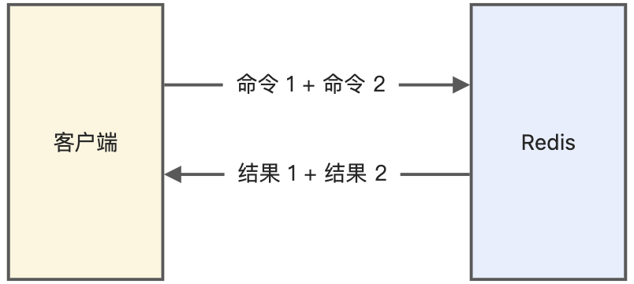
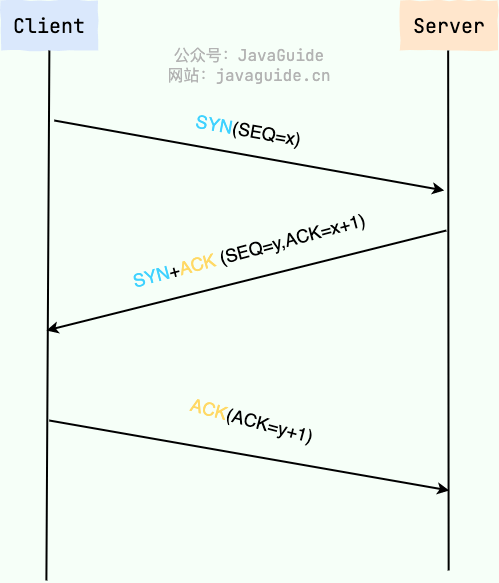

# Java基础

## JVM vs JDK vs JRE

- **JVM：**运行 Java 字节码的虚拟机。JVM 有针对不同系统的特定实现（Windows，Linux，macOS），目的是使用相同的字节码，它们都会给出相同的结果。

- **JDK：**功能齐全的 Java SDK，是提供给开发者使用，能够创建和编译 Java 程序的开发套件

- **JRE：**Java 运行时环境

  

## 集合

### 集合概述

集合主要由两大接口派生而来：`Collection` 接口和 `Map` 接口


###  List, Set, Queue, Map 区别

- List：存储的元素是**有序的、可重复**的。
- Set：存储的元素**不可重复**的。
- Queue：按特定的**排队规则**来确定先后顺序，存储的元素是**有序的、可重复**的。
- Map：使用**键值对**存储，key 是无序的、不可重复的，value 是无序的、可重复的，每个键最多映射到一个值。

### List

#### ArrayList 和 Array的区别

1. ArrayList会根据实际存储的元素动态地 **扩容或缩容**
2. ArrayList可以使用 **泛型**来保证类型安全
3. ArrayList **只能存储对象**，Array可以存储基本类型数据和对象
4. ArrayList提供了很多 **api操作方法**
5. ArrayList创建时 **不需要指定大小**，而Array创建时必须指定大小。

#### ArrayList 和 Vector 的区别

- ArrayList 是 List 的主要实现类，底层使用 Object[]存储，适用于频繁的查找工作，**线程不安全 。**
- Vector 是 List 的古老实现类，底层使用Object[] 存储，**线程安全。**

#### ArrayList 与 LinkedList 区别

- **是否保证线程安全：** ArrayList 和 LinkedList 都是 **不同步** 的，也就是不保证线程安全；
- **底层数据结构：** ArrayList 底层使用的是 Object **数组**；LinkedList 底层使用的是 **双向链表** 数据结构
- **插入和删除是否受元素位置的影响：**ArrayList 采用数组存储，所以插入和删除元素的时间复杂度受元素位置的影响。 LinkedList 采用链表存储，所以在头尾插入或者删除元素不受元素位置的影响，时间复杂度为 O(1)，如果是要在指定位置 i 插入和删除元素的话， 时间复杂度为 O(n) ，因为需要先移动到指定位置再插入和删除
- **是否支持快速随机访问：** LinkedList 不支持高效的随机元素访问，而 ArrayList（实现了 **RandomAccess** 标志接口） 支持。快速随机访问就是通过元素的序号快速获取元素对象(对应于 **get(int index)**方法)。
- **内存空间占用：** ArrayList 的空间浪费主要体现在在 list 列表的结尾会预留一定的容量空间，而 LinkedList 的空间花费则体现在它的每一个元素都需要消耗比 ArrayList 更多的空间（因为要存放直接后继和直接前驱以及数据）

#### ArrayList的扩容机制

1. 以无参数构造方法创建 `ArrayList` 时，实际上**初始化赋值**的是一个**空数组**。当真正对数组进行添加元素操作时，才真正分配容量。
2. 向数组中添加**第一个元素**时，数组容量扩为 **10**
3. 添加 **第 11 个**元素时，开始扩容，每次扩容之后容量都会变为原来的 **1.5 倍左右**（奇偶不同）或直接为所需的容量（addAll方法超过了1.5倍）


### HashMap 

#### HashMap 的底层实现

HashMap 通过 key 的 hashcode 经过扰动函数处理过后得到 **hash 值**，然后通过 (n - 1) & hash 判断当前元素存放的位置（这里的 n 指的是数组的长度），如果**当前位置存在元素**的话，就判断该元素与要存入的元素的 **hash 值以及 key** 是否相同，如果相同的话，直接覆盖，不相同就添加到链表中，如果链表长度大于阈值（默认为 8），将链表转化为**红黑树**，以减少搜索时间。


- **使用红黑树的原因**

  红黑树就是为了解决二叉查找树的缺陷，因为二叉查找树在某些情况下会**退化**成一个**线性结构。**

### HashSet 如何检查重复

把对象加入HashSet时，HashSet 会先计算对象的hashcode值来判断对象加入的位置，同时也会与其他加入的对象的 hashcode 值作比较，如果没有相符的 hashcode，HashSet 会假设对象没有重复出现。但是如果发现有相同 hashcode 值的对象，这时会调用equals()方法来检查 hashcode 相等的对象是否真的相同。如果两者相同，HashSet 就不会让加入操作成功。

## ConcurrentHashMap的原理

1. **JDK1.7 的 ConcurrentHashMap**

ConcurrentHashMap对整个桶数组进行了分割分段(`Segment`，分段锁)，`Segment` 的个数一旦**初始化就不能改变**，每一把锁只锁容器其中一部分数据，当一个线程占用锁访问其中一个段数据时，其他段的数据也能被其他线程访问。多线程访问容器里不同数据段的数据，就**不会存在锁竞争**，提高并发访问率。


2. **JDK1.8 的 ConcurrentHashMap**：

用 `Node` 数组+链表+红黑树的数据结构来实现，并发控制使用 `synchronized` 和 `CAS` 来操作。


##  Lambda 表达式

### 使用场景

用来取代函数接口实现简写

### 使用条件

1. **必须有相应的函数接口**（函数接口，是指内部只有**一个**抽象方法的接口）
2. **满足类型推断机制**，在上下文信息足够的情况下，编译器可以推断出参数表的类型，而不需要显式指名。

### Lambda 表达式和内部匿名类的区别

- 内部匿名类的区别：匿名内部类**仍然是一个类**，编译器会自动为该类取名并产生class文件。
- Lambda 表达式：书写Lambda表达式不会产生新的类，被封装成了主类的一个**私有方法**，并通过 *invokedynamic* 指令进行调用。


# JVM

## 运行时数据区

线程**私有**的：虚拟机栈、本地方法栈、程序计数器

- 虚拟机栈：线程执行方法都会创建一个**栈帧**，用来存储局部变量表，操作栈，动态链接，方法出口等信息
- 本地方法栈：保存执行**Native方法**的信息
- 程序计数器：保存着当前**线程执行的字节码位置**

线程**共享**的：堆、方法区

- 堆：存放**对象的实例**
- 方法区：存储已被虚拟机加载的**类信息、常量、静态变量**等数据


## 类加载过程

加载过程：Class 文件需要加载到虚拟机中之后才能运行和使用


- 加载：通过类的**完全限定名**来获取类的**字节码文件**，将字节码文件存放在**方法区**
- 验证：确保字节码文件符合当前虚拟机的要求，**不会危害**到虚拟机自身安全
- 准备：为类的**静态变量**分配内存，并将其初始化为默认值（不包含 `final` 修饰的静态变量，final变量在编译时分配）
- 解析：将常量池中的**符号引用替换为直接引用**
- 初始化：完成**静态块执行以及静态变量的赋值**

**先初始化父类**，再初始化当前类。只有对类主动使用时才会初始化。**触发条件**包括：创建类的实例时、访问类的静态方法或静态变量的时候、使用Class.forName反射类的时候、或者某个子类初始化的时候

## 什么是双亲委派模型

Java 类加载器在加载类时会按照层级结构**逐级询问**父加载器是否已经**加载了相同的类**，避免了重复加载，确保了类加载的一致性。

- 加载器的**层级结构**：启动类加载器 -> 拓展类加载器 -> 应用程序类加载器 -> 自定义加载器


## 堆内存分配

### 指针碰撞

一般情况下，JVM的对象都放在堆内存中（发生逃逸分析除外）。当类加载检查通过后，Java虚拟机开始为新生对象分配内存。如果Java堆中内存是绝对规整的，所有被使用过的的内存都被放到一边，空闲的内存放到另外一边，中间放着一个指针作为分界点的指示器，所分配内存仅仅是把那个指针向空闲空间方向挪动一段与对象大小相等的实例，这种分配方式就是 指针碰撞。


### 空闲列表

如果Java堆内存中的内存并不是规整的，已被使用的内存和空闲的内存相互交错在一起，不可以进行指针碰撞啦，虚拟机必须维护一个列表，记录哪些内存是可用的，在分配的时候从列表找到一块大的空间分配给对象实例，并更新列表上的记录，这种分配方式就是空闲列表。

### TLAB

## 垃圾回收器

### 类型

#### 新生代收集器

- Serial收集器：复制算法，单线程收集器，标记和清理都是单线程，优点是简单高效
- ParNew收集器：复制算法，并行收集器，实际上是Serial收集器的多线程版
- Parallel Scavenge收集器：复制算法，并行收集器，追求高吞吐量，高效利用 CPU

#### 老年代收集器

- Serial Old收集器：复制算法，单线程收集器
- Parallel Old收集器 ：标记-整理算法，并行收集器，吞吐量优先，Parallel Scavenge收集器的老年代版本
- CMS(Concurrent Mark Sweep)收集器：标记-清除算法，并行收集器，以获取**最短回收停顿时间**为目标的收集器，具有高并发、低停顿的特点，追求最短GC回收停顿时间

#### 整堆收集器

- G1(Garbage First)收集器：标记-整理算法，不会产生内存碎片，回收的范围是**整个Java堆**

### 如何选择

### 如何判断对象已经死亡

- **可达性分析**

  一系列的称为"GC Roots"的对象被选定，然后JVM从这些节点开始向下搜索，如果一个对象到GC Roots没有任何引用链相连（即不可达），那么这个对象就被认为是死亡的，可以被垃圾回收器回收。

- **引用计数法**

  但是由于它不能解决对象之间的循环引用问题，所以在Java的垃圾回收器中并不采用。

# 多线程和并发

## 线程的定义

### 线程的状态

线程通常都有五种状态，创建、就绪、运行、阻塞和死亡。

1. **创建状态。**在生成线程对象，并没有调用该对象的start方法，这是线程处于创建状态。
2. **就绪状态。**当调用了线程对象的start方法之后，该线程就进入了就绪状态，但是此时线程调度程序还没有把该线程设置为当前线程，此时处于就绪状态。在线程运行之后，从等待或者睡眠中回来之后，也会处于就绪状态。
3. **运行状态。**线程调度程序将处于就绪状态的线程设置为当前线程，此时线程就进入了运行状态，开始运行run函数当中的代码。
4. **阻塞状态。**线程正在运行的时候，被暂停，通常是为了等待某个事件的发生(比如说某项资源就绪)之后再继续运行。sleep，suspend，wait等方法都可以导致线程阻塞。
5. **死亡状态。**如果一个线程的run方法执行结束或者调用stop方法后，该线程就会死亡。对于已经死亡的线程，无法再使用start方法令其进入就绪。

### 进程和线程的区别

- 进程是**资源分配和调度**的最小单位，线程是**执行**的最小单位
- 线程是进程的一个实体，**一个进程中拥有多个线程**，线程之间**共享**地址空间和其它资源
- **线程上下文的切换**比进程上下文切换要**快**很多
  - 进程切换时，涉及到**当前进程的CPU环境**的保存和**新被调度**运行进程的CPU环境的设置
  - 线程切换时，需要保存和设置少量的**寄存器内容**

## 线程的使用

### 创建线程

严格来说，Java 就只有一种方式可以创建线程，那就是通过`new Thread().start()`创建。

### 实现多线程的方法

1. 继承Thread类

   ```java
   public class ExtendsThread extends Thread {
       @Override
       public void run() {
           System.out.println("1......");
       }
   
       public static void main(String[] args) {
           new ExtendsThread().start();
       }
   }
   ```

   

2. 实现Runnable接口

3. 实现Callable接口

4. 线程池方式创建

5. 使用`CompletableFuture`类

### 线程阻塞

#### CountDownLatch

##### CountDownLatch有什么用

CountDownLatch 允许一个或多个线程**等待**直到在其他线程中一组操作执行完成。

##### CountDownLatch 的原理是什么

CountDownLatch 是共享锁的一种实现，它默认构造 AQS 的 state 值为 count。当线程使用 `countDown() `方法时,其实使用了tryReleaseShared方法以 CAS 的操作来减少 state，直至 state 为 0 。当调用 await() 方法的时候，如果 state 不为 0，那就证明任务还没有执行完毕，`await()` 方法就会一直阻塞，也就是说 await() 方法之后的语句不会被执行。直到count 个线程调用了countDown()使 state 值被减为 0，或者调用await()的线程被中断，该线程才会从阻塞中被唤醒，await() 方法之后的语句得到执行。

#### CyclicBarrier

##### CyclicBarrier有什么用

CyclicBarrier也可以实现线程间的技术等待，但是它的功能比 CountDownLatch 更加复杂和强大。

##### CyclicBarrier的原理是什么

CyclicBarrier 内部通过一个 count 变量作为计数器，count 的初始值为 parties 属性的初始化值，每当一个线程到了栅栏这里了，那么就将计数器减 1。如果 count 值为 0 了，表示这是这一代最后一个线程到达栅栏，就尝试执行我们构造方法中输入的任务。

##### CyclicBarrier和CountDownLatch的区别

- CyclicBarrier可以**重用**，CountDownLatch **不可重用**
- CyclicBarrier的某个线程运行到某个点上之后，该**线程即停止运行**，直到所有的线程都到达了这个点，所有线程才重新运行；CountDownLatch则不是，某线程运行到某个点上之后，只是给某个数值-1而已，该线程**继续运行**
- CyclicBarrier只能唤起一个任务，CountDownLatch可以唤起多个任务

### 线程切换

#### 多线程中的上下文切换是什么

在多线程环境下，当CPU需要切换执行不同的线程时，需要保存当前线程的执行状态以及程序计数器等相关信息，并恢复下一个线程的执行状态，这个过程就是上下文切换。 上下文是指线程的当前执行环境，保存在**进程控制块**中，包括寄存器的值、程序计数器（PC）的值、栈指针、堆栈的内容、线程的状态等。

发生上下文切换的情况：中断处理，多任务处理，用户态切换。

### 函数

#### start() 和 run() 方法有什么区别？

- start() 用来启动线程，使线程处于**就绪状态**，start() 方法内部回调用run()
- 调用run()方法的时候，只会是在原来的线程中调用，没有新的线程启动

#### sleep() 方法和 wait() 方法对比

- sleep() 方法没有释放锁，而 wait() 方法释放了锁 。
- sleep() 通常被用于暂停执行，wait() 通常被用于线程间交互/通信。
- sleep() 方法执行完成后，线程会自动苏醒，或者也可以使用 `wait(long timeout)` 超时后线程会自动苏醒。wait() 方法被调用后，线程不会自动苏醒，需要别的线程调用同一个对象上的 notify() 或者 notifyAll() 方法。
- sleep() 是 `Thread` 类的静态本地方法，wait() 则是 `Object` 类的本地方法。

#### notify()和notifyAll()有什么区别

**notify() 方法**：

- notify() 方法是 `Object` 类的一个方法，用于唤醒因调用 wait() 方法而处于**等待状态的一个线程**。如果有多个线程在等待，那么只有一个线程会被唤醒。具体唤醒哪一个线程是不确定的，取决于线程**调度器的策略**。

**notifyAll() 方法**：

- notifyAll() 方法是 `Object` 类的一个方法，用于唤醒因调用 wait( ) 方法而处于**等待状态的所有线程**，可以确保所有等待的线程都有机会竞争锁。

#### wait()、sleep()、join()和yield()的区别

- sleep() ：转入阻塞状态，休眠并释放cpu
- wait() ：必须放在**循环体和同步代码块**中，执行该方法的线程会**释放锁**，进入线程等待池中等待被再次**唤醒**
- yield() ：转入就绪状态，给相同优先级或更高优先级的线程运行的机会
- join() ：当前线程进入阻塞状态直到另一个线程运行结束等待该线程终止。如：t.join(); //用于等待 t 线程运行结束

## 线程安全

### 多线程的问题

内存泄漏、死锁、线程不安全等

### 死锁

#### 死锁条件

1. **互斥条件：**该资源任意一个时刻只由一个线程占用。
2. **请求与保持条件：**一个线程因请求资源而阻塞时，对已获得的资源保持不放。
3. **不剥夺条件：**线程已获得的资源在未使用完之前不能被其他线程强行剥夺，只有自己使用完毕后才释放资源。
4. **循环等待条件：**若干线程之间形成一种头尾相接的循环等待资源关系。

#### 破坏死锁

- **破坏请求与保持条件**：一次性申请所有的资源。
- **破坏不剥夺条件**：占用部分资源的线程进一步申请其他资源时，如果申请不到，可以主动释放它占有的资源。
- **破坏循环等待条件**：按顺序申请锁

## ThreadLocal

### ThreadLocal 有什么用

实现每一个线程都有自己的**专属本地变量**。可以理解为线程本地变量，他会在每个线程都创建一个副本，那么在线程之间访问内部
副本变量就行了，做到了线程之间互相隔离，用空间换时间。

### ThreadLocal的原理

ThreadLocal有一个静态内部类ThreadLocalMap，而ThreadLocalMap 可以存储以ThreadLocal 为 key ，Object 对象为 value 的键值对。

### ThreadLocal 内存泄露问题是怎么导致的

ThreadLocalMap 中使用的 key 为 ThreadLocal 的弱引用，而 value 是强引用。所以，如果 ThreadLocal 没有被外部强引用的情况下，在垃圾回收的时候，key 会被清理掉，而 value 不会被清理掉，就会存在内存泄露的问题，即ThreadLocalMap中就存在key为null，但是value有值的entry对象，value永远无法被GC回收。

ThreadLocalMap 实现中已经考虑了这种情况，在调用 `set()`、`get()`、`remove()` 方法的时候，会清理掉 key 为 null 的记录。使用完 ThreadLocal方法后最好手动调用`remove()`方法。

### 引用类型有哪些

强引用 > 软引用 > 弱引用 > 虚引用

1. **强引用**关联的对象，永远不会被GC回收。
2. 系统在发生内存溢出前会对**软引用**的对象进行回收。
3. **弱引用**的对象下一次GC的时候一定会被回收，而不管内存是否足够。
4. **虚引用**必须和ReferenceQueue一起使用，同样的当发生GC的时候，虚引用也会被回收。

## 线程池

### 什么是线程池

线程池就是管理一系列线程的资源池。使用线程池的**好处**：

- **降低资源消耗**。通过重复利用已创建的线程降低线程创建和销毁造成的消耗。
- **提高响应速度**。当任务到达时，任务可以不需要等到线程创建就能立即执行。
- **提高线程的可管理性**。线程是稀缺资源，如果无限制的创建，不仅会消耗系统资源，还会降低系统的稳定性，使用线程池可以进行统一的分配，调优和监控。

### 如何创建线程池

1. 通过`ThreadPoolExecutor`构造函数来创建（推荐）
2. 通过 `Executor` 框架的工具类 `Executors` 来创建（四种线程池类型）

### 线程池的核心参数

- `corePoolSize` : 任务队列未达到队列容量时，最大可以同时运行的线程数量。
- `maximumPoolSize` : 任务队列中存放的任务达到队列容量的时候，当前可以同时运行的线程数量变为最大线程数。
- `workQueue`: 新任务来的时候会先判断当前运行的线程数量是否达到核心线程数，如果达到的话，新任务就会被存放在队列中。
- `keepAliveTime`：线程池中的线程数量大于核心线程数的时候，如果这时没有新的任务提交，核心线程外的线程不会立即销毁，而是会等待，直到等待的时间超过了 活跃时间才会被回收销毁。
- `RejectedExecutionHandler`：拒绝策略

### 线程池处理任务的流程

1. 如果当前运行的线程数小于核心线程数，那么就会新建一个线程来执行任务。
2. 如果当前运行的线程数等于或大于核心线程数，但是小于最大线程数，那么就把该任务放入到任务队列里等待执行。
3. 如果向任务队列投放任务失败（任务队列已经满了），但是当前运行的线程数是小于最大线程数的，就新建一个线程来执行任务。
4. 如果当前运行的线程数已经等同于最大线程数了，新建线程将会使当前运行的线程超出最大线程数，那么当前任务会被拒绝，并根据拒绝策略处理。

### 线程池的拒绝策略有哪些

1. AbortPolicy：直接丢弃任务，抛出异常，这是默认策略
2. CallerRunsPolicy：只用调用者所在的线程来处理任务
3. DiscardOldestPolicy：丢弃等待队列中最旧的任务，并执行当前任务
4. DiscardPolicy：直接丢弃任务，也不抛出异常

### 线程池的类型

- **FixedThreadPool：**固定线程数量的线程池。
- SingleThreadExecutor： 只有一个线程的线程池。
- **CachedThreadPool：** 可根据实际情况调整线程数量的线程池。线程池的线程数量不确定，但若有空闲线程可以复用，则会优先使用可复用的线程。若所有线程均在工作，又有新的任务提交，则会创建新的线程处理任务。所有线程在当前任务执行完毕后，将返回线程池进行**复用**。
- **ScheduledThreadPool：**给定的延迟后运行任务或者定期执行任务的线程池。

### 如何设定线程池大小

判断要执行的任务类型是什么，如果是**CPU密集型任务**，可以将线程数设置为 $CPU 核心数+1$；如果是**I/O 密集型任务**，可以将线程数设置为 $2 * CPU 核心数$

### 如何设计一个能够根据任务的优先级来执行的线程池

可以考虑使用 `PriorityBlockingQueue` （优先级阻塞队列）作为任务队列（ThreadPoolExecutor 的构造函数有一个 `workQueue` 参数可以传入任务队列）。

PriorityBlockingQueue 是一个支持优先级的无界阻塞队列，可以看作是线程安全的 PriorityQueue，两者底层都是使用**小顶堆形式**的二叉堆，即值最小的元素优先出队。不过，PriorityQueue 不支持阻塞操作。

要想让 PriorityBlockingQueue 实现对任务的排序，传入其中的任务必须是具备排序能力的，方式有两种：

1. 提交到线程池的任务**实现 Comparable 接口**，并重写 compareTo 方法来指定任务之间的优先级比较规则。
2. 创建 PriorityBlockingQueue 时传入一个 **Comparator 对象**来指定任务之间的排序规则(推荐)。

## Future

### Future类有什么用

Future是异步思想的典型运用，可以将耗时任务交给一个子线程去异步执行，等其他事情干完后，通过 Future 类获取到耗时任务的执行结果。

### Callable 和 Future 有什么关系

FutureTask 提供了 Future 接口的基本实现，可传入 Callable 或者 Runnable 对象。FutureTask 相当于对Callable  进行了封装，管理着任务执行的情况，存储了 Callable 的 call 方法的任务执行结果。

## 锁

### 锁的分类

#### 重量级锁

synchronized

- 重量级锁为什么效率低？

  在 Java 早期版本中，监视器锁（monitor）是依赖于底层的操作系统的 `Mutex Lock` 来实现的，Java 的线程是映射到操作系统的原生线程之上的。如果要**挂起或唤醒**一个线程，都需要操作系统帮忙完成，而操作系统实现**线程之间的切换**时需要从**用户态转换到内核态**，这个状态之间的转换需要相对比较长的时间，时间成本相对较高。

#### 轻量级锁

volatile

### volatile

如果我们将变量声明为 `volatile` ，这就指示 JVM，这个变量是共享且不稳定的，每次使用它都到**主存中进行读取**，具备了两层语义：

1. `volatile` 关键字可以保证变量的可见性
2. 防止 JVM 的指令重排序，通过插入特定的 **内存屏障** 的方式来禁止指令重排序。


<center>JMM(Java 内存模型)强制在主存中进行读取</center>

#### 双重校验锁实现单例模式

单例模式：在多线程的情况下，如果有两个线程同时调用getInstance()，可能导致**对象被实例化了两次并且被不用对象持有**，违背了单例模式

- **解决：双重校验锁**

```java
public class Singleton {
    private volatile static Singleton uniqueSingleton;
    private Singleton() {
    }
    public Singleton getInstance() {
        if (null == uniqueSingleton) {
            synchronized (Singleton.class) {
                if (null == uniqueSingleton) {
                    uniqueSingleton = new Singleton();
                }
            }
        }
        return uniqueSingleton;
    }
}
```

- **分析**

对象实例化的过程：

1. 分配内存空间
2. 初始化对象
3. 将对象指向刚分配的内存空间

如果未使用volatile，可能会导致指令重排（2,3发生变化），导致其他线程读到未被初始化的对象。使用了volatile关键字后，重排序被禁止，所有的写（write）操作都将发生在读（read）操作之前。

参考：https://www.cnblogs.com/xz816111/p/8470048.html

#### volatile 可以保证原子性么

`volatile` 关键字能保证变量的可见性，但不能保证对变量的操作是原子性的。

**原子操作** 即最小不可拆分的操作，也就是说操作一旦开始，就不能被打断，直到操作完成。

### synchronized

#### synchronized的使用范围

1. 修饰实例方法（锁当前对象实例）
2. 修饰静态方法（锁当前对象实例）
3. 修饰代码块（锁指定对象/类）

#### 可以用synchronized(String a)上锁吗

尽量不要使用 `synchronized(String a)` ，因为 JVM 中，字符串常量池具有**缓存功能**，即**相同的字符串常量在内存中只会被存储一份**。因此，如果多个线程分别使用相同的字符串常量作为锁对象，那么它们实际上会锁定同一个对象，从而可能引发**不必要的竞争**和性能问题。

#### 构造方法可以用 synchronized 修饰么

**不能**。构造方法本身就属于线程安全的，不存在同步的构造方法一说。

#### synchronized 和 volatile 有什么区别？

- volatile 关键字是线程同步的**轻量级**实现，所以 volatile 性能比synchronized（**重量级**）关键字要好 。
- volatile 关键字只能用于**变量**，而 synchronized 关键字可以修饰**方法以及代码块** 。
- volatile 关键字能保证数据的**可见性**，但不能保证数据的**原子性**。synchronized 关键字**两者**都能保证。
- volatile 关键字主要用于解决变量在多个线程之间的**可见性**，而synchronized 关键字解决的是多个线程之间访问资源的**同步性**。

#### synchronized的底层

1. **同步语句块**

使用 `monitorenter` 和 `monitorexit` 指令，其中 monitorenter 指令指向同步代码块的**开始**位置，monitorexit 令则指明同步代码块的**结束**位置。

**执行过程：**

当执行 `monitorenter` 指令时，线程试图获取锁也就是获取 **对象监视器 `monitor`** 的持有权。在执行`monitorenter`时，会尝试获取对象的锁，如果锁的计数器为 0 则表示锁可以被获取，获取后将锁计数器设为 1 。对象锁的的拥有者线程才可以执行 `monitorexit` 指令来释放锁。在执行 `monitorexit` 指令后，将锁计数器设为 0，表明锁被释放，其他线程可以尝试获取锁。如果获取对象锁失败，那当前线程就要阻塞等待，直到锁被另外一个线程释放为止。


2. **修饰方法**

使用`ACC_SYNCHRONIZED` 标识，该标识指明了该方法是一个同步方法。JVM 通过该 `ACC_SYNCHRONIZED` 访问标志来辨别一个方法是否声明为同步方法，从而执行相应的同步调用。如果是实例方法，JVM 会尝试获取实例对象的锁。如果是静态方法，JVM 会尝试获取当前 class 的锁。

### 乐观锁和悲观锁

#### 什么是悲观锁

总是假设最坏的情况，每次去拿数据的时候都认为别人会修改，所以**每次在拿数据的时候都会上锁**，这样别人想拿这个数据就会阻塞直到它拿到锁。也就是说，**共享资源每次只给一个线程使用，其它线程阻塞，用完后再把资源转让给其它线程**。

- **悲观锁举例**：

数据库中的锁机制：行锁，表锁等，读锁，写锁等、synchronized、ReentrantLock锁。

- **悲观锁缺点：**

1. **增加性能开销。**高并发的场景下，激烈的锁竞争会造成线程阻塞，大量阻塞线程会导致系统的上下文切换，增加系统的性能开销。

2. **导致死锁。**

#### 什么是乐观锁

乐观锁总是假设最好的情况，认为共享资源每次被访问的时候不会出现问题，线程可以不停地执行，无需加锁也无需等待，只是在**提交修改**的时候去验证对应的资源（也就是数据）是否被其它线程修改了。

- **乐观锁缺点：**

如果冲突频繁发生（**写占比非常多**的情况），会频繁失败和重试，这样同样会非常影响性能，导致 CPU 飙升。

#### 如何实现乐观锁

- **使用版本号机制**

  要更新数据值时，在读取数据的同时也会读取版本号，在提交更新时，若刚才**读取到的版本号与当前数据库中的版本号值相等**时才更新，否则采取**丢弃或再次尝试**的策略。

- **CAS 算法实现**（ **Compare And Swap**）

  - **CAS 涉及到三个操作数：**

    - **V**：要更新的变量值(Var)
    - **E**：预期值(Expected)
    - **N**：拟写入的新值(New)

    当且仅当 **V == E** 时，CAS 通过原子方式用新值 N 来更新 V 的值。如果不等，说明已经有其它线程更新了 V，则当前线程被告知失败，允许**再次尝试或放弃**。

    CAS 的具体实现和操作系统以及 CPU 都有关系。`sun.misc`包下的`Unsafe`类提供了`compareAndSwapObject`、`compareAndSwapInt`、`compareAndSwapLong`方法来实现的对`Object`、`int`、`long`类型的 CAS 操作

  - **CAS 存在的问题：**

    - **ABA问题**：一个变量 V 初次读取的时候是 A 值，并且在准备赋值的时候检查到它仍然是 A 值，有可能该值被其他线程修改过，又修改回来了。

      解决思路：加上**版本号或者时间戳**，如JDK 1.5 以后的 `AtomicStampedReference` 类，其中的 `compareAndSet()` 方法就是首先检查当前引用是否等于预期引用，并且当前标志是否等于预期标志，如果全部相等，则以原子方式将该引用和该标志的值设置为给定的更新值。

    - **循环时间长开销大：**CAS 经常会用到自旋操作来进行重试，也就是不成功就一直循环执行直到成功。如果长时间不成功，会给 CPU 带来非常大的执行开销。

    - **只能保证一个共享变量的原子操作**

      解决思路：从 JDK 1.5 开始，提供了`AtomicReference`类来保证引用对象之间的原子性，你可以把多个变量放在一个对象里来进行 CAS 操作

#### 乐观锁和悲观锁的使用场景

- 悲观锁通常多用于写比较多的情况（多写场景，竞争激烈），这样可以避免频繁失败和重试影响性能，悲观锁的开销是固定的。不过，如果乐观锁解决了频繁失败和重试这个问题的话（比如`LongAdder`），也是可以考虑使用乐观锁的，要视实际情况而定。

- 乐观锁通常多用于写比较少的情况（多读场景，竞争较少），这样可以避免频繁加锁影响性能。不过，乐观锁主要针对的对象是单个共享变量（参考`java.util.concurrent.atomic`包下面的原子变量类）。

### ReentrantLock

#### ReentrantLock的原理

ReentrantLock 实现了 `Lock` 接口，是一个可重入且独占式的锁。ReentrantLock 更灵活、更强大，增加了轮询、超时、中断、公平锁和非公平锁等高级功能。ReentrantLock 里面有一个内部类 `Sync`，Sync 继承 **AQS**，添加锁和释放锁的大部分操作实际上都是在Sync 中实现的。Sync  有**公平锁** FairSync 和**非公平锁** NonfairSync 两个子类，默认使用非公平锁。

#### 什么叫可重入锁

**可重入锁** 也叫**递归锁**，指的是线程可以**再次获取**自己的内部锁。

以 ReentrantLock 为例，`state` 初始值为 0，表示未锁定状态。A 线程 `lock()` 时，会调用 tryAcquire() 独占该锁并将 state+1 。此后，其他线程再 tryAcquire() 时就会失败，直到 A 线程 `unlock()` 到 state=0（即释放锁）为止，其它线程才有机会获取该锁。当然，释放锁之前，A 线程自己是可以重复获取此锁的（state 会累加），这就是可重入的概念。但要注意，**获取多少次就要释放多少次，这样才能保证 state 是能回到零态的。**

#### 公平锁和非公平锁有什么区别

**公平锁** : 锁被释放之后，先申请的线程先得到锁。性能较差一些，保证时间上的绝对顺序，上下文切换更频繁。

**非公平锁**：锁被释放之后，后申请的线程可能会先获取到锁，是随机或者按照其他优先级排序的。性能更好，但某些线程可能永远无法获取到锁。

#### synchronized 和 ReentrantLock 有什么区别

**相似点：**

加锁方式同步，而且都是阻塞式的同步（进行线程阻塞和唤醒的代价是比较高的）

**区别：**

1. **synchronized 依赖于 JVM 而 ReentrantLock 依赖于 API**

   synchronized 是依赖于 JVM 实现的，对synchronized 的优化都是在虚拟机层面实现的，并没有直接暴露给我们。

   ReentrantLock 是 JDK 层面实现的（也就是 API 层面，需要 lock() 和 unlock() 方法配合 try/finally 语句块来完成），可以直接查看它的源代码，来看它是如何实现的。

2. **ReentrantLock 比 synchronized 增加了一些高级功能**
   - **等待可中断：**持有锁的线程长期不释放的时候，正在等待的线程可以选择放弃等待，对Synchronized来说可以避免出现死锁的情况。
   - **可实现公平锁：**ReentrantLock默认的构造函数是创建的非公平锁，可以通过参数true设为公平锁。
   - **可实现选择性通知**：用ReentrantLock类结合`Condition`实例可以实现选择性的进行线程通知（通知**部分线程**），而synchronized 会通知**所有线程。**

#### 可中断锁和不可中断锁有什么区别

**可中断锁**：抢占过程**可以**被中断的锁，也就是一个进程获取了锁，另一个进程可以抢断该进程的锁。`ReentrantLock` 就属于是可中断锁。

**不可中断锁**：抢占过程**不可以**被中断的锁。 `synchronized` 就属于是不可中断锁。

#### ReentrantReadWriteLock 是什么

ReentrantReadWriteLock 实现了 `ReadWriteLock` ，是一个可重入的读写锁，既可以保证多个线程同时读的效率，同时又可以保证有写入操作时的线程安全。**读锁是共享锁，写锁是独占锁。**读锁可以被同时读，可以同时被多个线程持有，而写锁最多只能同时被一个线程持有。

#### StampedLock 是什么

StampedLock 是 JDK 1.8 引入的性能更好的读写锁，不可重入且不支持条件变量 `Condition`。不同于一般的 Lock 类，StampedLock 并不是直接实现 Lock或 ReadWriteLock接口，而是基于 **CLH 锁** 独立实现

### Semaphore

#### Semaphore有什么用

Semaphore(信号量)可以用来控制**同时访问特定资源的线程数量**。通过两个函数实现：

```java
// 初始共享资源数量
final Semaphore semaphore = new Semaphore(5);
// 获取1个许可
semaphore.acquire();
// 释放1个许可
semaphore.release();
```

Semaphore 有两种模式：。

- **公平模式：** 调用 `acquire()` 方法的顺序就是获取许可证的顺序，遵循 FIFO；
- **非公平模式：** 抢占式的。

**使用场景：**

​		通常用于那些资源有明确访问数量限制的场景比如**限流**

#### Semaphore的原理

Semaphore 是共享锁的一种实现，它默认构造 AQS 的 `state` 值为 permits，你可以将 permits 的值理解为**许可证的数量**，只有拿到许可证的线程才能执行。

- **semaphore.acquire()**

  线程尝试获取许可证，如果 `state >= 0` 的话，则表示可以获取成功。如果获取成功的话，使用 CAS 操作去修改 state 的值 state=state-1。如果 `state<0` 的话，则表示许可证数量不足。此时会创建一个 Node 节点加入阻塞队列，挂起当前线程。

- **semaphore.release();**

  线程尝试释放许可证，并使用 CAS 操作去修改 state 的值 `state=state+1`。释放许可证成功之后，同时会**唤醒**同步队列中的一个线程。被唤醒的线程会重新尝试去修改 state 的值 `state=state-1` ，如果 `state>=0` 则获取令牌成功，否则重新进入阻塞队列，挂起线程。

### AQS

#### AQS是什么

抽象队列同步器，全称为 `AbstractQueuedSynchronizer`，是一个抽象类，主要用来构建锁和同步器。

#### AQS的原理

1. 同步状态

   使用由volatile 修饰的成员变量 `state`，来展示当前临界资源的获锁情况。如果被请求的共享资源**空闲**，则将当前请求资源的线程设置为有效的工作线程，并且将共享资源设置为锁定状态。

2. 线程等待队列

   使用 **CLH 队列锁**，来应对被请求的共享资源**被占用**的情况，将暂时获取不到锁的线程加入到队列中。

   **CLH队列**是一个虚拟的**双向队列**。AQS 是将每条请求共享资源的线程封装成一个 CLH 锁队列的一个结点来实现锁的分配。在 CLH 同步队列中，一个节点表示一个线程，它保存着线程的引用、 当前节点在队列中的状态、前驱节点、后继节点。


**ReentrantLock、CountDownLatch、Semaphore** 等都是基于AQS实现的

AQS定义了对双向队列所有的操作，而只开放了tryLock和tryRelease方法给开发者使用，开发者可以根据自己的实现重写tryLock和tryRelease方法，以实现自己的并发功能。

# Mysql

## 基础

### 数据库范式

- 1NF(第一范式)：**属性不可再分**，所有关系型数据库的最基本要求。

- 2NF(第二范式)：要求数据库中的每个非主属性 **完全依赖于候选键**

- 3NF(第三范式)：要求数据库中的每个非主属性都 **不传递依赖于候选键**，即不存在非主属性之间的传递依赖关系

### 主键和候选键有什么区别

**超键：**在关系中能唯一标识元组的属性集称为关系模式的超键

**候选键：**如果再去掉候选键中的任何一个属性它就不再是超键了

**主键：**表格的每一行都由主键唯一标识，一个表只有一个主键

主键也是候选键。按照惯例，候选键可以被指定为主键，并且可以用于任何外键引用。

### SQL优化手段有哪些

1. 查询语句中不要使用select *
2. 尽量减少子查询，使用关联查询（left join,right join,inner join）替代
3. 减少使用IN或者NOT IN ,使用exists，not exists或者关联查询语句替代
4. or 的查询尽量用 union或者union all 代替
5. 应尽量避免在 where 子句中使用!=或<>操作符，否则将引擎将放弃使用索引而进行全表扫描。
6. 应尽量避免在 where 子句中对字段进行 null 值判断，否则将导致引擎放弃使用索引而进行全表扫描

### 什么是内联接、左外联接、右外联接

- 内联接：匹配2张表中相关联的记录。
- 左外联接：除了匹配2张表中相关联的记录外，还会匹配左表中剩余的记录，右表中未匹配到的字段用NULL表示。
- 右外联接：除了匹配2张表中相关联的记录外，还会匹配右表中剩余的记录，左表中未匹配到的字段用NULL表示

### varchar 与 char 的区别

- varchar 与 char 的区别，char 是一种固定长度的类型，varchar 则是一种可变长度的类型。
- varchar(30) 中 30 的含义最多存放 30 个字符。varchar(30) 和 (130) 存储 hello 所占空间一样，但后者在排序时会消耗更多内存
- 对效率要求高用 char，对空间使用要求高用 varchar。

### 大表如何优化

1. 限定数据的范围：务必禁止不带任何限制数据范围条件的查询语句
2. 读/写分离：主库负责写，从库负责读
3. 垂直分区：把一张列比较多的表拆分为多张表
4. 水平分区：保持数据表结构不变，通过某种策略将存储数据分片，达到分布式的目的

## 存储引擎

### Mysql有哪些引擎

- MYISAM：全表锁，拥有较高的执行速度，不支持事务，不支持外键，并发性能差，占用空间相对较小，对事务完整性没有要求，以select、insert为主的应用基本上可以使用这引擎
- **Innodb：**行级锁，提供了具有提交、回滚和崩溃恢复能力的事务安全，支持自动增长列，支持外键约束，并发能力强，占用空间是MYISAM的2.5倍，处理效率相对会差一些
- Memory：全表锁，存储在内存中，速度快，但会占用和数据量成正比的内存空间且数据在mysql重启时会丢失，默认使用HASH索引，检索效率非常高，但不适用于精确查找，主要用于那些内容变化不频繁的代码表
- MERGE：是一组MYISAM表的组合

### InnoDB与MyISAM的区别

1. InnoDB支持事务，MyISAM不支持。
2. InnoDB支持外键，而MyISAM不支持。
3. InnoDB支持行级锁，MyISAM只支持表锁；
4. InnoDB是**聚集索引**，数据文件是和索引绑在一起的，必须要有主键，通过主键索引效率很高。而MyISAM是**非聚集索引**，数据文件是分离的，索引保存的是数据文件的指针。
5. InnoDB不保存表的具体行数，执行select count(*) from table时需要全表扫描。而MyISAM用一个变量**保存了整个表的行数**，执行上述语句时只需要读出该变量即可，速度很快；

## 索引

### 索引的分类

- 按「数据结构」分类：**B+tree索引、Hash索引、Full-text索引**。
- 按「物理存储」分类：**聚簇索引（主键索引）、二级索引（普通字段）**。
- 按「字段特性」分类：**主键索引、唯一索引、普通索引、前缀索引**。
- 按「字段个数」分类：**单列索引、联合索引**。

### InnoDb如何选择列作为索引

- 如果有**主键**，默认会使用主键作为聚簇索引的索引键（key）；
- 如果没有主键，就选择第一个**不包含 NULL 值的唯一列**作为聚簇索引的索引键（key）；
- 在上面两个都没有的情况下，InnoDB 将自动生成一个**隐式自增 id 列**作为聚簇索引的索引键（key）；

### B+树

#### 主键索引的B+树

B+Tree 是一种多叉树，叶子节点才存放数据，非叶子节点只存放索引，而且每个节点里的数据是**按主键顺序存放**的。每一层父节点的索引值都会出现在下层子节点的索引值中，因此在叶子节点中，包括了所有的索引值信息，并且每一个叶子节点都有两个指针，分别指向下一个叶子节点和上一个叶子节点，形成一个**双向链表**。


- **B+树的优点：**

  B+Tree 存储千万级的数据只需要 **3-4 层高度**就可以满足，数据库的索引和数据都是存储在硬盘的，我们可以把**读取一个节点当作一次磁盘 I/O 操作，**这意味着从千万级的表查询目标数据最多需要 3-4 次磁盘 I/O，所以B+Tree 相比于 B 树和二叉树来说，最大的优势在于查询效率很高，因为即使在数据量很大的情况，查询一个数据的磁盘 I/O 依然维持在 3-4次。

#### 二级索引的B+树

**区别：**

- 主键索引的 B+Tree 的叶子节点存放的是实际的**完整数据**；
- 二级索引的 B+Tree 的叶子节点存放的是**主键值**，而不是实际数据。


**索引过程：回表**

会先检二级索引中的 B+Tree 的索引值，找到对应的叶子节点，然后获取主键值，然后再通过主键索引中的 B+Tree 树查询到对应的叶子节点，然后获取整行数据。

#### 什么是索引覆盖

在二级索引的B+树就能查到需要的数据，就不用再根据主键查找主键索引的B+树，只需查找一次B+树。如在联合索引里查到了相关信息

#### B+树、B树、二叉树和Hash的对比

- **B+树和B树**

  1. B+树 只在叶子节点存储数据，而 B 树 的非叶子节点也要存储数据。
  2. B+树的每个叶子节点有一个指针指向下一个节点，把所有的叶子节点串在了一起。
  3. B+树有重复元素，B树没有。

- **B+树和二叉树**

  对于有 N 个叶子节点的 B+Tree，其搜索复杂度为`O(logdN)`，其中 d 表示节点允许的最大子节点个数为 d 个，复杂度低于二叉树

- **B+树和Hash**

  Hash 表适合做等值的查询，不适合做范围查询

- **B+树的优势**

  B+树非叶子节点仅存储key不存储data，这样一个节点就可以存储更多的key，可以使得B+树相对B树来说更矮（IO次数就是树的高度），所以与磁盘交换的IO操作次数更少。

### 主键和索引有什么区别

- 主键一定会创建一个唯一索引，但是有唯一索引的列不一定是主键；
- 主键不允许为空值，唯一索引列允许空值；
- 一个表只能有一个主键，但是可以有多个唯一索引；
- 主键可以被其他表引用为外键，唯一索引列不可以；
- 主键是一种**约束**，而唯一索引是一种索引，是表的**冗余数据结构**，两者有本质区别

### 联合索引最左匹配原则

多个普通字段组合在一起创建的索引就叫做联合索引，在使用时要遵循最左匹配原则，也就是按照**最左优先**的方式进行索引的匹配。

- 创建了一个 `(a, b, c)` 联合索引，查询条件是 where a=1 and c=2，索引怎么走？

  前面 a 会走索引，在联合索引找到主键值后，开始回表，到主键索引读取数据行，获得数据行后，再比较c字段

### 索引优化有哪些

1. **前缀索引优化：**减小索引字段大小，可以增加一个索引页中存储的索引值
2. **覆盖索引优化：**建立联合索引
3. **主键索引最好是自增的：**索引的叶子节点是按主键的大小顺序存储，如果非自增的，插入数据时，需要移动叶子节点的数据，效率低
4. **防止索引失效**

### 索引失效有哪些

1. 使用模糊匹配时：以**模糊查询开头**的时候，会造成索引失效， 比如`like %x` 或者 `like _x`

2. 对索引列**使用函数**
3. 没有遵循**最左匹配原则**
4. 在 WHERE 子句中，如果在 OR 前的条件列是索引列，而在 OR 后的条件列不是索引列，那么索引会失效。

### 什么时候不要使用索引

1. 经常增删改的列不要建立索引；

2. 有大量重复的列不建立索引；
3. 表记录太少不要建立索引。

## 事务

### 什么是事务

多条sql语句，要么全部成功，要么全部失败。

### 事务的特性

1. **原子性：**组成一个事务的多个数据库操作是一个不可分割的原子单元，只有所有操作都成功，整个事务才会提交。任何一个操作失败，已经执行的任何操作都必须撤销，让数据库返回初始状态。
2. **一致性：**事务操作前和操作后，数据满足完整性约束，数据库保持一致性状态。
3. **隔离性：**在并发数据操作时，不同的事务拥有各自的数据空间，它们的操作不会对彼此产生干扰。
4. **持久性：**一旦事务提交成功，事务中的所有操作都必须持久化到数据库中。

### 事务的隔离

#### 并发事务会引发什么问题

在同时处理多个事务的时候，就可能出现脏读（dirty read）、不可重复读（non-repeatable read）、幻读（phantom read）的问题。

1. **脏读**：一个事务读到了另一个**未提交事务修改过的数据**

2. **不可重复读：**在一个事务内多次读取同一个数据，前后两次读到的数据不一样
3. **幻读：**在一个事务内多次查询某个符合查询条件的**记录数量**，前后两次查询到的记录数量不一样

#### 事务的隔离级别

隔离级别越高，性能效率就越低，这四个隔离级别如下，隔离级别由低到高：

- **读未提交**：指一个事务还没提交时，它做的变更就能被其他事务看到；
- **读提交**：指一个事务提交之后，它做的变更才能被其他事务看到；
- **可重复读**：指一个事务执行过程中看到的数据，一直跟这个事务启动时看到的数据是一致的，**MySQL InnoDB 引擎的默认隔离级别**；
- **串行化**：会对记录加上读写锁，在多个事务对这条记录进行读写操作时，如果发生了读写冲突的时候，后访问的事务必须等前一个事务执行完成，才能继续执行；

针对不同的隔离级别，并发事务时可能发生的现象也会不同。


### 并发事务的控制方法

锁 和 MVCC。锁可以看作是**悲观控制**的模式，多版本并发控制可以看作是**乐观控制**的模式。

### 数据库的锁

- **读写锁（行级锁和表级锁都有）：**
  - **共享锁（S 锁）**：又称读锁，事务在读取记录的时候获取共享锁，允许多个事务同时获取（**锁兼容**）。
  - **排他锁（X 锁）**：又称写锁/独占锁，事务在修改记录的时候获取排他锁，不允许多个事务同时获取（**锁不兼容**）。

- **表锁：**系统开销最小，会锁定整张表，MyISAM 使用表锁。

- **行锁**：容易出现死锁，发生冲突概率低，并发高，InnoDB 支持行锁（必须有索引才能实现，否则会自动锁全表）。

- **间隙锁：**在索引记录之间的间隙上设置的锁，用于防止其他事务在间隙中插入新记录。可以 **避免幻读** 问题。

读写锁可以做到读读并行，但是无法做到写读、写写并行

### MVCC是什么

MVCC 是多版本并发控制方法，即对一份数据会存储多个版本，通过事务的可见性来保证事务能看到自己应该看到的版本。通常会有一个**全局的版本分配器**来为每一行数据设置版本号，**版本号是唯一**的。读操作只读该事务开始前的数据库的快照（复制了一份数据）。这样在读操作不用阻塞写操作，写操作不用阻塞读操作的同时，避免了**脏读和不可重复读**。

MVCC 在 MySQL 中实现所依赖的手段主要是: **隐藏字段、read view、undo log**。

- undo log : undo log 用于记录某行数据的多个版本的数据。
- read view 和 隐藏字段 : 用来判断当前版本数据的可见性。

# Redis

## 什么是Redis

Redis 的数据是保存在内存中的，因此读写速度非常快，可以作为数据库、缓存和消息中间件。

## Redis 为什么这么快

1. Redis是一个**内存数据库**，所有的数据都存储在内存中，这大大减少了磁盘I/O的延迟，使得数据读写速度非常快；
2. Redis使用**单线程模型**，避免了线程切换和锁竞争等开销，能够更高效地利用CPU资源；
3. Redis提供了多种**高效的数据结构**，如字符串、哈希表、列表、集合等，这些数据结构都经过了高度优化，能够实现快速的读写操作；
4. Redis还使用了**异步I/O模型**，能够同时处理多个并发请求，提高了系统的吞吐量。

## Redis的数据类型

### 基本类型

1. **String** ：最常规的 set/get 操作，Value 可以是 String 也可以是数字。一般做一些复杂的计数功能的缓存。
2. **List** 其实就是链表数据结构的实现，Redis 的 List 的实现为一个 **双向链表**
3. **Hash** 是一个 String 类型的 field-value（键值对） 的映射表，特别适合用于存储对象，Hash 类似于 JDK1.8 前的 `HashMap`，内部实现也差不多(数组 + 链表)
4. **Set** 类型是一种无序集合，集合中的元素没有先后顺序但都唯一，有点类似于 Java 中的 `HashSet` 
5. **ZSet** 增加了一个权重参数 `score`，使得集合中的元素能够按 `score` 进行有序排列，还可以通过 `score` 的范围来获取元素的列表。有点像是 Java 中 `HashMap` 和 `TreeSet` 的结合体。


### 特殊类型

1. **Bitmap** 存储的是连续的二进制数字（0 和 1），通过 Bitmap, 只需要一个 bit 位来表示某个元素对应的值或者状态，key 就是对应元素本身 。我们知道 8 个 bit 可以组成一个 byte，所以 Bitmap 本身会极大的**节省储存空间**。
2. **HyperLogLog** 是一种有名的基数计数概率算法 ，基于 LogLog Counting(LLC)优化改进得来，并不是 Redis 特有的，Redis 只是实现了这个算法并提供了一些开箱即用的 API。Redis 提供的 HyperLogLog 占用空间非常非常小，只需要 12k 的空间就能存储接近`2^64`个不同元素。适用数量量巨大（百万、千万级别以上）的计数场景，如统计月活数等
3. **Geospatial index**（地理空间索引，简称 GEO） 主要用于存储地理位置信息，基于 Sorted Set 实现。通过 GEO 我们可以轻松实现两个位置距离的计算、获取指定位置附近的元素等功能。

### 比较String和Hash两种方式存储对象

- String 存储的是序列化后的对象数据，存放的是整个对象。Hash 是对对象的每个字段单独存储，可以获取部分字段的信息，也可以修改或者添加部分字段，节省网络流量。如果对象中某些字段需要经常变动或者经常需要单独查询对象中的个别字段信息，Hash 就非常适合。
- String 存储相对来说更加节省内存，缓存相同数量的对象数据，String 消耗的内存约是 Hash 的一半。并且，存储具有多层嵌套的对象时也方便很多。如果系统对性能和资源消耗非常敏感的话，String 就非常适合。

在绝大部分情况，我们建议使用 String 来存储对象数据即可！

## Redis如何实现延时任务

1. **Redis 过期事件监听**

发布订阅功能（pub/sub ）涉及发布者和订阅者两个角色：

- 发布者通过 `PUBLISH` 投递消息给指定 channel。
- 订阅者通过`SUBSCRIBE`订阅它关心的 channel。并且，订阅者可以订阅一个或者多个 channel。


在 pub/sub 模式下，生产者需要指定消息发送到哪个 channel 中，而消费者则订阅对应的 channel 以获取消息。

Redis 中有很多默认的 channel，这些 channel 是由 Redis 本身向它们发送消息的，而不是我们自己编写的代码。官方有一个**keyspace notifications**的功能 ，作用是**实时监控 Redis 键和值的变化**。其中，`__keyevent@0__:expired` 就是一个默认的 channel，负责监听 **key 的过期事件**。也就是说，当一个 key 过期之后，Redis 会发布一个 key 过期的事件到`__keyevent@<db>__:expired`这个 channel 中。我们只需要监听这个 channel，就可以拿到过期的 key 的消息，进而实现了延时任务功能。

## Redis持久化

Redis 共有三种数据持久化的方式：

- **AOF 日志**：每执行一条写操作命令，就把该命令以追加的方式写入到一个文件里；
- **RDB 快照**：将某一时刻的内存数据，以二进制的方式写入磁盘；
- **混合持久化方式**：Redis 4.0 新增的方式，集成了 AOF 和 RBD 的优点

### RDB持久化

#### 什么是RDB持久化

Redis 可以通过创建快照来获得存储在内存里面的数据在 **某个时间点** 上的副本。Redis 创建快照之后，可以对快照进行备份，可以将快照复制到其他服务器从而创建具有相同数据的服务器副本（Redis 主从结构，主要用来提高 Redis 性能），还可以将快照留在原地以便重启服务器的时候使用。

#### RDB快照是如何实现的

Redis 提供了两个命令来生成 RDB 文件，分别是 save 和 bgsave，他们的区别就在于**是否在主线程**里执行：

- `save 命令`：就会在主线程生成 RDB 文件，由于和执行操作命令在同一个线程，所以如果写入 RDB 文件的时间太长，**会阻塞主线程**；
- `bgsave 命令`：创建一个子进程来生成 RDB 文件，这样可以**避免主线程的阻塞**；

### AOF 日志

Redis 在执行完一条写操作命令后，就会把该命令以追加的方式写入到一个文件里，然后 Redis 重启时，会读取该文件记录的命令，然后逐一执行命令的方式来进行数据恢复。


#### Redis 写入 AOF 日志的过程：


1. Redis 执行完写操作命令后，会将命令追加到 server.aof_buf 缓冲区；
2. 然后通过 write() 系统调用，将 aof_buf 缓冲区的数据写入到 AOF 文件，此时数据并没有写入到硬盘，而是拷贝到了内核缓冲区 page cache，等待内核将数据写入硬盘；
3. 具体内核缓冲区的数据什么时候**㝍回硬盘**，由内核决定。

#### 3种写回磁盘的策略


#### AOF重写机制


AOF 文件重写期间，Redis 还会维护一个 **AOF 重写缓冲区**，该缓冲区会在子进程创建新 AOF 文件期间，记录服务器执行的所有写命令。当子进程完成创建新 AOF 文件的工作之后，服务器会将重写缓冲区中的所有内容**追加**到新 AOF 文件的末尾，使得新的 AOF 文件保存的数据库状态与现有的数据库状态一致。最后，服务器用新的 AOF 文件**替换**旧的 AOF 文件，以此来完成 AOF 文件重写操作。

可以设置下面两个配置项，让程序自动决定触发时机：

- `auto-aof-rewrite-min-size`：如果 AOF 文件大小小于该值，则不会触发 AOF 重写。默认值为 64 MB;
- `auto-aof-rewrite-percentage`：执行 AOF 重写时，当前 AOF 大小（aof_current_size）和上一次重写时 AOF 大小（aof_base_size）的比值。如果当前 AOF 文件大小增加了这个百分比值，将触发 AOF 重写。

### 混合持久化

使用了混合持久化，AOF 文件的**前半部分是 RDB 格式的全量数据，后半部分是 AOF 格式的增量数据**。重启 Redis 加载数据的时候，由于前半部分是 RDB 内容，这样**加载的时候速度会很快**。加载完 RDB 的内容后，才会加载后半部分的 AOF 内容，这里的内容是 Redis 后台子进程重写 AOF 期间，主线程处理的操作命令，可以使得**数据更少的丢失**。


## Redis线程模型

### Redis 是单线程吗

Redis 单线程指的是「接收客户端请求->解析请求 ->进行数据读写等操作->发送数据给客户端」这个过程是由一个线程（主线程）来完成的。但是，Redis 会为**关闭文件、AOF 刷盘、释放内存**这些任务创建单独的**后台线程**来处理，是因为这些任务的操作都是很耗时的，如果把这些任务都放在主线程来处理，那么 Redis 主线程就很容易发生阻塞，这样就无法处理后续的请求了。

### Redis 单线程模式是怎样的

Redis 基于 **Reactor 模式**设计开发了一套高效的事件处理模型 ，这套事件处理模型对应的是 Redis 中的**文件事件处理器。**

Redis 通过 **IO 多路复用程序** 来监听来自客户端的大量连接（或者说是监听多个 socket），它会将感兴趣的事件及类型（读、写）注册到内核中并监听每个事件是否发生。这样的好处非常明显：I/O 多路复用技术的使用让 Redis **不需要额外创建多余的线程**来**监听**客户端的大量连接，降低了资源的消耗。

- **IO 多路复用机制**

  IO 多路复用机制是指**一个线程处理多个 IO 流**，就是我们经常听到的 select/epoll 机制。简单来说，在 Redis 只运行单线程的情况下，该机制**允许内核中，同时存在多个监听 Socket 和已连接 Socket**，将 socket 产生的事件放入队列中排队，事件分派器每次从队列中取出一个事件，把该事件交给对应的事件处理器进行处理。

文件事件处理器（file event handler）主要是包含 4 个部分：

- 多个 socket（客户端连接）
- IO 多路复用程序（支持多个客户端连接的关键）
- 文件事件分派器（将 socket 关联到相应的事件处理器）
- 事件处理器（连接应答处理器、命令请求处理器、命令回复处理器）


### Redis 采用单线程为什么还这么快

1. C语言实现，效率高
2. 纯内存操作
3. 基于非阻塞的IO复用模型机制
4. 单线程的话就能避免多线程的频繁上下文切换问题
5. 丰富的数据结构

## Redis集群

### Redis 如何实现服务高可用

#### 主从复制

主从复制是 Redis 高可用服务的最基础的保证，实现方案就是将从前的一台 Redis 服务器，同步数据到多台从 Redis 服务器上，且主从服务器之间采用的是**读写分离**的方式。所有的数据**修改只在主服务器**上进行，然后将最新的数据同步给从服务器，这样就使得主从服务器的数据是一致的。主从服务器之间的命令复制是`异步`进行的。


#### 哨兵模式（**Redis Sentinel**）

哨兵模式做到了可以监控主从服务器，并且提供**主从节点故障转移的功能。**


## Redis内存管理

### 给缓存数据设置过期时间

因为内存是有限的，如果缓存中的所有数据都是一直保存的话，分分钟直接 Out of memory。

业务场景就是需要某个数据只在某一时间段内存在，比如我们的短信验证码可能只在 1 分钟内有效，用户登录的 Token 可能只在 1 天内有效。

### Redis 是如何判断数据是否过期的

每当我们对一个 key 设置了过期时间时，Redis 会把该 key 带上过期时间存储到一个**过期字典**中，也就是说过期字典保存了数据库中所有 key 的过期时间。

当我们查询一个 key 时，Redis **首先检查该 key 是否存在于过期字典**中：

- 如果不在，则正常读取键值；
- 如果存在，则会获取该 key 的过期时间，然后与当前系统时间进行比对，如果比系统时间大，那就没有过期，否则判定该 key 已过期。

### Redis的缓存删除策略

1. **惰性删除**：只会在取出 key 的时候才对数据进行过期检查。这样对 CPU 最友好，但是可能会造成太多过期 key 没有被删除。
2. **定期删除**：每隔一段时间抽取一批 key 执行删除过期 key 操作。Redis 底层会通过限制删除操作执行的时长和频率来减少删除操作对 CPU 时间的影响。

### Redis 内存淘汰策略

当 Redis 的运行内存已经超过 Redis 设置的最大内存之后，则会使用内存淘汰策略删除符合条件的 key，以此来保障 Redis 高效的运行。

1. **no-eviction**：当内存不足以容纳新写入数据时，新写入操作会报错；
2. **volatile-random**：随机淘汰设置了过期时间的任意键值；
3. **volatile-ttl**：优先淘汰更早过期的键值。
4. **volatile-lru**：淘汰所有设置了过期时间的键值中，最久未使用的键值；
5. **volatile-lfu**：淘汰所有设置了过期时间的键值中，最少使用的键值；
6. **allkeys-random**：随机淘汰任意键值;
7. **allkeys-lru**：淘汰整个键值中最久未使用的键值；
8. **allkeys-lfu**：淘汰整个键值中最少使用的键值。

## Redis生产问题

### 缓存雪崩

#### 什么是缓存雪崩

当**大量缓存数据**在同一时间过期（失效）时，如果此时有大量的用户请求，都无法在 Redis 中处理，于是全部请求都直接访问数据库，从而导致数据库的压力骤增，严重的会造成数据库宕机，从而形成一系列连锁反应，造成整个系统崩溃


#### 如何避免缓存雪崩

- **将缓存失效时间随机打散：** 我们可以在原有的失效时间基础上增加一个**随机值**（比如 1 到 10 分钟）这样每个缓存的过期时间都不重复了，也就降低了缓存集体失效的概率。
- **设置缓存不过期：** 我们可以通过后台服务来更新缓存数据，从而避免因为缓存失效造成的缓存雪崩，也可以在一定程度上避免缓存并发问题

### 缓存击穿

#### 什么是缓存击穿

如果缓存中的**某个热点数据过期**了，此时大量的请求访问了该热点数据，就无法从缓存中读取，直接访问数据库，数

据库很容易就被高并发的请求冲垮

#### 如何避免缓存击穿

- 不给热点数据设置过期时间，由后台异步更新缓存
- 在热点数据准备要过期前，提前通知后台线程更新缓存以及重新设置过期时间

### 缓存穿透

#### 什么是缓存穿透

当用户访问的数据，**既不在缓存中，也不在数据库中**，导致请求在访问缓存时，发现缓存缺失，再去访问数据库时，发现数据库中也没有要访问的数据，没办法构建缓存数据，来服务后续的请求。那么当有大量这样的请求到来时，数据库的压力骤增，这就是**缓存穿透**的问题。

#### 缓存穿透发生的情况

- 业务误操作，缓存中的数据和数据库中的数据都被误删除了，所以导致缓存和数据库中都没有数据；
- 黑客恶意攻击，故意大量访问某些读取不存在数据的业务；

#### 如何避免缓存穿透

- **非法请求的限制**：当有大量恶意请求访问不存在的数据的时候，也会发生缓存穿透，因此在 API 入口处我们要判断求请求参数是否合理，请求参数是否含有非法值、请求字段是否存在，如果判断出是恶意请求就直接返回错误，避免进一步访问缓存和数据库。
- **设置空值或者默认值**：当我们线上业务发现缓存穿透的现象时，可以针对查询的数据，在缓存中设置一个空值或者默认值，这样后续请求就可以从缓存中读取到空值或者默认值，返回给应用，而不会继续查询数据库。
- **使用布隆过滤器快速判断数据是否存在，避免通过查询数据库来判断数据是否存在**：我们可以在写入数据库数据时，使用布隆过滤器做个标记，然后在用户请求到来时，业务线程确认缓存失效后，可以通过查询布隆过滤器快速判断数据是否存在，如果不存在，就不用通过查询数据库来判断数据是否存在，即使发生了缓存穿透，大量请求只会查询 Redis 和布隆过滤器，而不会查询数据库，保证了数据库能正常运行，Redis 自身也是支持布隆过滤器的。

## Redis性能优化

### 大key

#### 什么是big key

如果一个 key **对应的 value** 所占用的内存比较大，那这个 key 就可以看作是 **bigkey**。

#### big key的影响

- 网络阻塞；获取 bigkey 时，传输的数据量比较大，会增加带宽的压力。
- 超时阻塞；因为 bigkey 占用的空间比较大，所以操作起来效率会比较低，导致出现阻塞的可能性增加。
- 导致内存空间不平衡；一个 bigkey 存储数据量比较大，同一个 key 在同一个节点或服务器中存储，会造成一定影响。

#### 如何发现big key

1. 使用 Redis 自带的 `--bigkeys` 参数来查找。
2. 使用 Redis 自带的 `SCAN 命令`

### Redis管道

使用**管道技术可以解决多个命令执行时的网络等待**，它是把多个命令整合到一起发送给服务器端处理之后统一返回给客户端，这样就免去了每条命令执行后都要等待的情况，从而有效地提高了程序的执行效率。




# 计算机网络

## 网络模型

### OSI七层模型


### TCP/IP 四层模型


1. **应用层**

   提供两个终端设备上的应用程序之间**信息交换**的服务（各种协议），它定义了信息交换的格式，消息会交给下一层传输层来传输。

   

2. **传输层**

   负责向两台终端设备进程之间的通信提供通用的**数据传输**服务

   

3. **网络层**

   为分组交换网上的不同主机提供通信服务（把运输层产生的报文段或用户数据报封装成**分组和包**进行传送），选择合适的路由，使源主机运输层所传下来的分组，能通过网络层中的路由器找到目的主机

   

4. **网络接口层**

   数据链路层和物理层的合体。

   **数据链路层**的作用是将网络层交下来的 IP 数据报组装成帧，在两个相邻节点间的链路上传送帧。

   **物理层**的作用是实现相邻计算机节点之间比特流的透明传送。

### 网络分层的原因

1. **各层之间相互独立**：各层之间相互独立，各层之间不需要关心其他层是如何实现的，只需要知道自己如何调用下层提供好的功能就可以了。
2. **提高了整体灵活性**：每一层都可以使用最适合的技术来实现，你只需要保证你提供的功能以及暴露的接口的规则没有改变就行了。
3. **大问题化小：**分层可以将复杂的网络问题分解为许多比较小的、界线比较清晰简单的小问题来处理和解决。这样使得复杂的计算机网络系统变得易于设计，实现和标准化。 

## Get 和 Post 请求有哪些区别

- get 请求用来从服务器**获取**资源，post 请求用来向服务器**提交**数据
- get 请求直接将表单数据以 name1=value1&name2=value2 的形式**拼接到 URL 上**，post 请求将表单数据放到**请求头或者请求的消息体**中
- get 请求传输的数据**受 URL 长度的限制**，post 请求传输数据的大小理论上来说是**没有限制**的
- get 请求的参数会在地址栏**明文显示**，post 请求使用**二进制数据**多重编码传递参数。
- get 请求可以被浏览器**缓存**被收藏为标签，post 请求**不会被缓存**也不能被收藏为标签。

## Cookie与Session的区别

**Cookie**是客户端保存用户信息的一种机制，将服务器发送到浏览器的数据保存在本地，下次向同一服务器再发起请求时被携带发送。

**Session**是一种在服务器端保存数据的机制，用来跟踪用户状态的数据结构，当客户端关闭会话，或者Session超时失效时会话结束。

- 作用范围不同，Cookie 保存在客户端(浏览器)，Session 保存在服务器端。
- 存取方式的不同，Cookie只能保存 ASCII，Session可以存任意数据类型，比如UserId等。
- 有效期不同，Cookie可设置为长时间保持，比如默认登录功能功能，Session一般有效时间较短，客户端关闭或者Session超时都会失效。
- 隐私策略不同，Cookie存储在客户端，信息容易被窃取；Session存储在服务端，相对安全一些。
- 存储大小不同， 单个Cookie 保存的数据不能超过 4K，Session可存储数据远高于Cookie。

## 分布式系统中Session如何处理

1. 请求精确定位。也就是通过负载均衡器让来自同一IP的用户请求始终分配到同一服务上。比如，Nginx的ip_hash策略，就可以做到。
2. Session复制共享。该方案的目标就是确保所有的服务器的Session是一致的。像Tomcat等多数主流web服务器都采用了Session复制实现Session的共享。
3. 基于共享缓存。该方案是通过将Session放在一个公共地方，各个服务器使用时去取即可。比如，存放在Redis、Memcached等缓存中间件中。

## 协议

### 运输层协议

#### TCP 与UDP 的区别

1. TCP**面向连接**，在传送数据之前必须先建立连接，数据传送结束后要释放连接。UDP是**无连接**的，即发送数据之前不需要建立连接。
2. TCP提供**可靠**的服务，在传递数据之前，会有三次握手来建立连接，而且在数据传递时，有确认、窗口、重传、拥塞控制机制。连接传送的数据，无差错，不丢失，不重复，且按序到达；UDP尽最大努力交付，即**不保证可靠**交付。
3. UDP具有**较好的实时性**，工作效率比TCP高，适用于对高速传输和实时性有较高的通信或广播通信。
4. 每一条TCP连接只能是**点到点**的；UDP支持**一对一，一对多，多对一和多对多**的交互通信。
5. TCP对系统资源要求较多，UDP对系统资源要求较少。
6. TCP 是面向**字节流**的，UDP 是面向**报文**的。

#### TCP的三次握手

三次握手最主要的目的就是**双方确认自己与对方的发送与接收**是正常的。



1. **一次握手**：客户端发送带有 SYN（SEQ=x） 标志的数据包 -> 服务端，然后客户端进入 **SYN_SEND** 状态，等待服务器的确认
2. **二次握手**：服务端发送带有 SYN+ACK(SEQ=y,ACK=x+1) 标志的数据包 –> 客户端，然后服务端进入 **SYN_RECV** 状态
3. **三次握手**：客户端发送带有 ACK(ACK=y+1) 标志的数据包 –> 服务端，然后客户端和服务器端都进入**ESTABLISHED** 状态，完成 TCP 三次握手

- SYN 同步序列编号是 TCP/IP 建立连接时使用的**握手信号**

#### TCP的四次挥手


1. **第一次挥手**：客户端发送一个 FIN（SEQ=x） 标志的数据包->服务端，用来关闭客户端到服务器的数据传送。然后客户端进入 **FIN-WAIT-1** 状态。

2. **第二次挥手**：服务器收到这个 FIN（SEQ=X） 标志的数据包，它发送一个 ACK （ACK=x+1）标志的数据包->客户端 。然后服务端进入 **CLOSE-WAIT** 状态，客户端进入 **FIN-WAIT-2** 状态。

3. **第三次挥手**：服务端发送一个 FIN (SEQ=y)标志的数据包->客户端，请求关闭连接，然后服务端进入 **LAST-ACK** 状态。

4. **第四次挥手**：客户端发送 ACK (ACK=y+1)标志的数据包->服务端，然后客户端进入**TIME-WAIT**状态，服务端在收到 ACK (ACK=y+1)标志的数据包后进入 CLOSE 状态。此时如果客户端等待 **2*MSL**（一趟发送和回复最长的时间） 后依然没有收到回复，就证明服务端已正常关闭，随后客户端也可以关闭连接了。

#### TCP产生粘包拆包的原因

TCP 传输数据基于字节流，从应用层到 TCP 传输层的多个数据包是一连串**没有边界的字节流**，而且 TCP 首部并**没有记录**数据包的**长度**，所以 TCP 传输数据的时候可能会发送粘包和拆包的问题。

- 拆包
  1. TCP 发送**缓冲区剩余空间不足**以发送一个完整的数据包
  2. 要发送的数据**超过了最大报文长度的限制**
- 粘包
  1. TCP 将**多个数据包**写满发送缓冲区**一次发送**出去
  2. 接收端**没有及时读取** TCP 发送缓冲区中的数据包

#### 如何解决粘包拆包问题

- 发送端给数据包添加首部，**首部中添加数据包的长度属性**，这样接收端通过首部中的长度字段就可以知道数据包的实际长度；
- 发送端可以将不同的**数据包规定成同样的长度**，不足这个长度的补充 0，接收端从缓冲区读取固定的长度数据这样就可以区分不同的数据包；
- 发送端通过给不同的数据包**添加间隔符合确定边界**，接收端通过这个间隔符合就可以区分不同的数据包。

#### TCP 如何保证可靠性

- **序列号和确认号机制：**

  TCP 发送端发送数据包的时候会选择一个 seq 序列号，接收端收到数据包后会检测数据包的完整性，如果检测通过会响应一个 ack 确认号表示收到了数据包。

- **超时重发机制：**

  TCP 发送端发送了数据包后会启动一个定时器，如果一定时间没有收到接受端的确认后，将会重新发送该数据包。

- **对乱序数据包重新排序：**

  从 IP 网络层传输到 TCP 层的数据包可能会乱序，TCP 层会对数据包重新排序再发给应用层。

- **丢弃重复数据：**

  从 IP 网络层传输到 TCP 层的数据包可能会重复，TCP 层会丢弃重复的数据包。

- **流量控制：**

  TCP 发送端和接收端都有一个固定大小的缓冲空间，为了防止发送端发送数据的速度太快导致接收端缓冲区溢出，发送端只能发送接收端可以接纳的数据，为了达到这种控制效果，TCP 用了**流量控制协议**（可变大小的滑动窗口协议）来实现。

### 应用层协议

#### 如何理解HTTP协议是无状态的

HTTP协议是无状态的，指的是协议对于事务处理没有记忆能力，服务器**不保留**与客户交易时的任何状态。

#### HTTP的状态码


#### HTTP 和HTTPS 的区别

1. **端口号**：HTTP 默认是 80，HTTPS 默认是 443。
2. **URL 前缀**：HTTP 的 URL 前缀是 `http://`，HTTPS 的 URL 前缀是 `https://`。
3. **安全性和资源消耗**：和HTTP相比，HTTPS通信会因为加解密的处理消耗更多的CPU和内存资源，安全性也更高

#### HTTPS的加密

HTTPS 在内容传输的加密上使用的是对称加密，非对称加密只作用在证书验证阶段。


#### HTTP协议与TCP/IP协议的关系

- HTTP的长连接和短连接本质上是TCP长连接和短连接。
- HTTP属于应用层协议，在传输层使用TCP协议，在网络层使用IP协议。
- IP协议主要解决网络路由和寻址问题，
- TCP协议主要解决如何在IP层之上可靠地传递数据包，使得网络上接收端收到发送端所发出的所有包，并且顺序与发送顺序一致。TCP协议是可靠的、面向连接的。

#### 输入网址后会发生什么

1. 在浏览器中输入指定网页的 URL。
2. 浏览器通过 DNS 协议，获取域名对应的 IP 地址。
3. 浏览器根据 IP 地址和端口号，向目标服务器发起一个 TCP 连接请求。
4. 浏览器在 TCP 连接上，向服务器发送一个 HTTP 请求报文，请求获取网页的内容。
5. 服务器收到 HTTP 请求报文后，处理请求，并返回 HTTP 响应报文给浏览器。
6. 浏览器收到 HTTP 响应报文后，解析响应体中的 HTML 代码，渲染网页的结构和样式，同时根据 HTML 中的其他资源的 URL（如图片、CSS、JS 等），再次发起 HTTP 请求，获取这些资源的内容，直到网页完全加载显示。
7. 浏览器在不需要和服务器通信时，可以主动关闭 TCP 连接，或者等待服务器的关闭请求。

#### 什么是长连接和短连接

- 短连接

  在HTTP/1.0中默认使用短连接。也就是说，客户端和服务器每进行一次HTTP操作，就建立一次连接，任务结束就中断连接。

- 长连接

  从HTTP/1.1起，默认使用长连接。在使用长连接的情况下，当一个网页打开完成后，客户端和服务器之间用于传输HTTP数据的TCP连接不会关闭，客户端再次访问这个服务器时，会继续使用这一条已经建立的连接。Keep-Alive不会永久保持连接，它有一个保持时间。

# Spring

## Spring基础

### 什么是Spring

Spring 是 Java 生态的一个企业级应用开发框架，核心功能是 IoC 和 AOP。

### Spring的核心模块

- **Spring Core：**核心类库，提供IOC依赖注入功能，Spring 其他所有的功能基本都需要**依赖于该模块**
- **Spring Context：**提供框架式的**Bean访问方式**，以及企业级功能
- **Spring Beans**：提供对 **bean 的创建、配置和管理**等功能的支持
- **Spring AOP：**提供了**面向切面**的编程实现
- **Spring DAO：**对 **JDBC的抽象**，简化了数据访问异常的处理
- **Spring ORM：**对现有的**ORM框架**（对象关系映射）的支持
- **Spring Web：**对 **Web** 功能的实现提供一些最基础的支持
- **Spring MVC：**提供面向Web应用的Model-View-Controller实现。

### Spring IoC

#### 什么是Spring IoC

将对象之间的相互依赖关系交给 IoC 容器来管理，并由 IoC 容器完成对象的注入。需要使用对象时，直接向IoC容器申请就可以了。

IoC 容器存储了各个对象的实例化， IoC 容器实际上就是个 Map（key，value），Map 中存放的是各种对象。

#### 什么是 Spring Bean

Bean 代指的就是那些 **被 IoC 容器所管理的对象**。

#### 将一个类声明为 Bean 的注解有哪些

**@Component：**通用的注解，可标注任意类为 `Spring` 组件。如果一个 Bean 不知道属于哪个层，可以使用`@Component` 注解标注。

**@Repository :** 对应持久层即 Dao 层，主要用于数据库相关操作。

**@Service :** 对应服务层，主要涉及一些复杂的逻辑，需要用到 Dao 层。

**@Controller :** 对应 Spring MVC 控制层，主要用于接受用户请求并调用 `Service` 层返回数据给前端页面。

#### @Component 和 @Bean 的区别是什么

- @Component 注解作用于**类**，而@Bean 注解作用于方法。

- @Component 通常是通过**类路径扫描**来自动侦测以及**自动装配**到 Spring 容器中（ `@ComponentScan` 注解定义要扫描的路径从中找出标识了需要装配的类自动装配到 Spring 的 bean 容器中）。@Bean 注解是让方法去产生一个Bean，进而**动态获取**一个Bean对象

- @Bean 注解比@Component 注解的**自定义性更强**（如，引用第三方库中的类装配到 Spring容器时，只能通过 @Bean 来实现）

#### 注入 Bean 的注解

@Resource、@Autowired、@Inject

#### @Autowired和@Resource关键字的区别

- @Autowired是Spring的注解，@Resource不是Spring的注解
- 注入方式：@Autowired通过**类型匹配**进行装配，@Resource通过**名称匹配**进行装配
- 当一个接口存在多个实现类的情况下，两者都需要通过名称才能正确匹配到对应的 Bean。@Autowired 可以通过 `@Qualifier` 注解来显式指定名称，@Resource 可以通过 `name` 属性来显式指定名称。

#### Bean 的作用域

- **singleton :** IoC 容器中只有**唯一**的 bean 实例。Spring 中的 bean 默认都是单例的，是对单例设计模式的应用。

- **prototype :** **每次获取**都会**创建一个新**的 bean 实例。连续 getBean() 两次，得到的是不同的 Bean 实例。
- **request** （仅 Web 应用可用）: 每一次 HTTP 请求都会产生一个新的 bean（请求 bean），该 bean 仅在当前 HTTP request 内有效。
- **session** （仅 Web 应用可用） : 每一次来自新 session 的 HTTP 请求都会产生一个新的 bean（会话 bean），该 bean 仅在当前 HTTP session 内有效。
- **application/global-session** （仅 Web 应用可用）：每个 Web 应用在启动时创建一个 Bean（应用 Bean），该 bean 仅在当前应用启动时间内有效。
- **websocket** （仅 Web 应用可用）：每一次 WebSocket 会话产生一个新的 bean。

#### Bean 是线程安全的吗

- **prototype 作用域**

  每次获取都会创建一个新的 bean 实例，不存在资源竞争问题，所以不存在线程安全问题。`例外` ：当类中有**静态变量**时，也会产生资源竞争

- **singleton 作用域**

  IoC 容器中只有唯一的 bean 实例，可能会存在资源竞争问题。如果这个 bean 是有状态的话，那就存在线程安全问题（有状态 Bean 是指包含**可变的成员变量**的对象）。

有状态单例 Bean 的线程安全问题的 **解决方法**：

在类中定义一个 `ThreadLocal` 成员变量，将需要的可变成员变量保存在 `ThreadLocal` 中

#### Bean的生命周期

1. **创建 Bean 的实例**：Bean 容器首先会找到配置文件中的 Bean 定义，然后使用 Java 反射 API 来创建 Bean 的实例。

2. **Bean 属性赋值/填充**：为 Bean 设置相关属性和依赖，例如`@Autowired` 等注解注入的对象、`@Value` 注入的值、`setter`方法或构造函数注入依赖和值、`@Resource`注入的各种资源。

3. **Bean 初始化**：
   - 如果 Bean 实现了 `BeanNameAware` 接口，调用 `setBeanName()`方法，传入 Bean 的名字。
   - 如果 Bean 实现了 `BeanClassLoaderAware` 接口，调用 `setBeanClassLoader()`方法，传入 `ClassLoader`对象的实例。
   - 如果 Bean 实现了 `BeanFactoryAware` 接口，调用 `setBeanFactory()`方法，传入 `BeanFactory`对象的实例。
   - 与上面的类似，如果实现了其他 `*.Aware`接口，就调用相应的方法。
   - 如果有和加载这个 Bean 的 Spring 容器相关的 `BeanPostProcessor` 对象，执行`postProcessBeforeInitialization()` 方法
   - 如果 Bean 实现了`InitializingBean`接口，执行`afterPropertiesSet()`方法。
   - 如果 Bean 在配置文件中的定义包含 `init-method` 属性，执行指定的方法。
   - 如果有和加载这个 Bean 的 Spring 容器相关的 `BeanPostProcessor` 对象，执行`postProcessAfterInitialization()` 方法

4. **销毁 Bean**：把 Bean 的销毁方法先记录下来，将来需要销毁 时候，就调用这些方法去释放 Bean 所持有的资源。 

   - 如果 Bean 实现了 `DisposableBean` 接口，执行 `destroy()` 方法。

   - 如果 Bean 在配置文件中的定义包含 `destroy-method` 属性，执行指定的 Bean 销毁方法。或者，也可以直接通过`@PreDestroy` 注解标记 Bean 销毁之前执行的方法。

**如何记忆：**

1. 整体上可以简单分为四步：实例化 —> 属性赋值 —> 初始化 —> 销毁。

2. 初始化这一步涉及到的步骤比较多，包含 `Aware` 接口的依赖注入、`BeanPostProcessor` 在初始化前后的处理以及 `InitializingBean` 和 `init-method` 的初始化操作。

3. 销毁这一步会注册相关销毁回调接口，最后通过`DisposableBean` 和 `destory-method` 进行销毁。


### Spring AOP

#### 什么是Spring AOP

AOP（面向切面编程）能够将那些与业务无关，却为业务模块所**共同调用的逻辑或责任**（例如事务处理、日志管理、权限控制等）封装起来，便于减少系统的重复代码，**降低模块间的耦合度**，并有利于未来的可扩展性和可维护性。

Spring AOP 就是基于 `动态代理`的：

- 如果要代理的对象，**实现了接口**，使用 **JDK Proxy**，去创建代理对象
- 没有实现接口的对象，使用 **Cglib** 生成一个被代理对象的子类来作为代理

#### Spring AOP 和 AspectJ AOP 有什么区别

Spring AOP是属于**运行时**增强，而AspectJ是**编译时**增强。Spring AOP**基于代理**，而AspectJ基于**字节码操作**。

Spring AOP已经集成了AspectJ，AspectJ相比于Spring AOP功能更加强大，但是Spring AOP相对来说更简单。当**切面太多**的话，最好选择AspectJ，它比SpringAOP快很多。

#### 关注点和横切关注的区别

- **关注点：**应用中**一个模块**的行为，一个关注点可能会被定义成一个我们想实现的一个功能。 

- **横切关注点：整个应用** 都会使用的功能，并影响整个应用，比如日志，安全和数据传输，几乎应用的每个模块都需要的功能。

## Spring MVC

### Spring MVC 的核心组件

- DispatcherServlet：**核心的中央处理器**，负责接收请求、分发，并给予客户端响应。
- HandlerMapping：**处理器映射器**，根据 URL 去匹配查找能处理的 Handler ，并会将请求涉及到的拦截器和 Handler 一起封装。
- HandlerAdapter：**处理器适配器**，根据 HandlerMapping 找到的 Handler ，适配执行对应的 Handler；
- Handler：**请求处理器**，处理实际请求的处理器。
- ViewResolver：**视图解析器**，根据 Handler 返回的逻辑视图 / 视图，解析并渲染真正的视图，并传递给 DispatcherServlet 响应客户端

### SpringMVC 工作原理


1. 客户端（浏览器）发送请求， DispatcherServlet拦截请求。
2. DispatcherServlet 根据请求信息调用 HandlerMapping 。HandlerMapping 根据 URL 去匹配查找能处理的 Handler（也就是我们平常说的 Controller 控制器） ，并会将请求涉及到的拦截器和 Handler 一起封装。
3. DispatcherServlet 调用 HandlerAdapter适配器执行 Handler 。
4. Handler 完成对用户请求的处理后，会返回一个 ModelAndView 对象给DispatcherServlet，ModelAndView 顾名思义，包含了数据模型以及相应的视图的信息。Model 是返回的数据对象，View 是个逻辑上的 View。
5. ViewResolver 会根据逻辑 View 查找实际的 View。
6. DispaterServlet 把返回的 Model 传给 View（视图渲染）。
7. 把 View 返回给请求者（浏览器）

### Spring事务

#### Spring管理事务的方式

**编程式事务**：在代码中硬编码(在分布式系统中推荐使用) : 通过 `TransactionTemplate`或者 `TransactionManager` 手动管理事务，事务范围过大会出现事务未提交导致超时，因此事务要比锁的粒度更小。

**声明式事务**：在 XML 配置文件中配置或者直接基于注解（单体应用或者简单业务系统推荐使用） : 实际是通过 AOP 实现（基于`@Transactional` 的全注解方式使用最多）

#### Spring事务的传播级别

事务传播指：当事务方法被另一个事务方法调用时，必须指定事务应该如何传播

1. PROPAGATION_REQUIRED：**默认**的Spring事物传播级别，若当前存在事务，则加入该事务，若不存在事务，则新建一个事务。
2. PROPAGATION_REQUIRE_NEW：若当前没有事务，则新建一个事务。若当前存在事务，则新建一个事务，新老事务相互独立。外部事务抛出异常回滚不会影响内部事务的正常提交。
3. PROPAGATION_NESTED：如果当前存在事务，则嵌套在当前事务中执行。如果当前没有事务，则新建一个事务，类似于REQUIRE_NEW。
4. PROPAGATION_SUPPORTS：支持当前事务，若当前不存在事务，以非事务的方式执行。
5. PROPAGATION_NOT_SUPPORTED：以非事务的方式执行，若当前存在事务，则把当前事务挂起。
6. PROPAGATION_MANDATORY：强制事务执行，若当前不存在事务，则抛出异常.
7. PROPAGATION_NEVER：以非事务的方式执行，如果当前存在事务，则抛出异常。

#### Spring事务的隔离级别

- 未提交读(Read Uncommitted)：允许脏读，也就是可能读取到其他会话中未提交事务修改的数据
- 提交读(Read Committed)：只能读取到已经提交的数据。

- 可重复读(Repeated Read)：在同一个事务内的查询都是事务开始时刻一致的，Mysql的InnoDB默认级别。在SQL标准中，该隔离级别消除了不可重复读，但是还存在幻读（多个事务同时修改同一条记录，事务之间不知道彼此存在，当事务提交之后，后面的事务修改的数据将会覆盖前事务，前一个事务就像发生幻觉一样）
- 可串行化(Serializable)：完全串行化的读，每次读都需要获得表级共享锁，读写相互都会阻塞。

#### @Transactional(rollbackFor = Exception.class)注解

作用：规定事务回滚的策略

当 @Transactional 注解作用于类上时，该类的**所有 public 方法**将都具有该类型的事务属性，同时，我们也可以在**方法级别**使用该标注来**覆盖类级别**的定义。

## SpringBoot

### SpringBoot 如何实现自动装配

在使用SpringBoot的时候，会自动将Bean装配到IoC容器中，自动装配大致过程如下：

- 获取到组件META-INF/spring.factories文件

- spring.factories文件中列出需要注入IoC容器的类

- 将实体类注入到IoC容器中进行使用

  

### @SpringBootApplication 注解

@SpringBootApplication看作是 @Configuration、@EnableAutoConfiguration、@ComponentScan 注解的集合。

- @EnableAutoConfiguration：启用 SpringBoot 的自动配置机制
- @ComponentScan： 扫描被@Component (@Service,@Controller)注解的 bean，注解默认会扫描该类所在的包下所有的类
- @Configuration：允许在上下文中注册额外的 bean 或导入其他配置类

### 如何理解 Spring Boot 中的 Starters

Starters可以理解为启动器，你可以一站式集成Spring 及其他技术，而不需要到处找示例代码和依赖包。 如想使用mybatis访问数据库，只要加入mybatis的启动器依赖就能使用了。

### Spring、Spring MVC、Spring Boot 之间什么关系

Spring MVC 是 Spring 中的一个很重要的模块，Spring Boot 简化了 Spring 开发，也简化了 Spring MVC 的很多配置，做到了开箱即用

# 设计模式

## 创建型模式

### 工厂方法模式


**优点：**

- 避免创建者和具体产品之间的紧密耦合。
- **单一职责原则。** 将产品创建代码放在程序的单一位置， 从而使得代码更容易维护。
- **开闭原则。** 无需更改现有客户端代码， 就可以在程序中引入新的产品类型。

**缺点：**

- 引入过多的子类


### 抽象工厂模式


# 场景题

## 如何捕获全局异常

SpringBoot中，`@ControllerAdvice `即可开启全局异常处理，使用该注解表示开启了全局异常的捕获，我们只需在自定义一个方法使用 `@ExceptionHandler` 注解然后**定义捕获异常的类型**即可对这些捕获的异常进行统一的处理。

```java
@ControllerAdvice
public class MyExceptionHandler {
    @ExceptionHandler(value =Exception.class)
    @ResponseBody
    public String exceptionHandler(Exception e){
        System.out.println("全局异常捕获>>>:"+e);
        return "全局异常捕获,错误原因>>>"+e.getMessage();
    }
}
```

