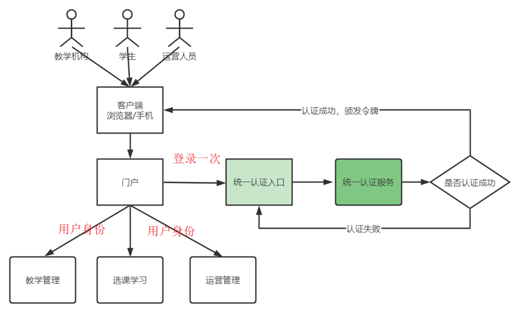
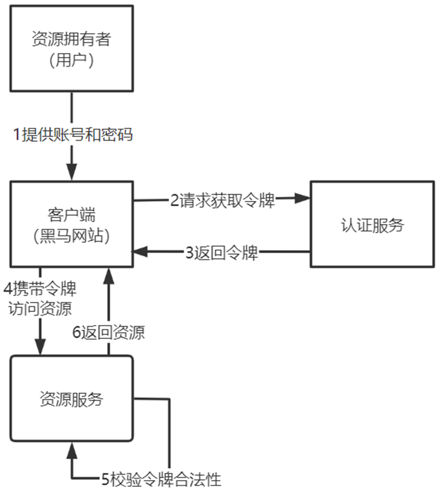
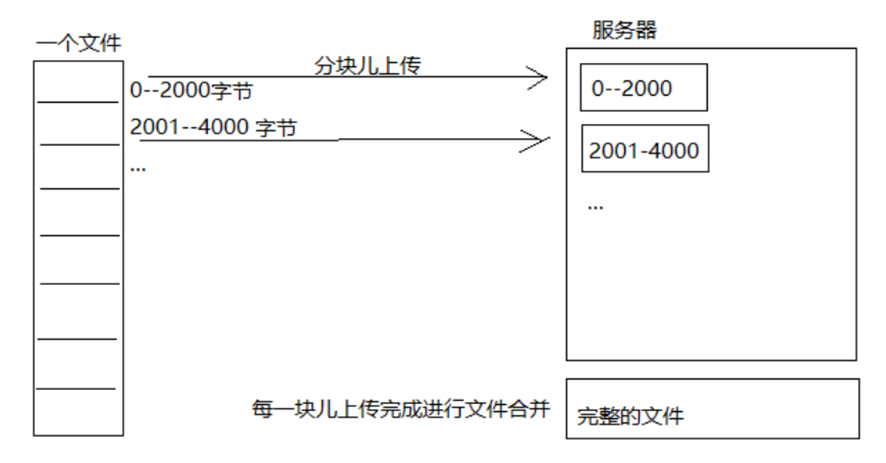
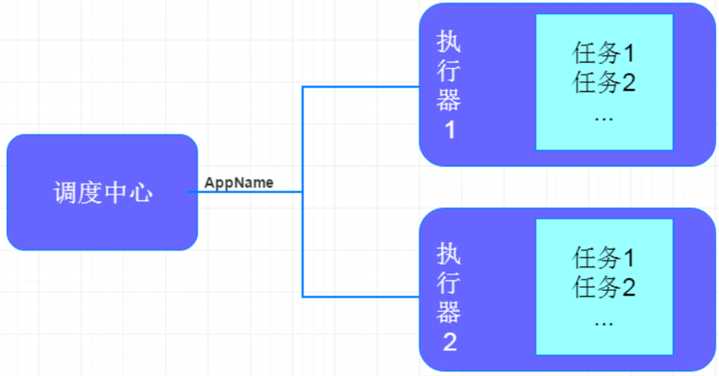
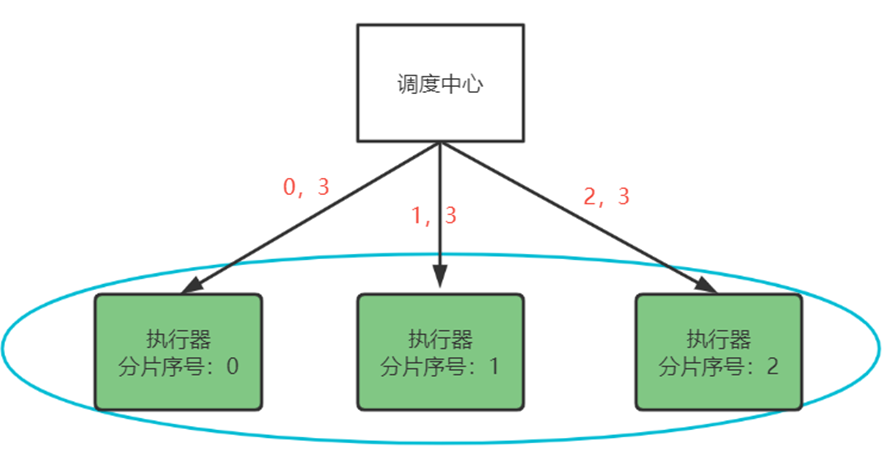
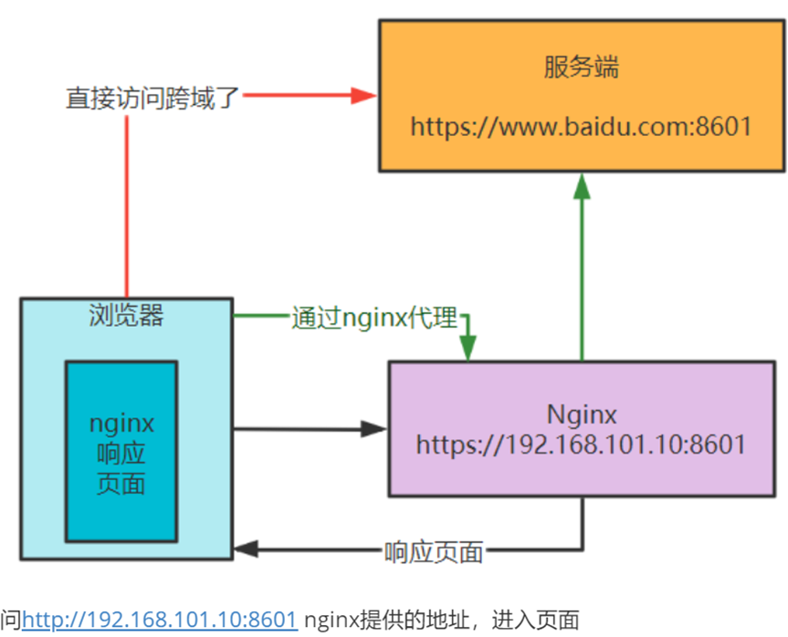

# 在线教育平台

## 登录模块

### 统一认证

项目包括**学生、学习机构的老师、平台运营人员**三类用户，三类用户将使用统一的认证入口

### 单点登录

用户只需要登录一次就可以访问所有相互信任的应用系统。



### 密码登录



输入正确的账号和密码，查询数据库，当账号密码匹配正确后，用户认证通过，得到一个JWT令牌，JWT令牌中已经包括了用户相关的信息，客户端只需要携带JWT访问资源服务，资源服务根据事先约定的算法自行完成令牌校验，无需每次都请求认证服务完成授权。

1、用户登录，通过账号密码进行认证

2、认证通过后，根据私钥生成token

3、将生成的token返回给浏览器

4、用户每次请求携带token

5、服务端利用公钥解读jwt签名，判断签名有效后，从Payload中获取用户信息

6、处理请求，返回响应结果

JWT实现单点认证：https://cloud.tencent.com/developer/article/2084586

### JWT

#### 什么是JWT

JWT，全称是Json Web Token， 是JSON风格轻量级的授权和身份认证规范，可实现**无状态、分布式**的Web应用授权

JWT令牌由三部分**（Header.Payload.Signature）**组成，每部分中间使用点（.）分隔

- Header：令牌类型及使用的哈希算法
- Payload：负载，存放jwt提供的信息字段，比如：iss（签发者）,exp（过期时间戳）, sub（面向的用户）等
- Signature：签名，用于防止jwt内容被篡改。根据前两步的数据，再加上指定的密钥（secret）（不要泄漏，最好周期性更换），通过base64编码生成。用于验证整个数据完整和可靠性

#### 什么是有状态认证

传统的基于session的方式是有状态认证，用户登录后，我们把登录者的信息保存在服务端session中，并且给用户一个cookie值，记录对应的session。然后下次请求，用户携带cookie值来，我们就能识别到对应session，从而找到用户的信息。

这样加大了服务端的存储压力，并且这种方式不适合在分布式系统中应用。当用户访问应用服务，每个应用服务都会去服务器查看session信息，如果session中没有该用户则说明用户没有登录，此时就会重新认证，而解决这个问题的方法是Session复制、Session黏贴。

#### 如何使用JWT实现无状态认证

如果是基于令牌技术在分布式系统中实现认证则服务端不用存储session，可以将用户身份信息存储在**令牌**中，用户认证通过后认证服务颁发令牌给用户，用户将令牌**存储在客户端**，去访问应用服务时**携带令牌去访问**，服务端从jwt**解析出用户信息**。这个过程就是无状态认证。

#### 密码格式

数据库中的密码加过密的，用户输入的密码是明文，我们使用`BCryptPasswordEncoder` ，将用户输入的密码编码为**BCrypt格式**与数据库中的密码进行比对。

## 上传视频

### 什么是断点续传

通常视频文件都比较大，所以对于媒资系统上传文件的需求要满足大文件的上传要求。如果一个大文件快上传完了，因网络问题没有上传完成，需要客户重新上传，用户体验非常差，所以对于大文件上传的要求最基本的是断点续传。

### 大文件上传的流程

1. 前端上传文件前会请求查询文件是否存在，如果已经存在则不再上传。
2. 如果文件在系统不存在则前端开始上传，首先对视频文件进行分块。
3. 前端分块进行上传，上传前首先检查分块是否上传，如已上传则不再上传，如果未上传则开始上传分块。
4. 服务端将分块上传到MinIO。
5. 前端将分块上传完毕请求合并分块。
6. 服务层根据文件信息找到MinIO中的分块文件，将所有分块下载到本地后开始合并（minioClient.composeObject () ） 。
7. 合并完成后校验文件的完整性，校验成功后将合并后的文件上传到MinIO。

### 断点续传的流程

1. 前端对文件分块。
2. 上传分块钱先检查该分块是否上传，如果已上传则不再上传。
3. 等所有分块上传完毕，服务端合并所有分块，校验文件的完整性。
4. 服务端合并文件后计算合并后文件的 md5 是否和原文件的一样，如果一样则说文件完整，如果不一样说明可能由于网络丢包导致文件不完整，这时上传失败需要重新上传。



### 其他方案

1. 前端（客户端）需要根据固定大小对文件进行分片，请求后端（服务端）时要带上分片序号和大小
2. 服务端创建conf文件用来记录分块位置，conf文件长度为总分片数，每上传一个分块即向conf文件中写入一个127，那么没上传的位置就是默认的0,已上传的就是Byte.MAX_VALUE 127（这步是实现断点续传和秒传的核心步骤）
3. 服务器按照请求数据中给的分片序号和每片分块大小（分片大小是固定且一样的）算出开始位置，与读取到的文件片段数据，写入文件

## 视频转码

###  XXL-JOB介绍

XXL-JOB主要有调度中心、执行器、任务：

**调度中心：** 负责管理调度信息，按照调度配置发出调度请求，自身不承担业务代码；

**任务执行器：**负责接收调度请求并执行任务逻辑；

**任务：**负责执行具体的业务处理。



### 分片广播策略

分片是指是调度中心以**执行器为维度进行分片**，将集群中的执行器**标上序号**：0，1，2，3...，广播是指每次调度会向集群中的所有执行器发送任务调度，**请求中携带分片参数**（分片序号，分片总数）。



### 分片方案

#### 如何保证多个执行器不会查询到重复的任务

每个执行从数据表取任务时可以让  任务id%分片总数，如果等于分片序号则执行此任务。如：

1 % 2 = 1  执行器2执行

2 % 2 = 0  执行器1执行

3 % 2 = 1   执行器2执行

#### 如何保证任务不重复执行

1. 调度中心按分片广播的方式去下发任务
2. 执行器收到作业分片广播的参数：分片总数和分片序号，计算 任务 id 除以 分片总数得到一个余数，如果余数等于分片序号这时就去执行这个任务，这里保证了不同的执行器执行不同的任务。
3. 配置调度过期策略为“忽略”，避免同一个执行器多次重复执行同一个任务
4. 保证任务处理的幂等性，执行过的任务可以打一个状态标记已完成，下次再调度执行该任务判断该任务已完成就不再执行

#### 任务幂等性如何保证

使用乐观锁实现（CAS）：

```sql
update media_process m set m.status='4' where (m.status='1' or m.status='3') and m.fail_count<3 and m.id=?
```

只有数据库字段为待处理的时候，sql才能执行成功，sql执行成功线程才能执行任务

## 分布式事务

### 什么是分布式事务

由多个服务通过网络完成一个事务叫分布式事务。

### 什么是CAP理论

CAP是 Consistency、Availability、Partition tolerance三个词语的缩写，分别表示**一致性、可用性、分区容忍性**。

- 一致性：指用户不管访问哪一个结点拿到的数据都是最新的

- 可用性：指任何时候查询用户信息都可以查询到结果，但不保证查询到最新的数据
- 分区容忍性：当系统采用分布式架构时由于网络通信异常导致请求中断、消息丢失，但系统依然对外提供服务

本项目满足 **AP**（最终一致性）

### 如何实现对分布式事务的控制

使用 **本地消息表 **加 **任务调度 **完成分布式事务最终数据一致性。

以发布课程为例进行说明，发布课程需要在内容管理数据库中写课程发布表记录，同时将课程信息同步到 redis、ES、MinIO，这里存在分布式事务。

1. 点击发布课程使用本地事务向发布表写一个课程信息，同时向消息表写一个消息记录，对每个需要同步的任务设置了状态字段，表明该同步任务是否完成；
2. xxl-job 的调度中心使用分片广播模式向执行器下发任务，开始扫描消息表
3. 需要保证多个执行器不会查询到重复的任务，通过任务号%分片总数 的方式确定执行器应该扫描哪一条消息，查到待处理的消息；
4. 根据消息的内容将课程信息同步到 redis、ES、MinIO；
5. 任务完成删除消息表记录。整个分布式事务完成，最终保证了一致性。

### 如何解决分布式事务回滚的

当在执行过程中某个环节失败后，会先进行两次**重试机制**，尽最大努力成功，当重试之后还是失败，则会将对应的消息表的失败记录存储在数据库中的事务失败表当中，然后启动定时任务去进行相应事务的失败处理操作，同时更新对应消息表的一个状态字段，以便后续的分布式任务调度能够继续执行消息表进行分布式操作。

## 其他

### Nacos怎么用

Naocs作为本项目的服务注册中心和配置中心。

服务注册中心：也叫服务发现中心，微服务将自己注册到服务注册中心，服务间远程调用通过服务注册中心获取目标服务的地址，从而进行远程调用。

配置中心：统一管理微服务的配置文件

- **使用**
  - 配置中心需要配置 `nacos-config` 依赖
  - 服务中心需要配置 `nacos-discovery` 依赖 

### Elasticsearch怎么用

Elasticsearch 是一个开源的分布式搜索和分析引擎，提供了强大的 **全文搜索功能以及数据分析 **等，并且具有很强的拓展性，可以轻松进行 **节点扩展**。

使用Elasticsearch对课程发布信息进行索引和搜索

首先创建索引（相当于 mysql 的表），将课程信息添加到索引库，对课程信息进行分词，存储到索引库

### 什么是MinIO

MinIO 的架构是一个分布式的、高可用的存储系统，它通过多个存储节点的组合来提供高性能、可扩展和可靠的对象存储服务。

### 如何解决接口跨域问题

跨域是基于浏览器的同源策略，去判断是否跨域请求，同源策略是浏览器的一种安全机制，从一个地址请求另一个地址，如果**协议、主机、端口**三者相同则不是跨域，否则就是跨域请求。

- **添加响应头**

服务端在响应头添加 `Access-Control-Allow-Origin`，后面加上允许的源请求


- 通过**nginx代理**跨域

  由于服务端之间没有跨域，浏览器通过nginx去访问跨域地址。

  在nginx的配置文件中， 在**Access-Control-Allow-Origin**后面加上具体的域名



浏览器访问同源的nginx地址，没有发生跨域，nginx访问服务端，服务端到服务端之间的访问，也没有跨域

### 微服务之间接口如何调用

微服务之间使用Feign进行远程调用，使用 `FeignClient` 注解，配置服务名，每个微服务都将自己注册到了服务注册中心nacos中，微服务在远程调用时会从服务注册中心找到**目标服务的地址**进行远程调用。

当目标服务异常在远程调用时发生熔断，此时调用方要定义**降级方法**保证请求快速响应。

### 什么是熔断降级

- **熔断：**下游服务异常而断开与上游服务的交互
- **降级：**当下游服务异常触发熔断后，上游服务就不再去调用异常的微服务而是执行了降级处理逻辑

降级方法：`FallbackFactory`

1. **创建FallbackFactory类**：创建一个类，实现Feign的`FallbackFactory`接口，并在该类中实现降级逻辑。
2. **配置Feign Client**：在FeignClient的注解中指定`FallbackFactory`类。


