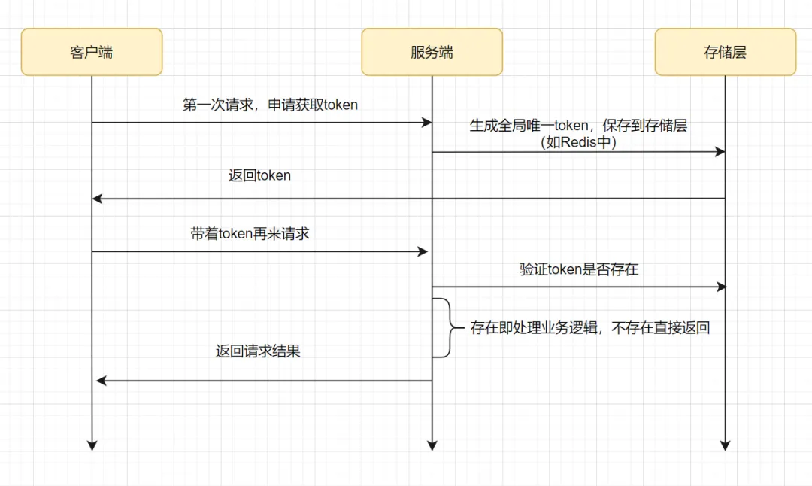

# 在线教育平台

## 登录模块

### 统一认证

项目包括**学生、学习机构的老师、平台运营人员**三类用户，三类用户将使用统一的认证入口

### 单点登录

用户只需要登录一次就可以访问所有相互信任的应用系统。


### 密码登录


输入正确的账号和密码，查询数据库，当账号密码匹配正确后，用户认证通过，得到一个JWT令牌，JWT令牌中已经包括了用户相关的信息，客户端只需要携带JWT访问资源服务，资源服务根据事先约定的算法自行完成令牌校验，无需每次都请求认证服务完成授权。

jwt + HMAC SHA256

1、用户登录

2、服务端根据私钥生成token

3、将生成的token返回给浏览器

4、用户每次请求携带token

5、服务端利用公钥解读jwt签名，判断签名有效后，从Payload中获取用户信息

6、处理请求，返回响应结果

JWT实现单点认证：https://cloud.tencent.com/developer/article/2084586

在HMAC SHA256算法中，将要传输的消息通过散列函数进行处理，得到一个消息摘要。接着，将该消息摘要与密钥进行异或运算，并继续使用散列函数对运算结果进行处理，得到一个最终的认证码。

### JWT

#### 什么是JWT

JWT，全称是Json Web Token， 是JSON风格轻量级的授权和身份认证规范，可实现**无状态、分布式**的Web应用授权

JWT令牌由三部分**（Header.Payload.Signature）**组成，每部分中间使用点（.）分隔

- Header：令牌类型及使用的哈希算法
- Payload：负载，存放jwt提供的信息字段，比如：iss（签发者）,exp（过期时间戳）, sub（面向的用户）等
- Signature：签名，用于防止jwt内容被篡改。根据前两步的数据，再加上指定的密钥（secret）（不要泄漏，最好周期性更换），通过base64编码生成。用于验证整个数据完整和可靠性

#### 什么是有状态认证

传统的基于session的方式是有状态认证，用户登录后，我们把登录者的信息保存在服务端session中，并且给用户一个cookie值，记录对应的session。然后下次请求，用户携带cookie值来，我们就能识别到对应session，从而找到用户的信息。

这样加大了服务端的存储压力，并且这种方式不适合在分布式系统中应用。当用户访问应用服务，每个应用服务都会去服务器查看session信息，如果session中没有该用户则说明用户没有登录，此时就会重新认证，而解决这个问题的方法是Session复制、Session黏贴。

#### 如何使用JWT实现无状态认证

如果是基于令牌技术在分布式系统中实现认证则服务端不用存储session，可以将用户身份信息存储在**令牌**中，用户认证通过后认证服务颁发令牌给用户，用户将令牌**存储在客户端**，去访问应用服务时**携带令牌去访问**，服务端从jwt**解析出用户信息**。这个过程就是无状态认证。


#### 密码格式

数据库中的密码加过密的，用户输入的密码是明文，我们使用`BCryptPasswordEncoder` ，将用户输入的密码编码为**BCrypt格式**与数据库中的密码进行比对。

## Redis缓存

### 项目怎么用

课程信息使用 **hash** 类型进行存储，代码大概为：

```java
RedisTemplate redisTemplate；
redisTemplate.opsForHash().putAll(key, map);
```

其他操作：

```java
//给一个指定的 key 值附加过期时间
redisTemplate.expire(key, time, TimeUnit.SECONDS);
//根据key 获取过期时间
redisTemplate.getExpire(key, TimeUnit.SECONDS);
//移除指定key 的过期时间
redisTemplate.boundValueOps(key).persist();
//将String值放入缓存
redisTemplate.opsForValue().set(key, value);
```

### 缓存数据一致性

在更新数据时，采用 **先更新数据库+删除缓存** 的方式，维持缓存和数据库的一致性，同时为缓存添加 **过期时间**，避免向缓存中写入脏数据。为保证 更新数据库+删除缓存 两个操作的原子性，使用 **任务调度+数据库消息表** 的方式，为每个任务设置状态字段，扫描消息表并执行任务，并设有重试机制，增加了容错性。

## 上传视频

### 什么是断点续传

通常视频文件都比较大，所以对于媒资系统上传文件的需求要满足大文件的上传要求。如果一个大文件快上传完了，因网络问题没有上传完成，需要客户重新上传，用户体验非常差，所以对于大文件上传的要求最基本的是断点续传。

### 大文件上传的流程

1. 前端上传文件前会请求查询文件是否存在，如果已经存在则不再上传。
2. 如果文件在系统不存在则前端开始上传，首先对视频文件进行分块。
3. 前端分块进行上传，上传前首先检查分块是否上传，如已上传则不再上传，如果未上传则开始上传分块。
4. 服务端将分块上传到MinIO。
5. 前端将分块上传完毕请求合并分块。
6. 服务层根据文件信息找到MinIO中的分块文件，将所有分块下载到本地后开始合并（minioClient.composeObject () ） 。
7. 合并完成后校验文件的完整性，校验成功后将合并后的文件上传到MinIO。

### 断点续传的流程

1. 前端对文件分块。
2. 上传分块钱先检查该分块是否上传，如果已上传则不再上传。
3. 等所有分块上传完毕，服务端合并所有分块，校验文件的完整性。
4. 服务端合并文件后计算合并后文件的 md5 是否和原文件的一样，如果一样则说文件完整，如果不一样说明可能由于网络丢包导致文件不完整，这时上传失败需要重新上传。


### 其他方案

1. 前端（客户端）需要根据固定大小对文件进行分片，请求后端（服务端）时要带上分片序号和大小
2. 服务端创建conf文件用来记录分块位置，conf文件长度为总分片数，每上传一个分块即向conf文件中写入一个127，那么没上传的位置就是默认的0,已上传的就是Byte.MAX_VALUE 127（这步是实现断点续传和秒传的核心步骤）
3. 服务器按照请求数据中给的分片序号和每片分块大小（分片大小是固定且一样的）算出开始位置，与读取到的文件片段数据，写入文件

## 视频转码

###  XXL-JOB介绍

XXL-JOB主要有调度中心、执行器、任务：

**调度中心：** 负责管理调度信息，按照调度配置发出调度请求，自身不承担业务代码；

**任务执行器：**负责接收调度请求并执行任务逻辑；

**任务：**负责执行具体的业务处理。


### 分片广播策略

分片是指是调度中心以**执行器为维度进行分片**，将集群中的执行器**标上序号**：0，1，2，3...，广播是指每次调度会向集群中的所有执行器发送任务调度，**请求中携带分片参数**（分片序号，分片总数）。


### 分片方案

#### 如何保证多个执行器不会查询到重复的任务

每个执行从数据表取任务时可以让  任务id%分片总数，如果等于分片序号则执行此任务。如：

1 % 2 = 1  执行器2执行

2 % 2 = 0  执行器1执行

3 % 2 = 1   执行器2执行

#### 如何保证任务不重复执行

1. 调度中心按分片广播的方式去下发任务
2. 执行器收到作业分片广播的参数：分片总数和分片序号，计算 任务 id 除以 分片总数得到一个余数，如果余数等于分片序号这时就去执行这个任务，这里保证了不同的执行器执行不同的任务。
3. 配置调度过期策略为“忽略”，避免同一个执行器多次重复执行同一个任务
4. 保证任务处理的幂等性，执行过的任务可以打一个状态标记已完成，下次再调度执行该任务判断该任务已完成就不再执行

### 任务幂等性

#### 什么是幂等性

**多次** 请求所产生的影响与 **一次 **请求执行的影响 **效果相同**。

#### 任务幂等性如何保证

##### 项目中

**select + update + 状态机幂等**

```sql
update media_process m set m.status='4' where (m.status='1' or m.status='3') and m.fail_count<3 and m.id=?
```

只有数据库字段为待处理的时候，sql才能执行成功，sql执行成功线程才能执行任务

幂等性：https://mp.weixin.qq.com/s?__biz=MzkyMzU5Mzk1NQ==&mid=2247506349&idx=1&sn=47b8ae3a94176440a6e5d5ad3505b4f3&source=41#wechat_redirect

##### 其他方式

1. token令牌

   服务端去redis确认token是否存在，一般用 `redis.del(token)`的方式，如果存在会删除成功，即处理业务逻辑，如果删除失败不处理业务逻辑，直接返回结果

   

   2. 悲观锁

   3. 乐观锁

   4. 分布式锁

      请求过来时，先去尝试获得分布式锁，如果获得成功，就执行业务逻辑，反之获取失败的话，就舍弃请求直接返回成功。

## 分布式事务

### 什么是分布式事务

由多个服务通过网络完成一个事务叫分布式事务。

### 什么是CAP理论

CAP是 Consistency、Availability、Partition tolerance三个词语的缩写，分别表示**一致性、可用性、分区容忍性**。

- 一致性：指用户不管访问哪一个结点拿到的数据都是最新的

- 可用性：指任何时候查询用户信息都可以查询到结果，但不保证查询到最新的数据
- 分区容忍性：当系统采用分布式架构时由于网络通信异常导致请求中断、消息丢失，但系统依然对外提供服务

本项目满足 **AP**（最终一致性）

### 如何实现对分布式事务的控制

使用 **本地消息表 **加 **任务调度 **完成分布式事务最终数据一致性。

以发布课程为例进行说明，发布课程需要在内容管理数据库中写课程发布表记录，同时将课程信息同步到 redis、ES、MinIO，这里存在分布式事务。

1. 点击发布课程使用本地事务向发布表写一个课程信息，同时向消息表写一个消息记录，对每个需要同步的任务设置了状态字段，表明该同步任务是否完成；
2. xxl-job 的调度中心使用分片广播模式向执行器下发任务，开始扫描消息表
3. 需要保证多个执行器不会查询到重复的任务，通过任务号%分片总数 的方式确定执行器应该扫描哪一条消息，查到待处理的消息；
4. 根据消息的内容将课程信息同步到 redis、ES、MinIO；
5. 任务完成删除消息表记录。整个分布式事务完成，最终保证了一致性。

### 如何解决分布式事务回滚的

当在执行过程中某个环节失败后，会先进行两次**重试机制**，尽最大努力成功，当重试之后还是失败，则会将对应的消息表的失败记录存储在数据库中的事务失败表当中，然后启动定时任务去进行相应事务的失败处理操作，同时更新对应消息表的一个状态字段，以便后续的分布式任务调度能够继续执行消息表进行分布式操作。

## 其他

### Nacos怎么用

Naocs作为本项目的服务注册中心和配置中心。

服务注册中心：也叫服务发现中心，微服务将自己注册到服务注册中心，服务间远程调用通过服务注册中心获取目标服务的地址，从而进行远程调用。

配置中心：统一管理微服务的配置文件

- **使用**
  - 配置中心需要配置 `nacos-config` 依赖
  - 服务中心需要配置 `nacos-discovery` 依赖 

### Elasticsearch怎么用

Elasticsearch 是一个开源的分布式搜索和分析引擎，提供了强大的 **全文搜索功能以及数据分析 **等，并且具有很强的拓展性，可以轻松进行 **节点扩展**。

使用Elasticsearch对课程发布信息进行索引和搜索

首先创建索引（相当于 mysql 的表），将课程信息添加到索引库，对课程信息进行分词，存储到索引库

### 什么是MinIO

MinIO 的架构是一个分布式的、高可用的存储系统，它通过多个存储节点的组合来提供高性能、可扩展和可靠的对象存储服务。

### 如何解决接口跨域问题

跨域是基于浏览器的同源策略，去判断是否跨域请求，同源策略是浏览器的一种安全机制，从一个地址请求另一个地址，如果**协议、主机、端口**三者相同则不是跨域，否则就是跨域请求。

- **添加响应头**

服务端在响应头添加 `Access-Control-Allow-Origin`，后面加上允许的源请求


- 通过**nginx代理**跨域

  由于服务端之间没有跨域，浏览器通过nginx去访问跨域地址。

  在nginx的配置文件中， 在**Access-Control-Allow-Origin**后面加上具体的域名


浏览器访问同源的nginx地址，没有发生跨域，nginx访问服务端，服务端到服务端之间的访问，也没有跨域

### 微服务之间接口如何调用

微服务之间使用Feign进行远程调用，使用 `FeignClient` 注解，配置服务名，每个微服务都将自己注册到了服务注册中心nacos中，微服务在远程调用时会从服务注册中心找到**目标服务的地址**进行远程调用。

当目标服务异常在远程调用时发生熔断，此时调用方要定义**降级方法**保证请求快速响应。

### 什么是熔断降级

- **熔断：**下游服务异常而断开与上游服务的交互
- **降级：**当下游服务异常触发熔断后，上游服务就不再去调用异常的微服务而是执行了降级处理逻辑

降级方法：`FallbackFactory`

1. **创建FallbackFactory类**：创建一个类，实现Feign的`FallbackFactory`接口，并在该类中实现降级逻辑。
2. **配置Feign Client**：在FeignClient的注解中指定`FallbackFactory`类。

# RPC

## rpc总体框架

### 架构图

简略版：


详细版：


服务提供端 Server 向注册中心注册服务，服务消费者 Client 通过注册中心拿到服务相关信息，然后再通过网络请求服务提供端 Server

实现一个最基本的 RPC 框架应该至少包括下面几部分:

1. **注册中心** ：注册中心负责服务地址的注册与查找，相当于目录服务。
2. **网络传输** ：既然我们要调用远程的方法，就要发送网络请求来传递目标类和方法的信息以及方法的参数等数据到服务提供端。
3. **序列化和反序列化** ：要在网络传输数据就要涉及到**序列化**。
4. **动态代理** ：屏蔽远程方法调用的底层细节。
5. **负载均衡** ： 避免单个服务器响应同一请求，容易造成服务器宕机、崩溃等问题。
6. **传输协议** ：这个协议是客户端（服务消费方）和服务端（服务提供方）交流的基础。

### 一个RPC的完整过程

1. 客户端以本地调用的方式调用远程服务
2. 将方法、参数等组装成能够进行网络传输的消息体
3. 找到远程服务的地址，并将消息发送到服务端
4. 服务端收到消息将消息反序列化为 Java 对象
5. 根据反序列化之后得到的类、方法、方法参数等信息，调用服务器本地的方法
6. 服务端得到方法的执行结果并将其组装成能够进行网络传输的消息体，发送至客户端
7. 客户端接收到消息并将消息反序列化为Java对象，得到最终结果

### 问题

#### Netty的主从线程模型

Netty采用了事件驱动的线程模型，它的核心思想是将网络I/O操作和业务逻辑处理分离开来，使得在处理网络请求时能够更加高效地利用系统资源。

Netty的线程模型包括两个重要的部分：Boss线程和Worker线程。

1. **Boss线程**：
   - Boss线程主要负责处理客户端的连接请求，以及将已经建立的连接注册到Worker线程池中。
   - 当有新的连接请求到来时，Boss线程负责接受连接，并将连接注册到一个Worker线程负责的EventLoop中进行后续的处理。
2. **Worker线程**：
   - Worker线程池中包含多个Worker线程，每个Worker线程拥有一个EventLoop，负责处理注册到其上的连接的I/O事件和业务逻辑。
   - 每个Worker线程中的EventLoop采用单线程模型，保证了对于同一个连接的所有操作都在同一个线程中执行，避免了多线程并发操作时的同步问题。

#### Netty获取结果是同步还是异步的

目前做的是同步操作，调用`ChannelFuture`的`sync()`方法来实现同步等待操作完成

#### 如何用一致性哈希实现负载均衡

一致性哈希法的核心思想是将数据和节点都映射到一个哈希环上，然后根据 **哈希值的顺序** 来确定数据属于哪个节点。

为每个服务器地址创建了一定数量的虚拟节点，并将这些虚拟节点加入到一致性哈希环中。引入虚拟节点会**增加哈希环上的节点数量**，可以使节点**更均匀**的分布在哈希环上。

一致性Hash通过构建**环状的Hash空间**代替线性Hash空间的方法解决了 集群数量变化导致之前所有的Hash映射失效 的问题。


group0宕机后，key3，key6可以被**重定位**到group1


#### 为什么需要心跳机制

在 TCP 保持长连接的过程中，可能会出现断网等网络异常出现，异常发生的时候， client 与 server 之间如果没有交互的话，它们是无法发现对方已经掉线的。为了解决这个问题, 我们就需要引入 心跳机制 。

**心跳机制的工作原理是：**在 client 与 server 之间在一定时间内没有数据交互时, 即处于 idle 状态时, 客户端或服务器就会发送一个特殊的数据包给对方, 当接收方收到这个数据报文后, 也立即发送一个特殊的数据报文, 回应发送方, 此即一个 PING-PONG 交互。所以, 当某一端收到心跳消息后, 就知道了对方仍然在线, 这就确保 TCP 连接的有效性。

通过 Netty 实现心跳机制的话，核心类是 `IdleStateHandler `。

## 实现

### 注册中心

注册中心负责服务**地址的注册与查找**，相当于目录服务。本项目使用zookeeper作为注册中心，常用的还有Nacos和Redis。

ZooKeeper 通常被用于实现诸如数据发布/订阅、负载均衡、命名服务、分布式协调/通知、集群管理、Master 选举、分布式锁和分布式队列等功能。并且，ZooKeeper 将数据保存在`内存`中，性能是非常棒的。 在`“读”多于“写”`的应用程序中尤其地高性能，因为“写”会导致所有的服务器间同步状态。（“读”多于“写”是协调服务的典型场景）。

#### ZooKeeper 

##### 客户端 Curator

通过 `CuratorFrameworkFactory` 创建 `CuratorFramework` 对象，然后再调用  `CuratorFramework` 对象的 `start()` 方法即可

```java
private static final int BASE_SLEEP_TIME = 1000;
private static final int MAX_RETRIES = 3;

// Retry strategy. Retry 3 times, and will increase the sleep time between retries.
RetryPolicy retryPolicy = new ExponentialBackoffRetry(BASE_SLEEP_TIME, MAX_RETRIES);
CuratorFramework zkClient = CuratorFrameworkFactory.builder()
    // the server to connect to (can be a server list)
    .connectString("127.0.0.1:2181")
    .retryPolicy(retryPolicy)
    .build();
zkClient.start();
```

##### 节点

1. **节点类型**

   - **持久（PERSISTENT）节点** ：一旦创建就一直存在即使 ZooKeeper 集群宕机，直到将其删除。

   - **临时（EPHEMERAL）节点** ：临时节点的生命周期是与 **客户端会话（session）** 绑定的，**会话消失则节点消失** 。并且，临时节点 **只能做叶子节点** ，不能创建子节点。

   - **持久顺序（PERSISTENT_SEQUENTIAL）节点** ：除了具有持久（PERSISTENT）节点的特性之外， 子节点的名称还具有顺序性。比如 `/node1/app0000000001` 、`/node1/app0000000002` 。

   - **临时顺序（EPHEMERAL_SEQUENTIAL）节点** ：除了具备临时（EPHEMERAL）节点的特性之外，子节点的名称还具有顺序性。

2. **创建节点**

父节点不存在的时候自动创建父节点：

```java
zkClient.create().creatingParentsIfNeeded().withMode(CreateMode.PERSISTENT).forPath("/node1/00001");
```

创建临时节点

```java
zkClient.create().creatingParentsIfNeeded().withMode(CreateMode.EPHEMERAL).forPath("/node1/00001");
```

创建节点并指定数据内容

```java
zkClient.create().creatingParentsIfNeeded().withMode(CreateMode.EPHEMERAL).forPath("/node1/00001","java".getBytes());
zkClient.getData().forPath("/node1/00001");//获取节点的数据内容，获取到的是 byte数组
```

检测节点是否创建成功

```java
zkClient.checkExists().forPath("/node1/00001");//不为null的话，说明节点创建成功
```

3. **删除节点**

删除一个子节点

```java
zkClient.delete().forPath("/node1/00001");
```

删除一个节点以及其下的所有子节点

```java
zkClient.delete().deletingChildrenIfNeeded().forPath("/node1");
```

获取/更新节点数据内容

```java
zkClient.create().creatingParentsIfNeeded().withMode(CreateMode.EPHEMERAL).forPath("/node1/00001","java".getBytes());
zkClient.getData().forPath("/node1/00001");//获取节点的数据内容
zkClient.setData().forPath("/node1/00001","c++".getBytes());//更新节点数据内容
```

获取某个节点的所有子节点路径

```java
List<String> childrenPaths = zkClient.getChildren().forPath("/node1");
```

##### 监听器

注册了监听器之后，这个节点的子节点发生变化比如增加、减少或者更新的时候，可以自定义回调操作。

```java
String path = "/node1";
PathChildrenCache pathChildrenCache = new PathChildrenCache(zkClient, path, true);
PathChildrenCacheListener pathChildrenCacheListener = (curatorFramework, pathChildrenCacheEvent) -> {
    // do something
};
pathChildrenCache.getListenable().addListener(pathChildrenCacheListener);
pathChildrenCache.start();
```

- **节点事件类型：**

```java
public static enum Type {
        CHILD_ADDED,//子节点增加
        CHILD_UPDATED,//子节点更新
        CHILD_REMOVED,//子节点被删除
        CONNECTION_SUSPENDED,
        CONNECTION_RECONNECTED,
        CONNECTION_LOST,
        INITIALIZED;
   }
```

#### 实现

定义了两个接口 `ServiceDiscovery.java` 和 `ServiceRegistry.java`，分别是服务发现和服务注册行为。

```java
/**
 * 服务注册
 */
public interface ServiceRegistry {
    /**
     * 注册服务到注册中心
     * @param rpcServiceName    完整的服务名称（class name+group+version）
     * @param inetSocketAddress 远程服务地址
     */
    void registerService(String rpcServiceName, InetSocketAddress inetSocketAddress);
}
/**
 * 服务发现
 */
public interface ServiceDiscovery {
    /**
     * 根据 rpcServiceName 获取远程服务地址
     * @return 远程服务地址
     */
    InetSocketAddress lookupService(String rpcServiceName);
}
```

当我们的服务被注册进 zookeeper 的时候，我们将完整的服务名称 rpcServiceName （class name+group+version）作为根节点 ，子节点是对应的服务地址（ip+端口号）。

一个根节点（rpcServiceName）可能会对应多个服务地址，如果我们要获得某个服务对应的地址的话，就直接根据完整的服务名称来获取到其下的所有子节点，然后通过具体的`负载均衡` 策略取出一个就可以了。


### 网络传输

网络传输即**发送网络请求来传递目标类和方法的信息以及方法的参数等数据到服务提供端**，本项目使用Netty做网络传输，常用的还有Socket和NIO。

#### **Socket 网络通信**

##### 什么是Socket

Socket 是一个抽象概念，应用程序可以通过它发送或接收数据。套接字是 IP 地址与端口的组合：
$$
Socket=（IP 地址：端口号）
$$
在 Java 开发中使用 Socket 时会常用到两个类，都在 `java.net` 包中：

1. `Socket`：一般用于客户端
2. `ServerSocket` ：用于服务端

##### Socket 网络通信过程

- Socket 网络通信过程简单来说分为下面 4 步：

1. 建立服务端并且监听客户端请求
2. 客户端请求，服务端和客户端建立连接
3. 两端之间可以传递数据
4. 关闭资源

Socket 网络通信过程如下图所示：


- 对应到服务端和客户端的话，是下面这样的。

**服务器端：**

1. 创建 `ServerSocket` 对象并且绑定地址（ip）和端口号(port)：`server.bind(new InetSocketAddress(host, port))`
2. 通过 `accept()`方法监听客户端请求
3. 连接建立后，通过输入流读取客户端发送的请求信息
4. 通过输出流向客户端发送响应信息
5. 关闭相关资源

**客户端：**

1. 创建`Socket` 对象并且连接指定的服务器的地址（ip）和端口号(port)：`socket.connect(inetSocketAddress)`
2. 连接建立后，通过输出流向服务器端发送请求信息
3. 通过输入流获取服务器响应的信息
4. 关闭相关资源

##### 局限

1. `ServerSocket` 的 accept () 方法是**阻塞方法**，也就是说 `ServerSocket` 在调用accept ()  等待客户端的连接请求时会阻塞，直到收到客户端发送的连接请求才会继续往下执行代码。
2. 只能同时处理一个客户端的连接，如果需要管理多个客户端的话，就需要为我们请求的客户端单独创建一个线程。每次使用都创建线程会造成资源浪费，可以使用**线程池**，创建和回收的成本较低，并且可以指定最大线程数量。

#### Netty

##### 基础知识

**介绍：**

1. **Netty 是一个基于 NIO 的 client-server(客户端服务器)框架，使用它可以快速简单地开发网络应用程序。**
2. 它极大地简化并简化了 TCP 和 UDP 套接字服务器等网络编程,并且性能以及安全性等很多方面甚至都要更好。
3. 支持多种协议如 FTP，SMTP，HTTP 以及各种二进制和基于文本的传统协议

**使用场景：**

- 作为 RPC 框架的网络通信工具
- 实现一个自己的 HTTP 服务器 
- 实现一个即时通讯系统
- 消息推送系统

**管道和通道：**

- Channel 表示一个网络通道，它负责在客户端和服务器之间进行数据的读写操作
- ChannelPipeline 是一个处理器链，它由一系列的 `ChannelHandler` （可以自定义）组成，用于处理进出 `Channel` 的事件和数据。每个 `Channel` 都有自己的ChannelPipeline ，可以对数据进行解码、编码、处理等操作。

`.handler()`方法用于设置一些针对于整个Channel的处理器，这些处理器通常在Channel的生命周期中只需要设置一次。因此，Netty提供了两个方法用于设置处理器，分别是`.handler()`和`.childHandler()`。其中，`.handler()`方法设置的处理器是针对ServerBootstrap所创建的ServerChannel的，而`.childHandler()`方法设置的处理器是针对ServerBootstrap所接受的连接的Channel的。

##### 工作原理

Netty入门：https://blog.csdn.net/S1124654/article/details/125489407


说明如下：

1. Netty抽象出两组线程池： BossGroup 专门负责接收客户端的连接, WorkerGroup 专门负责网络的读写。BossGroup 和 WorkerGroup 类型都是 NioEventLoopGroup
2. NioEventLoopGroup 相当于一个事件循环组, 这个组中含有多个事件循环 ，每一个事件循环是 NioEventLoop
3. NioEventLoop 表示一个不断循环的执行处理任务的线程， 每个NioEventLoop 都有一个selector , 用于监听绑定在其上的socket的网络通讯
4. NioEventLoopGroup 可以有多个线程, 即可以含有多个NioEventLoop
5. 每个Boss NioEventLoop 循环执行的步骤有3步：
   - 轮询accept 事件
   - 处理accept 事件 , 与client建立连接 , 生成NioScocketChannel , 并将其注册到某个worker NIOEventLoop 上的 selector
   - 处理任务队列的任务 ， 即 runAllTasks
6. 每个 Worker NIOEventLoop 循环执行的步骤
   - 轮询read, write 事件
   - 处理i/o事件， 即read , write 事件，在对应NioScocketChannel 处理
   - 处理任务队列的任务 ， 即 runAllTasks
7. 每个Worker NIOEventLoop 处理业务时，会使用pipeline(管道), pipeline 中包含了 channel , 即通过pipeline 可以获取到对应通道, 管道中维护了很多的 处理器

##### ByteBuf类

**工作原理：**

ByteBuf维护了两个不同的索引：一个用于**读取**，一个用于**写入**。当你从ByteBuf读取时，它的readerIndex将会被递增已经被读取的字节数。同样地，当你写入ByteBuf时，它的writerIndex也会被递增。


名称以 `set `或者 `get `开头的ByteBuf方法，将会推进其对应的索引，而名称以set或者get开关的操作则不会。


#### 传输协议

通过设计协议，我们定义需要传输哪些类型的数据， 并且还会规定每一种类型的数据应该占多少字节。这样我们在接收到二级制数据之后，就可以正确的解析出我们需要的数据。

以下是设计的传输协议：


- **魔法数** ： 通常是 4 个字节。这个魔数主要是为了筛选来到服务端的数据包，有了这个魔数之后，服务端首先取出前面四个字节进行比对，能够在第一时间识别出这个数据包并非是遵循自定义协议的，也就是无效数据包，为了安全考虑可以直接关闭连接以节省资源。
- **序列化器类型** ：标识序列化的方式，比如是使用 Java 自带的序列化，还是 json，kyro 等序列化方式。
- **消息长度** ： 运行时计算出来。

#### 心跳检测

心跳检测逻辑：服务端启动后，等待客户端连接，客户端连接之后，向服务端发送消息。如果客户端在线服务端必定会收到数据，如果客户端没在干活那么服务端接收不到客户端的消息。所以服务端检测一定时间内不活跃的客户端，将客户端连接关闭。Netty中自带了一个**IdleStateHandler** 可以用来实现心跳检测。

```java
public IdleStateHandler(
            long readerIdleTime, long writerIdleTime, long allIdleTime,
            TimeUnit unit)
```

- readerIdleTime：为读超时时间（即服务端一定时间内未接受到客户端消息）
- writerIdleTime：为写超时时间（即服务端一定时间内向客户端发送消息）
- allIdleTime：所有类型的超时时间
- unit：时间单位

#### 实现

1. 定义 **RpcRequest.java**
   - 包含了要调用的目标方法和类的名称、参数等数据

2. 定义 **RpcResponse.java**
   - 调用结果就通过 RpcResponse 返回给客户端

3. 在Netty框架下实现。

   - Netty 客户端主要实现了 **NettyClient.java**:

     - doConnect() : 用于连接服务端（目标方法所在的服务器）并返回对应的 Channel。当我们知道了服务端的地址之后，我们就可以通过 NettyClient 成功连接服务端了。（有了 Channel 之后就能发送数据到服务端了）

     - sendRpcRequest() : 用于传输 rpc 请求(RpcRequest) 到服务端。
     - NettyClientHandler类：用于处理服务器发送的数据。

   - Netty 服务端主要实现了 **NettyRpcServer.java**:
     - NettyServerHandler类：用于处理客户端发送的数据。


### 序列化和反序列化

**为什么需要序列化和反序列化呢？** 
因为网络传输的数据必须是二进制的。因此，我们的 Java 对象没办法直接在网络中传输。为了能够让 Java 对象在网络中传输我们需要将其**序列化**为二进制的数据。我们最终需要的还是目标 Java 对象，因此我们还要将二进制的数据“解析”为目标 Java 对象，也就是对二进制数据再进行一次**反序列化**。


现在比较常用序列化的有 hessian、**kryo**、protostuff，JSON 和 XML 这种属于文本类序列化方式。虽然可读性比较好，但是性能较差

#### Java自带序列化方式

JDK 自带的序列化，只需实现 `java.io.Serializable`接口即可。

1. **serialVersionUID 有什么作用？**

序列化号 `serialVersionUID` 属于版本控制的作用。反序列化时，会检查 `serialVersionUID` 是否和当前类的 `serialVersionUID` 一致。

2. **serialVersionUID 不是被 static 变量修饰了吗？为什么还会被“序列化”？**

static修饰的变量是静态变量，位于方法区，本身是不会被序列化的。static变量是属于类的而不是对象。反序列之后，static变量的值就像是默认赋予给了对象一样，看着就像是static变量被序列化，实际只是假象罢了。

3. **有些字段不想进行序列化怎么办？**

使用 `transient` 关键字修饰。

- transient 只能修饰 `变量`，不能修饰类和方法。
- transient 修饰的变量，在反序列化后变量值将会被置成类型的默认值。例如，如果是修饰int 类型，那么反序列后结果就是0。
- static 变量因为不属于任何对象(Object)，所以无论有没有 transient 关键字修饰，均不会被序列化。

4. **为什么不推荐使用 JDK 自带的序列化？**

- **不支持跨语言调用** : 如果调用的是其他语言开发的服务的时候就不支持了。
- **性能差** ：相比于其他序列化框架性能更低，主要原因是序列化之后的字节数组体积较大，导致传输成本加大。
- **存在安全问题** ：序列化和反序列化本身并不存在问题。但当输入的反序列化的数据可被用户控制，那么攻击者即可通过构造恶意输入，让反序列化产生非预期的对象，在此过程中执行构造的任意代码。

#### Kryo

Kryo 是一个高性能的序列化/反序列化工具，由于其变长存储特性并使用了字节码生成机制，拥有较高的运行速度和较小的字节码体积。

1.  Kryo 不是线程安全的，所以使用 `ThreadLocal` 来确保每个线程都有自己的 `Kryo` 实例
2.  使用kryo.writeObject(output, obj) 和kryo.readObject(input, clazz) 分别实现序列化和反序列化
3.  Output 或 Input 对象在退出 try 块后会自动关闭，而在关闭之前，需要将 Kryo 实例从 ThreadLocal 中移除（kryoThreadLocal.remove()），防止内存泄漏

### 代理模式

#### 定义

使用代理对象来代替对真实对象的访问，这样就可以在**不修改原目标对象**的前提下，提供额外的功能操作，扩展目标对象的功能。

**主要作用：**

1. 提供一种间接访问方式，以便于控制对真实对象的访问。
2. 扩展目标对象的功能，比如说在目标对象的某个方法执行前后你可以增加一些自定义的操作（重写invoke时添加代码）。

使用场景：

|                     |                                                              |
| :------------------ | :----------------------------------------------------------- |
| AOP（面向切面编程） | Spring的AOP功能也是基于代理模式实现的。通过定义切点和切面，代理对象可以在目标对象的方法执行前后插入额外的横切逻辑，如日志记录、性能监控、安全验证等。 |
| 事务管理            | Spring的事务管理功能通常使用代理模式来实现。通过在业务方法前后添加事务管理的逻辑，代理对象可以控制事务的开始、提交或回滚，并提供了对事务的管理和控制。 |

#### 静态代理

静态代理中，对目标对象的每个方法的增强都是手动完成的，比如接口一旦新增加方法，目标对象和代理对象都要进行修改，需要对每个目标类都单独写一个代理类。从 JVM 层面来说， 静态代理在**编译时**就将接口、实现类、代理类这些都变成了一个个实际的 class 文件。

**实现步骤：**

1. 定义一个接口及其实现类；
2. 创建一个代理类同样实现这个接口
3. 将目标对象注入进代理类，然后在代理类的对应方法调用目标类中的对应方法。

#### 动态代理

动态代理不需要针对每个目标类都单独创建一个代理类，并且也不需要必须实现接口，可以直接代理实现类。从 JVM 角度来说，动态代理是在运行时动态生成类字节码，并加载到 JVM 中的。

##### **JDK 动态代理**

1. **介绍**

在 Java 动态代理机制中 `InvocationHandler` 接口和 `Proxy` 类是核心。

`Proxy` 类中使用频率最高的方法是：`newProxyInstance()` ，这个方法主要用来生成一个代理对象。

```java
    public static Object newProxyInstance(ClassLoader loader, //接口的类加载器
                                          Class<?>[] interfaces, //接口
                                          InvocationHandler h)
        throws IllegalArgumentException
    {
        ......
    }
```

因此，还需要实现InvocationHandler 来自定义处理逻辑。 当我们的动态代理对象调用一个方法时候，这个方法的调用就会被转发到实现InvocationHandler 接口类的 `invoke()`来调用。也就是说：**通过**Proxy **类的** newProxyInstance() **创建的代理对象在调用方法的时候，实际会调用到实现**InvocationHandler 接口的类的 `invoke()`**方法。**

2. **使用步骤**
   1. 定义一个接口及其实现类；
   2. 实现 InvocationHandler 并重写`invoke`方法，该方法在代理对象调用方法时**被触发**，在 `invoke` 方法中我们会调用原生方法（被代理类的方法）并自定义一些处理逻辑；
   3. 通过 `Proxy.newProxyInstance(ClassLoader loader,Class<?>[] interfaces,InvocationHandler h)` 方法创建代理对象；

- **整体实例：**

```java
import java.lang.reflect.InvocationHandler;
import java.lang.reflect.Method;
import java.lang.reflect.Proxy;

// 定义接口
interface UserService {
    void addUser(String username);
}

// 实现接口的具体类
class UserServiceImpl implements UserService {
    public void addUser(String username) {
        System.out.println("添加用户：" + username);
    }
}

// 实现InvocationHandler接口
class MyInvocationHandler implements InvocationHandler {
    private Object target;

    public MyInvocationHandler(Object target) {
        this.target = target;
    }

    public Object invoke(Object proxy, Method method, Object[] args) throws Throwable {
        System.out.println("动态代理前置操作");
        Object result = method.invoke(target, args);
        System.out.println("动态代理后置操作");
        return result;
    }
}

public class DynamicProxyExample {
    public static void main(String[] args) {
        // 创建目标对象
        UserService userService = new UserServiceImpl();

        // 创建InvocationHandler实例
        MyInvocationHandler handler = new MyInvocationHandler(userService);

        // 创建动态代理对象
        UserService proxy = (UserService) Proxy.newProxyInstance(
                userService.getClass().getClassLoader(),
                userService.getClass().getInterfaces(),
                handler
        );

        // 通过代理对象调用方法
        proxy.addUser("Alice");
    }
}
```

3. **缺陷**

JDK 动态代理有一个最致命的问题是其只能代理**实现了接口的类**，可以用 CGLIB 动态代理机制来避免。例如，在Spring 中的 AOP 模块中：如果目标对象实现了接口，则默认采用 JDK 动态代理，否则采用 CGLIB 动态代理，JDK 动态代理的效率更高。

##### **CGLIB 动态代理**

1. **介绍**

在 CGLIB 动态代理机制中 `MethodInterceptor` 接口和 `Enhancer` 类是核心。

需要自定义 `MethodInterceptor` 并重写 `intercept` 方法，`intercept` 用于拦截增强被代理类的方法。可以通过 `Enhancer`类来动态获取被代理类，当代理类调用方法的时候，实际调用的是 `MethodInterceptor` 中的 `intercept` 方法。

```java
public interface MethodInterceptor extends Callback{
    // 拦截被代理类中的方法
    public Object intercept(Object obj, java.lang.reflect.Method method, Object[] args,
                               MethodProxy proxy) throws Throwable;
} // obj :被代理的对象（需要增强的对象）   method :被拦截的方法（需要增强的方法）  
  // args :方法入参     methodProxy :用于调用原始方法
```

2. **使用步骤**

   1. 定义一个类，添加依赖 cglib；

   2. 实现 `MethodInterceptor` 并重写 `intercept` 方法，`intercept` 用于拦截增强被代理类的方法，和 JDK 动态代理中的 `invoke` 方法类似；

   3. 通过 `Enhancer` 类的 `create()`创建代理类；

#### 对比

**静态代理和动态代理的对比：**

1. **灵活性** ：动态代理更加灵活，不需要必须实现接口，可以直接代理实现类，并且可以不需要针对每个目标类都创建一个代理类。另外，静态代理中，接口一旦新增加方法，目标对象和代理对象都要进行修改，这是非常麻烦的！
2. **JVM 层面** ：静态代理在编译时就将接口、实现类、代理类这些都变成了一个个实际的 class 文件。而动态代理是在运行时动态生成类字节码，并加载到 JVM 中的。

### 其他

#### 创造者模式

##### 定义

建造者模式可以使得对象的构建过程更加灵活，可以避免在对象的构造函数中传入大量的参数，并且可以提高代码的可读性和可维护性。通过链式调用的方式，可以直观地设置对象的属性，并且可以选择性地设置属性，而不需要考虑参数的顺序。

```java
RpcRequest rpcRequest = RpcRequest.builder()
  .interfaceName("interface")
  .methodName("hello").build();
```

##### 实现

1. **手写**

在目标类中定义一个静态内部类作为建造者类，建造者类中包含与目标类中相同的属性，并提供设置属性值的方法。建造者类还提供一个 `build()` 方法来构建目标类的实例，并且通常会在 `build()` 方法中进行参数的校验和初始化操作。

2. **注解**

Springboot中，只需要添加@Builder注解即可实现

# Redis

## 实现乐观锁

### 实现

使用 `watch` 监视被修改的值，用 `multi` 开启事务，如果中途值被修改，事务将执行失败

### watch原理

使用版本号实现乐观锁

